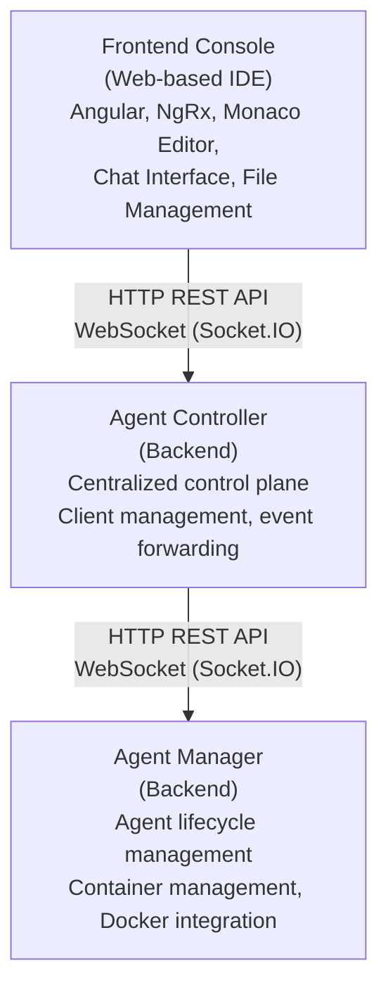

# Agenstra

**A centralized control plane for managing distributed AI agent infrastructure.**

Agenstra is a full-stack platform that enables you to manage multiple AI agent instances from a single web-based console. Connect to remote agent-manager services, interact with AI agents in real-time, edit code directly in containers, and automate server provisioning - all from one unified interface.

## What is Agenstra?

Agenstra provides a complete solution for managing distributed AI agent infrastructure:

- **Centralized Management** - Connect to and control multiple remote agent-manager services from a single console
- **Real-time AI Interaction** - WebSocket-based bidirectional communication with AI agents for instant responses
- **Integrated Code Editor** - Edit files directly in agent containers with Monaco Editor - read, write, and manage code in real-time
- **Automated Server Provisioning** - Provision cloud servers (Hetzner Cloud, DigitalOcean) with automated Docker and agent-manager deployment
- **Version Control Integration** - Full Git operations (status, branches, commit, push, pull, rebase) directly from the web interface
- **Container Management** - Monitor and interact with agent containers, view logs, and manage container lifecycle
- **VNC Browser Access** - Graphical browser access via VNC with XFCE4 desktop and Chromium browser
- **CI/CD Pipeline Management** - Configure, trigger, and monitor deployment pipelines from the console

## Architecture

Agenstra follows a three-tier distributed architecture:

### Components

- **Frontend Agent Console** (`apps/agenstra/frontend-agent-console`) - Web-based IDE and chat interface built with Angular and NgRx
- **Backend Agent Controller** (`apps/agenstra/backend-agent-controller`) - Centralized control plane for managing multiple agent-manager instances
- **Backend Agent Manager** (`apps/agenstra/backend-agent-manager`) - Agent management system with HTTP REST API and WebSocket gateway

### Repository layout

Applications and libraries are grouped by product domain:

| Domain     | Applications (`apps/<domain>/`)                                                          | Libraries (`libs/domains/<domain>/`)              |
| ---------- | ---------------------------------------------------------------------------------------- | ------------------------------------------------- |
| `agenstra` | Agent console, controllers, managers, billing, docs, landing page, native desktop client | Agenstra-specific features and data-access layers |
| `forepath` | Company marketing site (`frontend-landingpage`)                                          | Forepath marketing feature libraries              |
| `shared`   | Platform authentication, MCP devkit and proxy                                            | Cross-product utilities and monitoring            |
| `identity` | —                                                                                        | Authentication and user management (unchanged)    |

Nx project names use a domain prefix (for example `agenstra-backend-agent-manager`).

## Key Features

### Distributed Agent Management

Connect to and manage multiple remote agent-manager services from a single console. Each client represents a remote agent-manager instance that can be provisioned automatically or connected manually.

### Real-time AI Chat

WebSocket-based bidirectional communication with AI agents. Send messages, receive instant responses, and maintain chat history across reconnections.

### Integrated Code Editor

Monaco Editor integration allows you to edit files directly in agent containers. Read, write, and manage code in real-time with syntax highlighting and code completion.

### Automated Server Provisioning

Provision cloud servers (Hetzner Cloud, DigitalOcean) with automated Docker installation and agent-manager deployment. Configure authentication, Git repositories, and agent settings during provisioning.

### Version Control Integration

Full Git operations directly from the web interface:

- View git status and branches
- Stage, commit, and push changes
- Pull and rebase operations
- Resolve merge conflicts

### Container Management

Monitor agent containers, view logs, and manage container lifecycle. Real-time container statistics and health monitoring.

### VNC Browser Access

Access a Chromium browser running in a virtual workspace container via VNC. XFCE4 desktop environment with auto-started browser, accessible through a web-based noVNC client.

### CI/CD Pipeline Management

Configure CI/CD providers (GitHub Actions), trigger pipeline runs, monitor their status, and view logs directly from the Agenstra console.

## Quick Start

### Getting Started

1. **Set up your environment** - Follow the [Getting Started Guide](./docs/agenstra/getting-started.md) to install and configure Agenstra
2. **Create your first client** - Connect to an existing agent-manager or provision a new server
3. **Create an agent** - Set up your first AI agent and start interacting
4. **Explore features** - Use the integrated code editor, Git operations, and chat interface

## Documentation

### Getting Started

- [Getting Started Guide](./docs/agenstra/getting-started.md) - Your entry point to Agenstra
- [Local Development](./docs/agenstra/deployment/local-development.md) - Setting up for local development

### Architecture

- [System Overview](./docs/agenstra/architecture/system-overview.md) - High-level architecture and component relationships
- [Components](./docs/agenstra/architecture/components.md) - Detailed breakdown of all system components
- [Data Flow](./docs/agenstra/architecture/data-flow.md) - Communication patterns and data flow

### Features

- [Client Management](./docs/agenstra/features/client-management.md) - Managing remote agent-manager instances
- [Agent Management](./docs/agenstra/features/agent-management.md) - Agent lifecycle and container management
- [Server Provisioning](./docs/agenstra/features/server-provisioning.md) - Automated cloud server provisioning
- [WebSocket Communication](./docs/agenstra/features/websocket-communication.md) - Real-time bidirectional communication
- [File Management](./docs/agenstra/features/file-management.md) - File system operations in agent containers
- [Version Control](./docs/agenstra/features/version-control.md) - Git operations from the web interface
- [Web IDE](./docs/agenstra/features/web-ide.md) - Monaco Editor integration
- [Chat Interface](./docs/agenstra/features/chat-interface.md) - AI chat functionality
- [VNC Browser Access](./docs/agenstra/features/vnc-browser-access.md) - Graphical browser access via VNC

### Deployment

- [Docker Deployment](./docs/agenstra/deployment/docker-deployment.md) - Containerized deployment guide
- [Production Checklist](./docs/agenstra/deployment/production-checklist.md) - Production deployment guide
- [Environment Configuration](./docs/agenstra/deployment/environment-configuration.md) - Complete environment variables reference

### API Reference

- [API Reference](./docs/agenstra/api-reference/README.md) - Complete OpenAPI and AsyncAPI specifications

### Troubleshooting

- [Common Issues](./docs/agenstra/troubleshooting/common-issues.md) - Common problems and solutions
- [Debugging Guide](./docs/agenstra/troubleshooting/debugging-guide.md) - Debugging strategies and tools

## License

This project is licensed under the **MIT License**.

Copyright (c) 2025 IPvX UG (haftungsbeschränkt)

Portions of this software were originally Copyright (c) 2017-2025 Narwhal Technologies Inc.

This program is free software: you can redistribute it and/or modify it under the terms of the MIT License. See the [LICENSE](./LICENSE) file for the full license text.

### Sublicensed Components

The following components are sublicensed under the **GNU Affero General Public License v3.0 (AGPL-3.0)**:

- [`apps/agenstra/backend-agent-manager`](./apps/agenstra/backend-agent-manager/) - Backend application for agent management
- [`libs/domains/agenstra/backend/feature-agent-manager`](./libs/domains/agenstra/backend/feature-agent-manager/) - Agent management feature library
- [`libs/domains/shared/backend/feature-monitoring`](./libs/domains/shared/backend/feature-monitoring/) - Monitoring feature library
- [`apps/agenstra/frontend-agent-console`](./apps/agenstra/frontend-agent-console/) - Frontend application for agent console
- [`libs/domains/agenstra/frontend/feature-agent-console`](./libs/domains/agenstra/frontend/feature-agent-console/) - Agent console feature library
- [`libs/domains/agenstra/frontend/data-access-agent-console`](./libs/domains/agenstra/frontend/data-access-agent-console/) - Agent console data access library
- [`libs/domains/shared/frontend/util-configuration`](./libs/domains/shared/frontend/util-configuration/) - Frontend configuration utility library
- [`libs/domains/shared/frontend/util-cookie-consent`](./libs/domains/shared/frontend/util-cookie-consent/) - Cookie consent utility library
- [`libs/domains/shared/frontend/util-express-server`](./libs/domains/shared/frontend/util-express-server/) - Express server utilities for frontend apps
- [`libs/domains/agenstra/frontend/util-docs-parser`](./libs/domains/agenstra/frontend/util-docs-parser/) - Documentation parser utility library
- [`libs/domains/shared/frontend/util-runtime-config-server`](./libs/domains/shared/frontend/util-runtime-config-server/) - Frontend runtime config proxy utility library

These components are licensed under AGPL-3.0, which means that any modifications or derivative works must also be licensed under AGPL-3.0 and made available to users, including when accessed over a network. See the respective LICENSE files:

- [backend-agent-manager application](./apps/agenstra/backend-agent-manager/LICENSE)
- [feature-agent-manager library](./libs/domains/agenstra/backend/feature-agent-manager/LICENSE)
- [feature-monitoring library](./libs/domains/shared/backend/feature-monitoring/LICENSE)
- [frontend-agent-console application](./apps/agenstra/frontend-agent-console/LICENSE)
- [feature-agent-console library](./libs/domains/agenstra/frontend/feature-agent-console/LICENSE)
- [data-access-agent-console library](./libs/domains/agenstra/frontend/data-access-agent-console/LICENSE)
- [util-configuration library](./libs/domains/shared/frontend/util-configuration/LICENSE)
- [util-cookie-consent library](./libs/domains/shared/frontend/util-cookie-consent/LICENSE)
- [util-express-server library](./libs/domains/shared/frontend/util-express-server/LICENSE)
- [util-docs-parser library](./libs/domains/agenstra/frontend/util-docs-parser/LICENSE)
- [util-runtime-config-server library](./libs/domains/shared/frontend/util-runtime-config-server/LICENSE)

The following components are sublicensed under the **Business Source License 1.1 (BUSL-1.1)**:

- [`apps/agenstra/backend-agent-controller`](./apps/agenstra/backend-agent-controller/) - Backend application for agent controller
- [`libs/domains/agenstra/backend/feature-agent-controller`](./libs/domains/agenstra/backend/feature-agent-controller/) - Agent controller feature library

These components are licensed under BUSL-1.1, which permits non-production use and limited production use (subject to the Additional Use Grant terms). The license will convert to AGPL-3.0 after the Change Date (three years from release date). See the respective [backend-agent-controller application LICENSE](./apps/agenstra/backend-agent-controller/LICENSE) and [feature-agent-controller library LICENSE](./libs/domains/agenstra/backend/feature-agent-controller/LICENSE) files for the full BUSL-1.1 license text.

The following components are sublicensed under the **Source-Available License**:

- [`apps/agenstra/frontend-landingpage`](./apps/agenstra/frontend-landingpage/) - Frontend application for the public landing page
- [`libs/domains/agenstra/frontend/feature-landingpage`](./libs/domains/agenstra/frontend/feature-landingpage/) - Landing page feature library
- [`apps/agenstra/frontend-docs`](./apps/agenstra/frontend-docs/) - Frontend application for documentation
- [`libs/domains/agenstra/frontend/feature-docs`](./libs/domains/agenstra/frontend/feature-docs/) - Documentation feature library
- [`apps/agenstra/frontend-billing-console`](./apps/agenstra/frontend-billing-console/) - Frontend application for billing console
- [`libs/domains/agenstra/frontend/feature-billing-console`](./libs/domains/agenstra/frontend/feature-billing-console/) - Billing console feature library
- [`libs/domains/agenstra/frontend/data-access-billing-console`](./libs/domains/agenstra/frontend/data-access-billing-console/) - Billing console data access library
- [`libs/domains/agenstra/frontend/data-access-portal`](./libs/domains/agenstra/frontend/data-access-portal/) - Portal data access library
- [`apps/agenstra/backend-billing-manager`](./apps/agenstra/backend-billing-manager/) - Backend application for billing management
- [`libs/domains/agenstra/backend/feature-billing-manager`](./libs/domains/agenstra/backend/feature-billing-manager/) - Billing management feature library

These components are licensed under a source-available license that grants only the right to view the source code. No other rights are granted, including copying, modifying, distributing, or using the software for any purpose. See the respective LICENSE files:

- [frontend-landingpage application](./apps/agenstra/frontend-landingpage/LICENSE)
- [feature-landingpage library](./libs/domains/agenstra/frontend/feature-landingpage/LICENSE)
- [frontend-docs application](./apps/agenstra/frontend-docs/LICENSE)
- [feature-docs library](./libs/domains/agenstra/frontend/feature-docs/LICENSE)
- [frontend-billing-console application](./apps/agenstra/frontend-billing-console/LICENSE)
- [feature-billing-console library](./libs/domains/agenstra/frontend/feature-billing-console/LICENSE)
- [data-access-billing-console library](./libs/domains/agenstra/frontend/data-access-billing-console/LICENSE)
- [data-access-portal library](./libs/domains/agenstra/frontend/data-access-portal/LICENSE)
- [backend-billing-manager application](./apps/agenstra/backend-billing-manager/LICENSE)
- [feature-billing-manager library](./libs/domains/agenstra/backend/feature-billing-manager/LICENSE)

## Contribution

We welcome contributions! Whether you're fixing bugs, adding features, or improving documentation, your input helps make Agenstra better for everyone.

For detailed information on how to contribute, please see our [Contributing Guide](./CONTRIBUTING.md).
