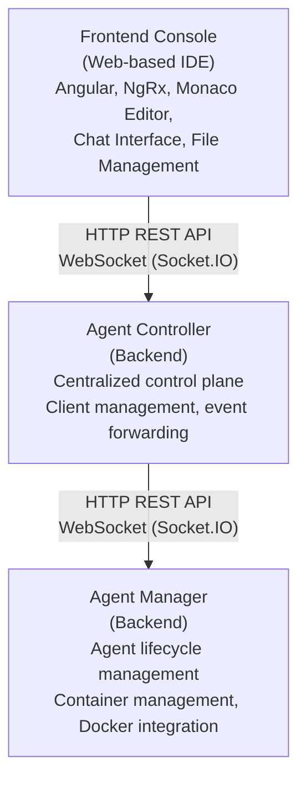

<div style="text-align: center;">

[](LICENSE)
[](https://nx.dev)
[](https://www.cursor.so)
[](https://www.typescriptlang.org/)
[](https://angular.io)
[](https://nestjs.com/)

[](https://github.com/forepath/one)

</div>

# ForePath One

**The central open source monorepo for ForePath products and shared platform code.**

This repository hosts the software that powers [ForePath One](https://forepath.io/one), the umbrella for ForePath open source products. Today it contains the company website, the Agenstra agent governance platform, shared authentication and MCP tooling, and the Nx workspace infrastructure that ties them together. Each product lives in a named domain under `apps/` and `libs/domains/`, with per-component licenses where sublicensing applies.

## Repository overview

Clone and install dependencies from the repository root:

```bash
git clone https://github.com/forepath/one.git
cd one
npm install
```

Applications and libraries are grouped by product domain. Nx project names use a domain prefix (for example `agenstra-backend-agent-manager` or `forepath-frontend-landingpage`).

| Domain     | Role                                                                                      | Applications (`apps/<domain>/`)                                                          | Libraries (`libs/domains/<domain>/`)                            |
| ---------- | ----------------------------------------------------------------------------------------- | ---------------------------------------------------------------------------------------- | --------------------------------------------------------------- |
| `forepath` | ForePath company website and marketing features                                           | `frontend-landingpage`                                                                   | `frontend/feature-landingpage`                                  |
| `agenstra` | Agent governance platform (console, controllers, managers, billing, docs, desktop client) | Agent console, controllers, managers, billing, docs, landing page, native desktop client | Feature, data-access, and utility libraries for Agenstra        |
| `shared`   | Cross-product platform services                                                           | Platform authentication (Keycloak), MCP devkit, MCP proxy                                | Monitoring, configuration, Express SSR utilities, queue, crypto |
| `identity` | Authentication shared across products                                                     | none                                                                                     | Keycloak integration for backend and frontend                   |

Workspace tooling under `tools/` (`code`, `ai`, `sbom`, `release-integrity`) supports generators, agent context, and release automation. It is covered by the root MIT license unless noted otherwise in the component.

## Projects

### ForePath

The ForePath domain contains the public company website at [forepath.io](https://forepath.io). It presents consulting, IT systems, software development services, and the ForePath One product portfolio. The site is an Angular SSR application with localized routes for home, services, pricing, legal pages, and the ForePath One overview.

| Component                 | Nx project                              | Path                                                                                                          | Description                                                 |
| ------------------------- | --------------------------------------- | ------------------------------------------------------------------------------------------------------------- | ----------------------------------------------------------- |
| Landing page application  | `forepath-frontend-landingpage`         | [`apps/forepath/frontend-landingpage`](./apps/forepath/frontend-landingpage/)                                 | Angular SSR shell, Express server, Docker deployment        |
| Marketing feature library | `forepath-frontend-feature-landingpage` | [`libs/domains/forepath/frontend/feature-landingpage`](./libs/domains/forepath/frontend/feature-landingpage/) | Pages, layout, routes, and content for the ForePath website |

Run the site locally:

```bash
nx serve forepath-frontend-landingpage
```

### Agenstra

[Agenstra](https://agenstra.com) is a centralized control plane for managing distributed AI agent infrastructure. It lets platform teams connect to remote agent-manager services, interact with agents in real time, edit code in containers, provision servers, and operate tickets, knowledge, and billing from a single web console or optional desktop client.

Agenstra follows a three-tier distributed architecture:



| Component                | Nx project                          | Path                                                                                  | Description                                                  |
| ------------------------ | ----------------------------------- | ------------------------------------------------------------------------------------- | ------------------------------------------------------------ |
| Frontend agent console   | `agenstra-frontend-agent-console`   | [`apps/agenstra/frontend-agent-console`](./apps/agenstra/frontend-agent-console/)     | Web-based IDE, chat, file management, tickets, knowledge     |
| Native agent console     | `agenstra-native-agent-console`     | [`apps/agenstra/native-agent-console`](./apps/agenstra/native-agent-console/)         | Electron desktop shell around the agent console              |
| Backend agent controller | `agenstra-backend-agent-controller` | [`apps/agenstra/backend-agent-controller`](./apps/agenstra/backend-agent-controller/) | Control plane for clients, tickets, proxying, and statistics |
| Backend agent manager    | `agenstra-backend-agent-manager`    | [`apps/agenstra/backend-agent-manager`](./apps/agenstra/backend-agent-manager/)       | Agent lifecycle, Docker workloads, VNC, SSH, worker images   |
| Backend billing manager  | `agenstra-backend-billing-manager`  | [`apps/agenstra/backend-billing-manager`](./apps/agenstra/backend-billing-manager/)   | Subscriptions, invoicing, Stripe integration                 |
| Frontend billing console | `agenstra-frontend-billing-console` | [`apps/agenstra/frontend-billing-console`](./apps/agenstra/frontend-billing-console/) | Admin and customer billing UI                                |
| Frontend docs            | `agenstra-frontend-docs`            | [`apps/agenstra/frontend-docs`](./apps/agenstra/frontend-docs/)                       | In-product documentation site                                |
| Frontend landing page    | `agenstra-frontend-landingpage`     | [`apps/agenstra/frontend-landingpage`](./apps/agenstra/frontend-landingpage/)         | Public Agenstra marketing and pricing site                   |

Key Agenstra capabilities include centralized management of remote agent-manager instances, WebSocket-based agent chat, Monaco Editor file editing in containers, automated cloud server provisioning (Hetzner Cloud, DigitalOcean), Git operations from the browser, container monitoring and logs, VNC browser access, and CI/CD pipeline management from the console.

To get started with Agenstra:

1. Follow the [Getting Started Guide](./docs/agenstra/getting-started.md) to install and configure the stack.
2. Create your first client by connecting to an existing agent-manager or provisioning a new server.
3. Create an agent and explore the integrated editor, Git tools, and chat interface.

### Shared platform

Shared applications and libraries are used by multiple ForePath products. They cover authentication, AI agent development tooling, monitoring, and common frontend server utilities.

| Component               | Nx project                       | Path                                                                            | Description                                                |
| ----------------------- | -------------------------------- | ------------------------------------------------------------------------------- | ---------------------------------------------------------- |
| Platform authentication | `shared-platform-authentication` | [`apps/shared/platform-authentication`](./apps/shared/platform-authentication/) | Keycloak Docker Compose for local and shared auth          |
| MCP devkit              | `shared-mcp-devkit`              | [`apps/shared/mcp-devkit`](./apps/shared/mcp-devkit/)                           | Model Context Protocol server for workspace and Nx tooling |
| MCP proxy               | `shared-mcp-proxy`               | [`apps/shared/mcp-proxy`](./apps/shared/mcp-proxy/)                             | Proxy that routes MCP clients to the devkit                |

Identity libraries under [`libs/domains/identity`](./libs/domains/identity/) provide Keycloak-backed authentication for NestJS backends and Angular frontends across Agenstra and future products.

## Documentation

### ForePath and workspace

- [Contributing Guide](./CONTRIBUTING.md) applies to the whole monorepo.

### Agenstra

- [Getting Started Guide](./docs/agenstra/getting-started.md)
- [Local Development](./docs/agenstra/deployment/local-development.md)
- [System Overview](./docs/agenstra/architecture/system-overview.md)
- [Components](./docs/agenstra/architecture/components.md)
- [Docker Deployment](./docs/agenstra/deployment/docker-deployment.md)
- [Environment Configuration](./docs/agenstra/deployment/environment-configuration.md)
- [API Reference](./docs/agenstra/api-reference/README.md)
- [Common Issues](./docs/agenstra/troubleshooting/common-issues.md)
- [Debugging Guide](./docs/agenstra/troubleshooting/debugging-guide.md)

Feature guides (client management, agent management, server provisioning, WebSocket communication, file management, version control, web IDE, chat, VNC access) live under [`docs/agenstra/features/`](./docs/agenstra/features/).

## License

The repository default is the **MIT License**. See [LICENSE](./LICENSE) for the full text.

Copyright (c) 2025 IPvX UG (haftungsbeschränkt)

Portions of this software were originally Copyright (c) 2017-2025 Narwhal Technologies Inc.

Individual applications and libraries may be sublicensed. Always check the LICENSE file in each component before use, modification, or distribution.

### GNU Affero General Public License v3.0 (AGPL-3.0)

The following components are sublicensed under AGPL-3.0. Modifications and derivative works must remain under AGPL-3.0 and must be made available to users, including when accessed over a network.

- [`apps/agenstra/backend-agent-manager`](./apps/agenstra/backend-agent-manager/) ([LICENSE](./apps/agenstra/backend-agent-manager/LICENSE))
- [`libs/domains/agenstra/backend/feature-agent-manager`](./libs/domains/agenstra/backend/feature-agent-manager/) ([LICENSE](./libs/domains/agenstra/backend/feature-agent-manager/LICENSE))
- [`libs/domains/shared/backend/feature-monitoring`](./libs/domains/shared/backend/feature-monitoring/) ([LICENSE](./libs/domains/shared/backend/feature-monitoring/LICENSE))
- [`apps/agenstra/frontend-agent-console`](./apps/agenstra/frontend-agent-console/) ([LICENSE](./apps/agenstra/frontend-agent-console/LICENSE))
- [`libs/domains/agenstra/frontend/feature-agent-console`](./libs/domains/agenstra/frontend/feature-agent-console/) ([LICENSE](./libs/domains/agenstra/frontend/feature-agent-console/LICENSE))
- [`libs/domains/agenstra/frontend/data-access-agent-console`](./libs/domains/agenstra/frontend/data-access-agent-console/) ([LICENSE](./libs/domains/agenstra/frontend/data-access-agent-console/LICENSE))
- [`libs/domains/shared/frontend/util-configuration`](./libs/domains/shared/frontend/util-configuration/) ([LICENSE](./libs/domains/shared/frontend/util-configuration/LICENSE))
- [`libs/domains/shared/frontend/util-cookie-consent`](./libs/domains/shared/frontend/util-cookie-consent/) ([LICENSE](./libs/domains/shared/frontend/util-cookie-consent/LICENSE))
- [`libs/domains/shared/frontend/util-express-server`](./libs/domains/shared/frontend/util-express-server/) ([LICENSE](./libs/domains/shared/frontend/util-express-server/LICENSE))
- [`libs/domains/agenstra/frontend/util-docs-parser`](./libs/domains/agenstra/frontend/util-docs-parser/) ([LICENSE](./libs/domains/agenstra/frontend/util-docs-parser/LICENSE))
- [`libs/domains/shared/frontend/util-runtime-config-server`](./libs/domains/shared/frontend/util-runtime-config-server/) ([LICENSE](./libs/domains/shared/frontend/util-runtime-config-server/LICENSE))
- [`libs/domains/shared/frontend/util-meta`](./libs/domains/shared/frontend/util-meta/) ([LICENSE](./libs/domains/shared/frontend/util-meta/LICENSE))
- [`libs/domains/shared/backend/util-http-context`](./libs/domains/shared/backend/util-http-context/) ([LICENSE](./libs/domains/shared/backend/util-http-context/LICENSE))

### Business Source License 1.1 (BUSL-1.1)

The following components are sublicensed under BUSL-1.1. They permit non-production use and limited production use subject to the Additional Use Grant. The license converts to AGPL-3.0 after the Change Date (three years from release date).

- [`apps/agenstra/backend-agent-controller`](./apps/agenstra/backend-agent-controller/) ([LICENSE](./apps/agenstra/backend-agent-controller/LICENSE))
- [`libs/domains/agenstra/backend/feature-agent-controller`](./libs/domains/agenstra/backend/feature-agent-controller/) ([LICENSE](./libs/domains/agenstra/backend/feature-agent-controller/LICENSE))

### Source-available license

The following components are source-available. You may view the source code to understand how the software works. No other rights are granted, including copying, modifying, distributing, or running the software.

**ForePath domain**

- [`apps/forepath/frontend-landingpage`](./apps/forepath/frontend-landingpage/) ([LICENSE](./apps/forepath/frontend-landingpage/LICENSE))
- [`libs/domains/forepath/frontend/feature-landingpage`](./libs/domains/forepath/frontend/feature-landingpage/) ([LICENSE](./libs/domains/forepath/frontend/feature-landingpage/LICENSE))

**Agenstra domain**

- [`apps/agenstra/frontend-landingpage`](./apps/agenstra/frontend-landingpage/) ([LICENSE](./apps/agenstra/frontend-landingpage/LICENSE))
- [`libs/domains/agenstra/frontend/feature-landingpage`](./libs/domains/agenstra/frontend/feature-landingpage/) ([LICENSE](./libs/domains/agenstra/frontend/feature-landingpage/LICENSE))
- [`apps/agenstra/frontend-docs`](./apps/agenstra/frontend-docs/) ([LICENSE](./apps/agenstra/frontend-docs/LICENSE))
- [`libs/domains/agenstra/frontend/feature-docs`](./libs/domains/agenstra/frontend/feature-docs/) ([LICENSE](./libs/domains/agenstra/frontend/feature-docs/LICENSE))
- [`apps/agenstra/frontend-billing-console`](./apps/agenstra/frontend-billing-console/) ([LICENSE](./apps/agenstra/frontend-billing-console/LICENSE))
- [`libs/domains/agenstra/frontend/feature-billing-console`](./libs/domains/agenstra/frontend/feature-billing-console/) ([LICENSE](./libs/domains/agenstra/frontend/feature-billing-console/LICENSE))
- [`libs/domains/agenstra/frontend/data-access-billing-console`](./libs/domains/agenstra/frontend/data-access-billing-console/) ([LICENSE](./libs/domains/agenstra/frontend/data-access-billing-console/LICENSE))
- [`libs/domains/agenstra/frontend/data-access-portal`](./libs/domains/agenstra/frontend/data-access-portal/) ([LICENSE](./libs/domains/agenstra/frontend/data-access-portal/LICENSE))
- [`apps/agenstra/backend-billing-manager`](./apps/agenstra/backend-billing-manager/) ([LICENSE](./apps/agenstra/backend-billing-manager/LICENSE))
- [`libs/domains/agenstra/backend/feature-billing-manager`](./libs/domains/agenstra/backend/feature-billing-manager/) ([LICENSE](./libs/domains/agenstra/backend/feature-billing-manager/LICENSE))

## Contributing

We welcome contributions across the monorepo, including bug fixes, features, documentation, tests, and design improvements for Agenstra, shared platform code, and workspace tooling.

Please read [CONTRIBUTING.md](./CONTRIBUTING.md) for setup instructions, coding standards, and the pull request process. Use [GitHub Discussions](https://github.com/forepath/one/discussions) for questions and [GitHub Issues](https://github.com/forepath/one/issues) for bugs and feature requests.

When contributing to a sublicensed component, ensure your changes comply with that component's license terms.
