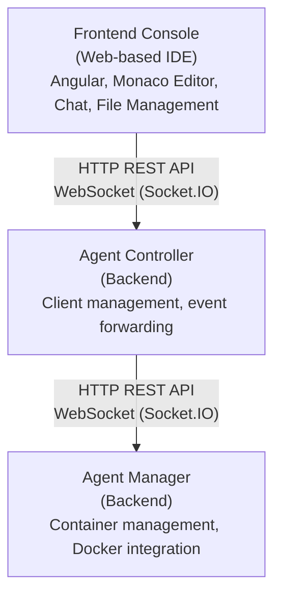

# Agenstra Documentation

Welcome to the comprehensive documentation for **Agenstra** - a centralized control plane for managing distributed AI agent infrastructure. This documentation provides guides, architecture details, and operational information for the complete agent management system.

## What is Agenstra?

Agenstra is a full-stack agent management platform that enables you to:

- **Manage Multiple Agent-Manager Instances** - Connect to and control multiple remote agent-manager services from a single console
- **Real-time AI Interaction** - WebSocket-based bidirectional communication with AI agents for instant responses
- **Integrated Code Editor** - Edit files directly in agent containers with Monaco Editor - read, write, and manage code in real-time
- **Automated Server Provisioning** - Provision cloud servers (Hetzner Cloud, DigitalOcean) with automated Docker and agent-manager deployment
- **Version Control Integration** - Full Git operations (status, branches, commit, push, pull, rebase) directly from the web interface
- **Container Management** - Monitor and interact with agent containers, view logs, and manage container lifecycle
- **VNC Browser Access** - Graphical browser access via VNC with XFCE4 desktop and Chromium browser

## Documentation Structure

### [Getting Started](./getting-started.md)

Your entry point to Agenstra, including:

- Prerequisites and installation
- Basic setup and configuration
- Creating your first client and agent
- Quick tour of features

### [Architecture](./architecture/README.md)

Understanding the system architecture:

- [System Overview](./architecture/system-overview.md) - High-level architecture and component relationships
- [Components](./architecture/components.md) - Detailed breakdown of all system components
- [Data Flow](./architecture/data-flow.md) - Communication patterns and data flow

### [Applications](./applications/README.md)

Detailed documentation for each application:

- [Backend Agent Controller](./applications/backend-agent-controller.md) - Centralized control plane for managing multiple agent-manager instances
- [Backend Agent Manager](./applications/backend-agent-manager.md) - Agent management system with HTTP REST API and WebSocket gateway
- [Frontend Agent Console](./applications/frontend-agent-console.md) - Web-based IDE and chat interface

### [AI Agents Context](./ai-agents/README.md)

Configuration for AI coding assistants (Cursor, OpenCode, GitHub Copilot) from a single, tool-agnostic source:

- [Overview](./ai-agents/README.md) - Single source of truth for rules, commands, skills, and agents; transformation to tool-specific configs
- [Rules](./ai-agents/rules.md) - Project-wide instructions (coding standards, architecture, testing, security)
- [Commands](./ai-agents/commands.md) - Reusable slash-style commands and prompts
- [Skills](./ai-agents/skills.md) - Domain-specific knowledge and patterns
- [Agents](./ai-agents/agents.md) - Primary agents and subagents configuration
- [MCP Definitions](./ai-agents/mcp-definitions.md) - Model Context Protocol server definitions
- [Perplexity plan prompt](./ai-agents/perplexity-plan-prompt.md) - Prompt for Perplexity to research best practices and output a plan file to generate .agenstra contents

### [Features](./features/README.md)

Comprehensive feature documentation:

- [Client Management](./features/client-management.md) - Creating and managing clients (remote agent-manager services)
- [Agent Management](./features/agent-management.md) - Agent lifecycle, types, and container management
- [Server Provisioning](./features/server-provisioning.md) - Automated cloud server provisioning (Hetzner, DigitalOcean)
- [WebSocket Communication](./features/websocket-communication.md) - Real-time bidirectional event forwarding and chat
- [File Management](./features/file-management.md) - File system operations in agent containers
- [Version Control](./features/version-control.md) - Git/VCS operations (status, branches, commit, push, pull)
- [Web IDE](./features/web-ide.md) - Monaco Editor integration for code editing
- [Chat Interface](./features/chat-interface.md) - AI chat functionality and message flow
- [VNC Browser Access](./features/vnc-browser-access.md) - Graphical browser access via VNC and noVNC
- [Authentication](./features/authentication.md) - Multiple authentication methods with configurable user registration
- [Atlassian import](./features/atlassian-import.md) - Jira and Confluence imports into controller tickets and knowledge (admin)
- [Dynamic provider plugins](./features/dynamic-provider-plugins.md) - Runtime provider extensions for controller and manager (baked-in or mounted)

### [Deployment](./deployment/README.md)

Deployment guides and configuration:

- [Local Development](./deployment/local-development.md) - Setting up for local development
- [Docker Deployment](./deployment/docker-deployment.md) - Containerized deployment guide
- [System Requirements](./deployment/system-requirements.md) - CPU, memory, and disk by role
- [Production Checklist](./deployment/production-checklist.md) - Production deployment guide
- [Environment Configuration](./deployment/environment-configuration.md) - Complete environment variables reference

### [Security](./security/README.md)

Public security and compliance-oriented documentation:

- [Compliance and standards](./security/compliance-and-standards.md) - EU CRA and BSI IT-Grundschutz documentation themes (informative)
- [Accepted risks](./security/accepted-risks.md) - Register AR-001 through AR-005 with mitigations and review dates
- [Container image security](./security/container-images.md) - Non-root users, bind mounts, restricted sudo
- [Operational hardening](./security/operational-hardening.md) - Implemented controls (including container image hardening) and operator notes
- [Vulnerability reporting and artifacts](./security/vulnerability-reporting-and-artifacts.md) - Disclosure process, SBOM paths, desktop integrity

The repository root file `SECURITY.md` duplicates the vulnerability contact and supported-version summary for viewers on hosts that promote that file; the documentation copy lives under [Security](./security/README.md) above.

### [API Reference](./api-reference/README.md)

Complete API specifications:

- [Agent Controller API](./api-reference/README.md) - HTTP REST API and WebSocket gateway specifications
- [Agent Manager API](./api-reference/README.md) - HTTP REST API and WebSocket gateway specifications

### [Troubleshooting](./troubleshooting/README.md)

Problem-solving guides:

- [Common Issues](./troubleshooting/common-issues.md) - Common problems and solutions
- [Debugging Guide](./troubleshooting/debugging-guide.md) - Debugging strategies and tools

## Quick Start

New to Agenstra? Follow this learning path:

1. **[Getting Started Guide](./getting-started.md)** - Set up your environment and create your first agent
2. **[System Overview](./architecture/system-overview.md)** - Understand the architecture
3. **[Client Management](./features/client-management.md)** - Learn how to manage remote agent-manager instances
4. **[Agent Management](./features/agent-management.md)** - Create and interact with agents
5. **[WebSocket Communication](./features/websocket-communication.md)** - Understand real-time communication

## System Architecture

Agenstra follows a three-tier architecture:

For detailed architecture information, see the [Architecture Documentation](./architecture/README.md).

## Key Features

### Distributed Agent Management

Connect to and manage multiple remote agent-manager services from a single console. Each client represents a remote agent-manager instance that can be provisioned automatically or connected manually.

### Real-time AI Chat

WebSocket-based bidirectional communication with AI agents. Send messages, receive instant responses, and maintain chat history across reconnections.

### Integrated Code Editor

Monaco Editor integration allows you to edit files directly in agent containers. Read, write, and manage code in real-time with syntax highlighting and code completion.

### Automated Server Provisioning

Provision cloud servers (Hetzner Cloud, DigitalOcean) with automated Docker installation and agent-manager deployment. Configure authentication, Git repositories, and agent settings during provisioning.

### Version Control Integration

Full Git operations directly from the web interface:

- View git status and branches
- Stage, commit, and push changes
- Pull and rebase operations
- Resolve merge conflicts

### Container Management

Monitor agent containers, view logs, and manage container lifecycle. Real-time container statistics and health monitoring.

### VNC Browser Access

Access a Chromium browser running in a virtual workspace container via VNC. XFCE4 desktop environment with auto-started browser, accessible through a web-based noVNC client.

### Atlassian import

Administrators configure Atlassian site connections and import rules so Jira issues and Confluence pages sync into workspace **tickets** and **knowledge** on the agent controller, with optional scheduling and manual runs. See [Atlassian import](./features/atlassian-import.md).

## Related Documentation

### Application Documentation

For application-specific information, see the application documentation:

- **[Backend Agent Controller Application](./applications/backend-agent-controller.md)** - Application deployment and configuration
- **[Backend Agent Manager Application](./applications/backend-agent-manager.md)** - Application deployment and configuration

## External Resources

- [Nx Documentation](https://nx.dev) - Monorepo tooling and best practices
- [NestJS Documentation](https://nestjs.com) - Backend framework documentation
- [Angular Documentation](https://angular.io) - Frontend framework documentation
- [Socket.IO Documentation](https://socket.io) - WebSocket library documentation
- [Monaco Editor](https://microsoft.github.io/monaco-editor/) - Code editor documentation

---

_This documentation provides operational and user-facing information for Agenstra. For technical implementation details, see the library and application README files._
