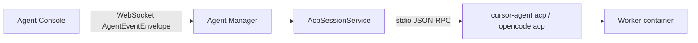

# Agent Client Protocol (ACP) in Agenstra

Agenstra’s agent manager uses the [Agent Client Protocol](https://agentclientprotocol.com) as the **internal transport** between the platform (ACP client) and coding agents running in worker containers (ACP agents).

## Glossary

| Term             | Meaning                                                                |
| ---------------- | ---------------------------------------------------------------------- |
| **ACP (client)** | Agent Client Protocol — JSON-RPC over stdio (this document)            |
| **MCP**          | Model Context Protocol — tools and resources for LLM hosts             |
| **BeeAI ACP**    | IBM Agent Communication Protocol — REST agent-to-agent (not used here) |

## Architecture



Outward APIs (OpenAPI / AsyncAPI) are unchanged. ACP replaces vendor-specific CLI NDJSON parsing inside providers.

## Enabling ACP

| Variable                   | Values            | Default                  |
| -------------------------- | ----------------- | ------------------------ |
| `AGENT_PROVIDER_TRANSPORT` | `legacy`, `acp`   | `legacy`                 |
| `CURSOR_AGENT_TRANSPORT`   | per-type override | —                        |
| `OPENCODE_AGENT_TRANSPORT` | per-type override | —                        |
| `ACP_AUTO_APPROVE`         | `true` / `false`  | `true` (headless agents) |

Example (staging):

```bash
export AGENT_PROVIDER_TRANSPORT=acp
```

## Worker image requirements

The [worker image](../../../apps/backend-agent-manager/Dockerfile.worker) installs:

- `cursor-agent acp` — `~/.local/bin/cursor-agent`
- `opencode acp` — `~/.opencode/bin/opencode`

See [acp-spike fixture](../../../libs/domains/framework/backend/feature-agent-manager/src/lib/providers/acp/fixtures/acp-spike.md) for sample JSON-RPC messages.

## Troubleshooting

- **Session fails at initialize** — Confirm the agent binary supports `acp` inside the container (`docker exec … cursor-agent acp`).
- **Permission prompts** — Set `ACP_AUTO_APPROVE=false` only if the console will answer `session/request_permission`.
- **Auth errors** — Check Cursor/OpenCode credentials inside the worker container; stderr is logged as ACP exec stderr.
