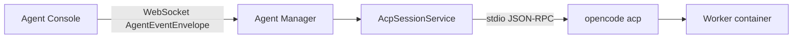

# Agent Client Protocol (ACP) in Agenstra

Agenstra’s agent manager uses the [Agent Client Protocol](https://agentclientprotocol.com) as the **internal transport** between the platform (ACP client) and coding agents running in worker containers (ACP agents).

## Glossary

| Term             | Meaning                                                                |
| ---------------- | ---------------------------------------------------------------------- |
| **ACP (client)** | Agent Client Protocol — JSON-RPC over stdio (this document)            |
| **MCP**          | Model Context Protocol — tools and resources for LLM hosts             |
| **BeeAI ACP**    | IBM Agent Communication Protocol — REST agent-to-agent (not used here) |

## Architecture

```mermaid
flowchart LR
  Console[Agent Console]
  Manager[Agent Manager]
  ACP[AcpSessionService]
  Worker[Worker container]
  Agent[opencode acp]

  Console -->|WebSocket AgentEventEnvelope| Manager
  Manager --> ACP
  ACP -->|stdio JSON-RPC| Agent
  Agent --> Worker
```

Outward APIs (OpenAPI / AsyncAPI chat events) are unchanged. ACP replaces vendor-specific CLI NDJSON parsing inside providers.

Built-in provider:

- **`opencode`** — launches `opencode acp` in the worker container

## Protocol details

- **Version:** ACP protocol version 1 (stable)
- **Transport:** newline-delimited JSON-RPC 2.0 over stdio
- **Session flow:** `initialize` → `session/new` (or `session/load` with a persisted agent-issued id) → `session/prompt` → `session/update` notifications
- **Session resume:** ACP session ids are stored per agent on `acp_sessions` (jsonb), keyed by `resumeSessionSuffix`:
  - **Empty suffix** (`''`) — primary user-visible chat session
  - **User chats** — `-chat-{uuid}` where `{uuid}` is the chat session id (one ACP session per user-created thread)
  - **Reserved / hidden** — not listed in agent `chats` / UI: `-prompt-enhance`, `-ticket-body`, and `-ticket-auto-*` (for example `-ticket-auto-pre`, `-ticket-auto-loop`, `-ticket-auto-commit-msg`)
    After an API restart, the manager opens a new stdio transport and calls `session/load` when the container id still matches. That covers primary, user, and background sessions the same way in-memory reuse already did within a process.
- **Permissions:** `session/request_permission` is auto-approved when `ACP_AUTO_APPROVE` is not `false` (default for headless agents). **OpenCode ticket automation does not use this flag** — reserved `-ticket-auto-*` sessions use OpenCode session permission rulesets and runtime auto-reply instead (see [Ticket automation](../features/ticket-automation.md)).

## Configuration

| Variable           | Values           | Default                  |
| ------------------ | ---------------- | ------------------------ |
| `ACP_AUTO_APPROVE` | `true` / `false` | `true` (headless agents) |

## Profile / config surface

Provider capabilities (including `transport: 'acp'`) are returned on:

- Manager `GET /api/config` → `agentTypes[].capabilities`
- Agent response DTOs → `capabilities`
- Controller client profile → `config.agentTypes` (embedded manager config)

## Notifications

Operator-facing notification events (controller notification bus / webhooks):

| Event                         | When                                              |
| ----------------------------- | ------------------------------------------------- |
| `agent.acp.session_failed`    | ACP initialize / session / transport failure      |
| `agent.acp.permission_denied` | Permission request denied or no options available |
| `agent.chat.failed`           | Generic chat turn failure                         |

Streaming token deltas are not notified.

## Worker image requirements

The [worker image](../../../apps/agenstra/backend-agent-manager/Dockerfile.worker) installs OpenCode so the manager can exec:

- `opencode acp`

## Troubleshooting

- **Session fails at initialize** — Confirm the agent binary supports `acp` inside the container (`docker exec … opencode acp`).
- **Permission prompts** — Set `ACP_AUTO_APPROVE=false` only if the console will answer `session/request_permission`.
- **Auth errors** — Check OpenCode credentials inside the worker container; stderr is logged as ACP exec stderr.

## Migration note

- Legacy OpenClaw (`openclaw` agent type / AGI image) has been removed. Recreate affected agents as `opencode`.
- Former `cursor` agents were remapped to `opencode`. ACP sessions for remapped agents were cleared so new sessions are established under OpenCode.

## Future: Agenstra as ACP server

OpenCode chat now runs over **HTTP** (`opencode serve` + `@opencode-ai/sdk`), not ACP stdio. ACP client code remains in the manager temporarily for compatibility and migration, but new work should target the OpenCode HTTP runtime.

Agenstra may later expose an **ACP server** surface so external IDEs / clients can attach to platform-managed agents. The intended seam is:

| Piece                         | Role                                                                                      |
| ----------------------------- | ----------------------------------------------------------------------------------------- |
| `OutboundAgentEventPublisher` | Maps internal `AgentResponseObject` / chat events outward (today a no-op sink)            |
| OpenCode HTTP runtime         | Source of truth for turns, permissions, questions, and usage                              |
| Future ACP server             | Adapts those outbound events to ACP JSON-RPC notifications and accepts ACP client prompts |

No ACP server is implemented yet. When added, wire a real `OutboundAgentEventPublisher` implementation and keep ChatFilter / context injection on the existing manager chat path.
