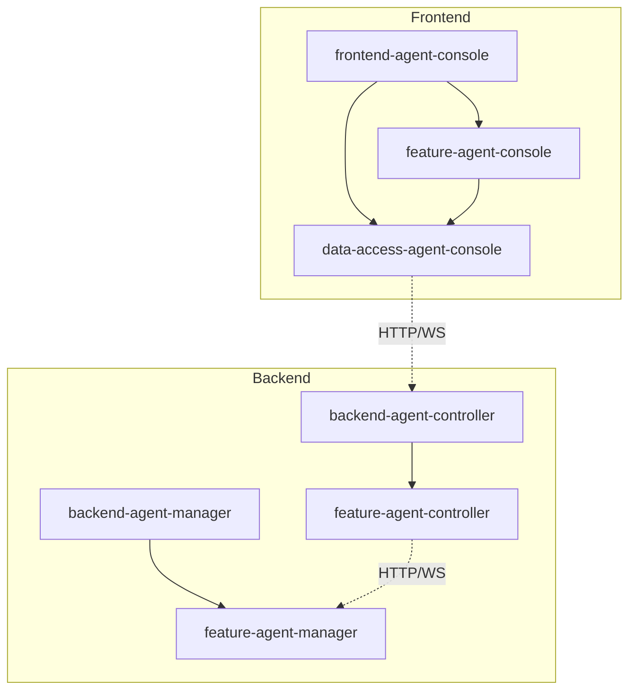

# Components

This document provides a detailed breakdown of all system components, their responsibilities, and relationships.

## Backend Applications

### Backend Agent Controller

**Location**: `apps/backend-agent-controller`

**Purpose**: Centralized control plane for managing multiple distributed agent-manager instances.

**Key Components** (via `ClientsModule` and related providers from `@forepath/agenstra/backend`):

- `ClientsController` - HTTP REST API for clients, proxy paths, tickets, statistics, filter rules, provisioning
- `ClientsService` - Business logic for clients with permission checks
- `ClientUsersService` - Manages client-user relationships and per-client roles
- `ClientsGateway` - WebSocket `clients` namespace (manager proxy, ticket hints for chat)
- `TicketsBoardGateway` - WebSocket `tickets` namespace (ticket board realtime)
- `ClientAgentProxyService` - Proxies HTTP requests to remote agent-managers
- `ProvisioningService` - Automated cloud server provisioning
- Ticket, automation, statistics, and filter-rule services and repositories (see library source)

**Dependencies**:

- `@forepath/agenstra/backend` (Nest module: agent-controller feature bundle)
- PostgreSQL database
- Keycloak (optional, can use API key or users auth)

**Ports**:

- HTTP API: `3100` (default)
- WebSocket: `8081` (default; namespaces `clients` and `tickets`)

**Documentation**: [Backend Agent Controller Application](../applications/backend-agent-controller.md)

### Backend Agent Manager

**Location**: `apps/backend-agent-manager`

**Purpose**: Agent management system with HTTP REST API and WebSocket gateway.

**Key Components** (via `AgentsModule` from `@forepath/agenstra/backend`):

- `AgentsController` - HTTP REST API for agent management
- `AgentsDeploymentsController` - Deployment configuration and CI/CD runs
- `AgentsService` - Business logic for agents
- `AgentsGateway` - WebSocket gateway for agent communication
- `DockerService` - Container management and log streaming
- `AgentProviderFactory` - Plugin-based agent provider system
- Regex filter rule services for `/api/agents-filters`

**Dependencies**:

- `@forepath/agenstra/backend` (Nest module: agent-manager feature bundle)
- PostgreSQL database
- Docker (for container management)
- Keycloak (optional, can use API key)

**Ports**:

- HTTP API: `3000` (default)
- WebSocket: `8080` (default)

**Documentation**: [Backend Agent Manager Application](../applications/backend-agent-manager.md)

## Frontend Applications

### Frontend Agent Console

**Location**: `apps/frontend-agent-console`

**Purpose**: Web-based IDE and chat interface for interacting with agents.

**Key Components**:

- `AgentConsoleChatComponent` - Main workspace shell (chat, files, Git, env, deployments)
- `AgentConsoleContainerComponent` - Layout and lazy-loaded routes
- `TicketsBoardComponent` - Ticket board
- `RuleManagerComponent` - Admin filter rules
- `AuditComponent` - Admin audit views
- Monaco Editor integration
- NgRx state management (including identity auth routes)

**Dependencies**:

- `@forepath/agenstra/frontend/feature-agent-console` - Feature components
- `@forepath/agenstra/frontend/data-access-agent-console` - State management
- Angular framework
- NgRx store

**Ports**:

- Development: `4200` (default)
- Production: Configurable

**Documentation**: [Frontend Agent Console Application](../applications/frontend-agent-console.md)

## Backend Libraries

### Feature Agent Controller

**Location**: `libs/domains/agenstra/backend/feature-agent-controller`

**Purpose**: Client management and proxying functionality.

**Key Components**:

- `ClientEntity` - Client domain model
- `ClientUserEntity` - Client-user relationship with per-client roles
- `ClientAgentCredentialEntity` - Agent credential storage
- Ticket, comment, activity, automation, and body-generation entities
- Statistics shadow and event entities (`statistics_*` tables)
- Global console filter rule entities and sync-target tables
- `ClientsRepository` - Data access layer
- `ClientUsersRepository` - Client-user relationship data access
- `ClientsService` - Business logic with permission checks
- `ClientUsersService` - Client-user relationship management
- `ClientAgentProxyService` - HTTP request proxying
- `ClientsGateway` - WebSocket `clients` namespace
- `TicketsBoardGateway` - WebSocket `tickets` namespace
- `ProvisioningService` - Server provisioning (Hetzner, DigitalOcean)

**Implementation**: Backend Agent Controller library

### Feature Agent Manager

**Location**: `libs/domains/agenstra/backend/feature-agent-manager`

**Purpose**: Agent management core functionality.

**Key Components**:

- `AgentEntity` - Agent domain model
- Deployment configuration and deployment run entities
- `AgentEnvironmentVariableEntity` - Per-agent environment variables
- `RegexFilterRuleEntity` - Per-agent regex chat filters
- `AgentMessageEventEntity` - Structured agent message stream events
- `AgentsRepository` - Data access layer
- `AgentsService` - Business logic
- `AgentsGateway` - WebSocket gateway
- `DockerService` - Container management
- `AgentProvider` - Plugin interface for agent providers
- `CursorAgentProvider` - Cursor-agent implementation

**Implementation**: Backend Agent Manager library

## Frontend Libraries

### Feature Agent Console

**Location**: `libs/domains/agenstra/frontend/feature-agent-console`

**Purpose**: Frontend feature components and UI.

**Key Components**:

- `AgentConsoleChatComponent` - Workspace shell
- `AgentConsoleContainerComponent` - Shell layout
- `TicketsBoardComponent`, `RuleManagerComponent`, `AuditComponent`
- `FileEditorComponent` - Monaco Editor integration
- `agentConsoleRoutes` - Route table and feature providers

**Implementation**: Frontend Feature Agent Console library

### Data Access Agent Console

**Location**: `libs/domains/agenstra/frontend/data-access-agent-console`

**Purpose**: State management (NgRx) and data access.

**Key Components**:

- **State Slices**:
  - `clients` - Client state management
  - `agents` - Agent state management
  - `sockets` - WebSocket `clients` namespace state
  - `ticketsBoardSocket` - WebSocket `tickets` namespace state
  - `files` - File system state
  - `env` - Environment variables
  - `vcs` - Version control state
  - `authentication` - Authentication state (identity bundle)
  - `stats` - Container statistics state
  - `statistics` - Controller usage statistics
  - `deployments` - CI/CD state
  - `tickets`, `ticketAutomation` - Ticket board and automation
  - `clientAgentAutonomy` - Autonomy configuration
  - `filterRules` - Global filter rules (admin)
- **Facades**:
  - `ClientsFacade` - Client operations
  - `AgentsFacade` - Agent operations
  - `SocketsFacade` - WebSocket operations
  - `TicketsBoardSocketFacade` - Tickets namespace
  - `FilesFacade` - File operations
  - `EnvFacade` - Environment variables
  - `VcsFacade` - Git operations
  - `StatisticsFacade`, `DeploymentsFacade`, `TicketsFacade`, `TicketAutomationFacade`, `ClientAgentAutonomyFacade`, `FilterRulesFacade`
- **Effects**: NgRx effects for side effects
- **Selectors**: State selectors

**Implementation**: Frontend Data Access Agent Console library

## Component Dependencies

## Database Schema

### Agent Controller Database

**Tables**:

- `clients` - Client entities (remote agent-manager instances)
- `client_users` - Many-to-many user-client relationships with per-client roles (admin/user)
- `client_agent_credentials` - Stored agent credentials for auto-login
- `provisioning_references` - Links clients to provisioned cloud servers

### Agent Manager Database

**Tables**:

- `agents` - Agent entities with container information
- `agent_chat_messages` - Chat message history (if implemented)

## External Dependencies

### Infrastructure

- **PostgreSQL** - Database for both controller and manager
- **Docker** - Container runtime for agent execution
- **Keycloak** - Identity and access management (optional)

### Cloud Providers

- **Hetzner Cloud** - Server provisioning provider
- **DigitalOcean** - Server provisioning provider

## Component Communication

### HTTP REST API

- Frontend → Agent Controller: Client management, proxied agent operations
- Agent Controller → Agent Manager: Proxied HTTP requests

### WebSocket

- Frontend ↔ Agent Controller (`clients`): Workspace context, `forward` to manager, proxied events by name
- Frontend ↔ Agent Controller (`tickets`): Ticket board and automation realtime
- Agent Controller ↔ Agent Manager: Event forwarding, agent communication

### Database

- **Agent Controller**: Clients, credentials, provisioning references, client users, tickets (`tickets`, `ticket_comments`, `ticket_activity`, `ticket_body_generation_sessions`), ticket automation (`client_agent_autonomy`, `ticket_automation`, `ticket_automation_run`, `ticket_automation_lease`, `ticket_automation_run_step`), statistics shadow and event tables (`statistics_users`, `statistics_clients`, `statistics_agents`, `statistics_provisioning_references`, `statistics_client_users`, `statistics_chat_io`, `statistics_chat_filter_drops`, `statistics_chat_filter_flags`, `statistics_entity_events`), global console filter tables (`agent_console_regex_filter_rules`, `agent_console_regex_filter_rule_clients`, `agent_console_regex_filter_rule_sync_targets`)
- **Agent Manager**: Agents, chat messages (`agent_chat_messages`), agent message events (`agent_message_events`), environment variables (`agent_environment_variables`), `deployment_configurations`, `deployment_runs`, per-agent regex rules (`regex_filter_rules`)

## Related Documentation

- **[System Overview](./system-overview.md)** - High-level architecture
- **[Data Flow](./data-flow.md)** - Communication patterns
- **[Backend Agent Controller Application](../applications/backend-agent-controller.md)** - Application details
- **[Backend Agent Manager Application](../applications/backend-agent-manager.md)** - Application details
- **[Frontend Agent Console Application](../applications/frontend-agent-console.md)** - Application details

---

_For implementation details, see the respective library and application README files._
