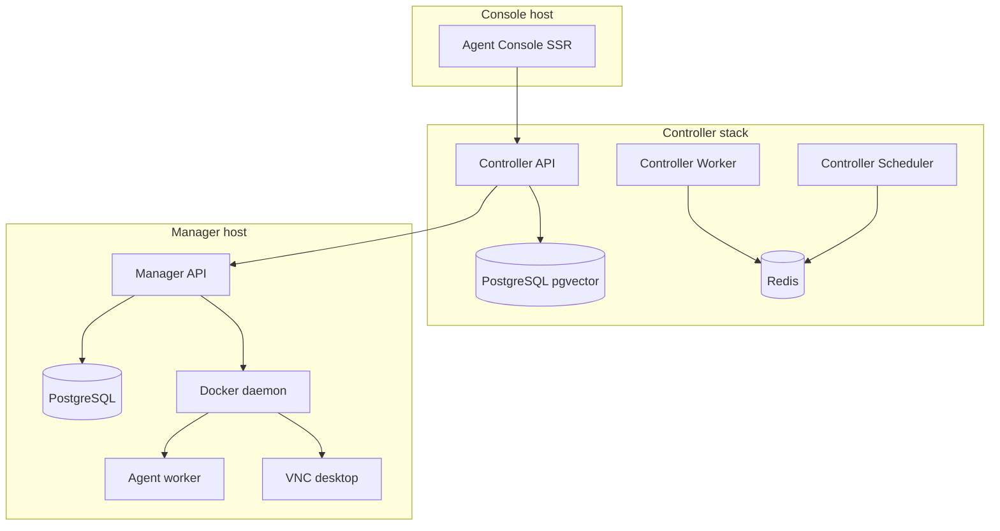

# System Requirements

Hardware and software requirements for running Agenstra components in development and production. Figures are **starting points** for capacity planning; tune limits from observed CPU, memory, Docker stats, and queue depth.

## Overview

Agenstra has two backend stacks and the agent console frontend:

1. **Agent controller** — control plane with BullMQ roles (`api`, `worker`, `scheduler`), PostgreSQL with **pgvector**, and Redis.
2. **Agent manager** — per-workspace runtime on a **Docker host** that spawns agent workload containers (worker, VNC, SSH, AGI).

The console talks only to the controller. The controller proxies agent operations to one or more manager instances.

Agent **worker** and **VNC** containers dominate manager-host sizing. The manager API itself is modest; plan the host for concurrent agents.

## Platform Prerequisites

| Requirement                     | Minimum                                                        | Recommended                                                                           |
| ------------------------------- | -------------------------------------------------------------- | ------------------------------------------------------------------------------------- |
| **Host OS**                     | Linux amd64 or arm64                                           | Linux amd64 for manager hosts running many agents                                     |
| **Docker**                      | 20.10+ on manager hosts                                        | 24+ with Compose v2                                                                   |
| **Docker Compose**              | 2.0+                                                           | Latest stable                                                                         |
| **Node.js** (local Nx dev only) | 24.14.1                                                        | Match container `NODE_VERSION`                                                        |
| **Docker socket**               | Required on manager (and controller when provisioning locally) | Restrict permissions; see [Container image security](../security/container-images.md) |

Container images use **Node.js 24.14.1** on **debian:trixie-slim** (VNC image uses full **debian:trixie** for the desktop stack). API images run as `agenstra` (UID **10001**). Frontend servers run as `node` (UID **1000**).

Host path **`/opt/agents`** must exist and be writable by UID **10001** on manager hosts (or rely on entrypoint `chown` after bind mount).

## Controller Stack

### PostgreSQL (pgvector)

Stores clients, tickets, knowledge embeddings, statistics, and filter rules.

| Profile             | vCPU | Memory | Disk     | Notes                                      |
| ------------------- | ---- | ------ | -------- | ------------------------------------------ |
| Local / staging     | 1    | 2 GiB  | 15 GiB   | Default compose (`pgvector/pgvector:pg16`) |
| Production (small)  | 2    | 4 GiB  | 50 GiB   | Few workspaces, moderate knowledge corpus  |
| Production (medium) | 4    | 8 GiB  | 100+ GiB | Large embedding indexes and ticket history |

Embedding reindex jobs increase CPU and I/O on Postgres during knowledge imports.

### Redis 7

BullMQ for controller background jobs. AOF enabled in default Compose.

| Profile         | vCPU | Memory  | Disk  | Notes                                          |
| --------------- | ---- | ------- | ----- | ---------------------------------------------- |
| Local / staging | 0.5  | 512 MiB | 1 GiB |                                                |
| Production      | 1    | 1–2 GiB | 5 GiB | Completed jobs retained for Bull Board history |

### Controller API (`QUEUE_ROLE=api`)

HTTP **3100**, WebSocket **8081** (`clients` and `tickets` namespaces), migrations, optional Bull Board.

| Profile         | vCPU | Memory limit | Notes                                                |
| --------------- | ---- | ------------ | ---------------------------------------------------- |
| Local / staging | 1    | 2 GiB        |                                                      |
| Production      | 1–2  | 2–4 GiB      | Scale for concurrent console users and proxy traffic |

### Controller Worker (`QUEUE_ROLE=worker`)

Processes unit jobs: context import, **knowledge embedding reindex**, filter-rule sync, autonomous ticket automation. Default **`QUEUE_WORKER_CONCURRENCY=5`**.

| Profile         | vCPU | Memory limit | Notes                                             |
| --------------- | ---- | ------------ | ------------------------------------------------- |
| Local / staging | 1    | 2 GiB        | Lower concurrency on laptops                      |
| Production      | 2–4  | 4–8 GiB      | Embedding and import batches are CPU/memory heavy |

Scale worker replicas horizontally. Keep **`QUEUE_WORKER_CONCURRENCY`** aligned with CPU and embedding provider rate limits.

### Controller Scheduler (`QUEUE_ROLE=scheduler`)

Registers repeatable coordinators only. **One** scheduler per Redis key prefix.

| Profile          | vCPU     | Memory limit  | Notes                    |
| ---------------- | -------- | ------------- | ------------------------ |
| All environments | 0.25–0.5 | 512 MiB–1 GiB | Singleton per deployment |

## Agent Manager Host

The manager API orchestrates Docker containers; it does not replace Docker host capacity for agents.

### Manager PostgreSQL

Agent metadata, chat history, deployment runs, and filter rules.

| Profile         | vCPU | Memory  | Disk   | Notes                                     |
| --------------- | ---- | ------- | ------ | ----------------------------------------- |
| Local / staging | 1    | 1–2 GiB | 15 GiB |                                           |
| Production      | 2    | 2–4 GiB | 50 GiB | Grows with agents and deployment run logs |

### Manager API

HTTP **3000**, WebSocket **8080**, Docker socket mount.

| Profile         | vCPU | Memory limit | Notes                                          |
| --------------- | ---- | ------------ | ---------------------------------------------- |
| Local / staging | 1    | 1–2 GiB      |                                                |
| Production      | 1–2  | 2 GiB        | Size for Docker API churn, not agent workloads |

Align image **`DOCKER_GID`** with the host `docker` group GID at build time.

### Per-Agent Workload Containers

Spawned dynamically per agent. Typical cursor agents use a **worker** container; VNC is optional.

| Container image           | vCPU (per agent) | Memory limit (per agent) | Disk (per agent)                               | Notes                                                                          |
| ------------------------- | ---------------- | ------------------------ | ---------------------------------------------- | ------------------------------------------------------------------------------ |
| `agenstra-manager-worker` | 2                | 2–4 GiB                  | 10–50 GiB workspace under `/opt/agents/{uuid}` | Includes cursor-agent, OpenCode, Nx, Git; builds and `npm install` spike usage |
| `agenstra-manager-vnc`    | 2                | 2–4 GiB                  | 5 GiB                                          | XFCE4 + Chromium at default **1920×1080**                                      |
| `agenstra-manager-ssh`    | 0.25             | 256–512 MiB              | —                                              | SSH sidecar                                                                    |
| `agenstra-manager-agi`    | 1–2              | 1–2 GiB                  | 2 GiB                                          | OpenClaw gateway on **18789**                                                  |

Idle agent workers still consume baseline memory; stop agents when not in use.

### Manager Host Totals (planning)

Add manager API, manager Postgres, and Docker overhead (~1–2 GiB) to per-agent totals.

| Agents (worker + VNC each) | Host vCPU | Host memory | Host disk |
| -------------------------- | --------- | ----------- | --------- |
| 1                          | 4–6       | 12–16 GiB   | 50 GiB    |
| 3                          | 8–12      | 24–32 GiB   | 120 GiB   |
| 5                          | 12–16     | 32–48 GiB   | 200 GiB   |

For production manager-only hosts, cloud sizes such as Hetzner **`cx21`** (2 vCPU, 4 GiB) fit **API + Postgres only**; add agents only on larger instances (for example **`cx31`** or above per active agent with VNC). See **[Server Provisioning](../features/server-provisioning.md)** for provider size labels.

## Frontend Agent Console

| Application   | Image                     | vCPU | Memory limit  | Default port |
| ------------- | ------------------------- | ---- | ------------- | ------------ |
| Agent console | `agenstra-console-server` | 0.5  | 512 MiB–1 GiB | **4200**     |

Optional branded billing UI (`agenstra-billing-console-server`, **4500**) uses the same sizing when deployed alongside the console; it is not required for core agent workflows.

Monaco Editor and chat run in the **browser**. Recommend **4 GiB+** client RAM for comfortable IDE use. Initial bundle budget warns at **500 KB** (errors at **5 MB**).

## Mixed and Local Development Host

Full local stack: controller Compose (API, worker, scheduler, Postgres, Redis), manager Compose (API, Postgres, Docker socket), frontend console, and **one** agent with VNC:

| Resource | Minimum     | Comfortable  |
| -------- | ----------- | ------------ |
| vCPU     | 8           | 12           |
| Memory   | 16 GiB      | 24 GiB       |
| Disk     | 80 GiB free | 120 GiB free |

Use **`QUEUE_ROLE=all`** on the controller only for lightweight API testing; prefer split roles when running background jobs locally.

## Production Sizing Examples

### Controller-only deployment (no local agents)

| Service               | vCPU   | Memory       |
| --------------------- | ------ | ------------ |
| API (1–2 replicas)    | 2 each | 2–4 GiB each |
| Worker (1+ replicas)  | 2 each | 4 GiB each   |
| Scheduler (1 replica) | 0.5    | 1 GiB        |
| PostgreSQL pgvector   | 2      | 4 GiB        |
| Redis                 | 1      | 1 GiB        |
| Agent console         | 0.5    | 1 GiB        |

Managers run on separately provisioned hosts per client/workspace.

### Single manager host with two active agents (worker + VNC)

| Service                | vCPU      | Memory        |
| ---------------------- | --------- | ------------- |
| Manager API + Postgres | 2         | 4 GiB         |
| Two agent stacks       | 8         | 12–16 GiB     |
| **Host total**         | **10–12** | **16–20 GiB** |

## Network and External Dependencies

| Dependency                 | Controller | Manager  | Notes                                    |
| -------------------------- | :--------: | :------: | ---------------------------------------- |
| PostgreSQL                 |    Yes     |   Yes    | Separate databases per stack             |
| Redis                      |    Yes     |    No    | Controller BullMQ only                   |
| Docker socket              |  Optional  |   Yes    | Required for agent lifecycle             |
| Keycloak / API key         |  Optional  | Optional | Match `AUTHENTICATION_METHOD`            |
| SMTP                       |  Optional  |    —     | Mailhog in local controller compose      |
| Hetzner / DigitalOcean API |  Optional  |    —     | Server provisioning from controller      |
| Cursor / provider API keys |     —      | Optional | Agent workloads (`CURSOR_API_KEY`, etc.) |
| Outbound HTTPS             |    Yes     |   Yes    | Proxied agent and provider traffic       |

Ingress: expose console (**4200** or TLS terminator), controller API (**3100**) and WebSocket (**8081**), and manager API (**3000**) / WebSocket (**8080**) on manager hosts. Restrict Bull Board (`/admin/queues` on controller **3100**) to operations networks.

## Related Documentation

- **[Docker Deployment](./docker-deployment.md)** - Compose layout and socket mounts
- **[Background Jobs](./background-jobs.md)** - Controller queue roles and concurrency
- **[Production Checklist](./production-checklist.md)** - Set container limits before go-live
- **[Agent Management](../features/agent-management.md)** - Per-agent containers
- **[Server Provisioning](../features/server-provisioning.md)** - Cloud instance sizes for managers
- **[Components](../architecture/components.md)** - Ports and relationships

---

_For variables that affect scheduler batch sizes and worker load, see **[Environment Configuration](./environment-configuration.md)**._
