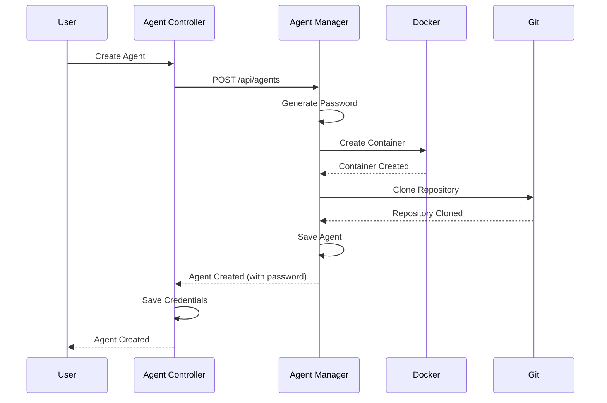

# Agent Management

Agent management enables you to create, manage, and interact with AI agents running in Docker containers.

## Overview

Agents are AI-powered entities that run in Docker containers. Each agent has:

- **Unique ID** (UUID)
- **Name** and optional description
- **Agent Type** (e.g., `opencode`)
- **Container** Docker container for agent execution
- **Credentials** Password for WebSocket authentication
- **Workspace** Git repository cloned into the container (bind-mounted from host `/opt/agents/{uuid}`; path depends on agent type, see [Container image security](../security/container-images.md))

## Creating an Agent

1. Select a client from the clients list
2. Click "Add Agent"
3. Fill in agent details:
   - **Name**: A descriptive name for the agent
   - **Description**: Optional description
   - **Agent Type**: Choose an agent type (e.g., `opencode`)
4. Click "Create"

The system will:

- Create the agent in the remote agent-manager
- Generate a secure password
- Create a Docker container for the agent
- Clone the Git repository (if configured) into the container
- Store credentials in the controller for automatic login
- Return the agent details including the password

**Important**: Save the password! You'll need it to authenticate with the agent via WebSocket (though the system handles this automatically).

## Agent Lifecycle

### Creation



### Authentication

Agents authenticate via WebSocket using their UUID or name and password:

```typescript
socket.emit('login', {
  agentId: 'agent-uuid-or-name',
  password: 'agent-password',
});
```

The system automatically handles authentication when you select an agent in the frontend.

### Container Management

- **Container Creation**: Automatically created when agent is created
- **Container Lifecycle**: Managed by the agent-manager
- **Container Logs**: Streamed in real-time via WebSocket
- **Container Stats**: CPU, memory, and network statistics

### Deletion

When an agent is deleted:

1. The Docker container is stopped and removed
2. The agent entity is deleted from the database
3. Stored credentials are deleted from the controller
4. All associated data is removed

## Agent Types

Agenstra uses **OpenCode** exclusively as the agent harness. Each agent stores `agentType: opencode` for metrics/history.

### Available Types

- **`opencode`** (only) — OpenCode via HTTP API (`opencode serve` in the worker container)

The provider advertises capabilities (including chat/streaming/tools/questions) on manager config and agent profile responses.

### Adding New Agent Types

Harness plugins (`DYNAMIC_AGENT_PROVIDERS`) are no longer supported. Pipeline and chat-filter dynamic plugins remain available — see [Dynamic provider plugins](./dynamic-provider-plugins.md).

## Agent Operations

### View Agents

- List all agents for a client
- View agent details including container status
- See agent type and configuration

### Update Agent

1. Select an agent from the list
2. Click "Update Agent"
3. Modify agent details (name, description)
4. Click "Save"

### Delete Agent

1. Select an agent from the list
2. Click "Delete Agent"
3. Confirm deletion

**Warning**: This will delete the agent, stop and remove the container, and delete all associated data.

## Container Interaction

### Chat

Send messages to agents via the chat interface. The console uses WebSocket chat events unchanged. Internally, the agent-manager speaks OpenCode’s HTTP API (`opencode serve`) inside the worker container and maps session/events to the existing chat event model.

### Terminal

The editor terminal uses the same Socket.IO forward events (`createTerminal`, `terminalInput`, `terminalOutput`, `terminalResize`, `closeTerminal`). The agent-manager creates an OpenCode PTY in the worker (not Docker exec TTY), streams I/O over the OpenCode WebSocket, and forwards bytes to the console xterm instance without client-side line buffering. When `createTerminal` omits `shell`, OpenCode chooses the shell from worker `config.shell` (or its preferred detected shell); an explicit `shell` value overrides that.

### File Operations

Read, write, create, and delete files in the agent container's workspace.

### Version Control

Perform Git operations (status, branches, commit, push, pull) in the agent container's workspace.

### Container Logs

View real-time container logs via WebSocket. Logs are streamed as they are generated.

### Container Statistics

Monitor container resource usage:

- CPU usage
- Memory usage
- Network I/O

These metrics come from the **agent-manager** via the proxied `clients` WebSocket (`containerStats`). The manager sends the first snapshot right after login, then broadcasts on a fixed interval (default **15 seconds**). Operators can change the interval with `CONTAINER_STATS_SCHEDULER_INTERVAL` (milliseconds) on the agent-manager; see [Environment Configuration](../deployment/environment-configuration.md).

For **usage statistics** (messages, filters, entity events) aggregated on the controller, see [Usage Statistics](./usage-statistics.md).

### Start, stop, and restart

From the console (through the controller) or via HTTP on the manager, you can start a stopped container, stop a running one, or restart it to pick up certain configuration changes. Exact paths are listed in [Backend Agent Manager Application](../applications/backend-agent-manager.md) and [Backend Agent Controller Application](../applications/backend-agent-controller.md) (proxied routes).

### Environment variables

Agent-scoped environment variables are stored on the **agent-manager** and applied to the agent’s Docker container. Creating, updating, or deleting a variable triggers a container restart so the process sees the new environment. Manage them from the console or via the HTTP API (manager paths, or controller-proxied paths per client).

See also [Deployment](./deployment.md) for CI/CD tokens stored in deployment configuration.

### Message filters

Per-agent regex filters live on the manager (`/api/agents-filters`). Global policies live on the controller and are documented in [Message Filter Rules](./message-filter-rules.md).

## API Endpoints

### Agent Management

- `GET /api/clients/:id/agents` - List all agents for a client
- `GET /api/clients/:id/agents/:agentId` - Get a single agent by UUID
- `POST /api/clients/:id/agents` - Create a new agent
- `POST /api/clients/:id/agents/:agentId` - Update an existing agent
- `DELETE /api/clients/:id/agents/:agentId` - Delete an agent
- `POST /api/clients/:id/agents/:agentId/start` - Start agent container (proxied)
- `POST /api/clients/:id/agents/:agentId/stop` - Stop agent container (proxied)
- `POST /api/clients/:id/agents/:agentId/restart` - Restart agent container (proxied)

For detailed API documentation, see the application and API reference docs linked below.

## Related documentation

- **[Chat Interface](./chat-interface.md)** Chat with agents
- **[File Management](./file-management.md)** File operations in containers
- **[Version Control](./version-control.md)** Git operations in containers
- **[WebSocket Communication](./websocket-communication.md)** Real-time communication
- **[Usage Statistics](./usage-statistics.md)** Controller-side usage metrics
- **[Message Filter Rules](./message-filter-rules.md)** Regex filters
- **[Dynamic provider plugins](./dynamic-provider-plugins.md)** Custom agent, pipeline, and filter providers
- **[Backend Agent Manager Application](../applications/backend-agent-manager.md)** Application details

---

_For detailed agent lifecycle information, see the application and feature docs linked below._
