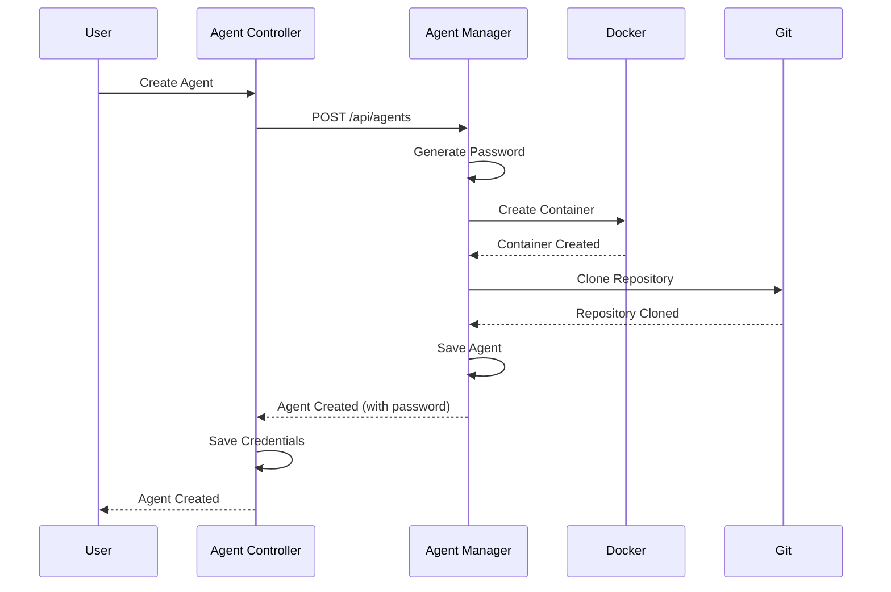

# Agent Management

Agent management enables you to create, manage, and interact with AI agents running in Docker containers.

## Overview

Agents are AI-powered entities that run in Docker containers. Each agent has:

- **Unique ID** (UUID)
- **Name** and optional description
- **Agent Type** (e.g., `opencode`)
- **Container** Docker container for agent execution
- **Credentials** Password for WebSocket authentication
- **Workspace** Git repository cloned into the container (bind-mounted from host `/opt/agents/{uuid}`; path depends on agent type, see [Container image security](../security/container-images.md))
- Repository initialization/cloning and Git credential files are prepared as the worker's `agenstra` user. Preparation checks command exit codes: authentication, host-key, or clone failures abort creation instead of reporting a ready environment with an empty workspace. Platform skills are installed outside `/app`; the repository's `.opencode` directory is left untouched.

## Creating an Agent

1. Select a client from the clients list
2. Click "Add Agent"
3. Fill in agent details:
   - **Name**: A descriptive name for the agent
   - **Description**: Optional description
   - **Agent Type**: Choose an agent type (e.g., `opencode`)
4. Click "Create"

The system will:

- Create the agent in the remote agent-manager
- Generate a secure password
- Create a Docker container for the agent
- Clone the Git repository (if configured) into the container
- Store credentials in the controller for automatic login
- Return the agent details including the password

**Important**: Save the password! You'll need it to authenticate with the agent via WebSocket (though the system handles this automatically).

## Agent Lifecycle

### Creation



### Provisioning progress

Creating an environment and updates that apply a changed environment to its container (environment variable changes, workspace configuration overrides including mass updates, OpenCode configuration sync) report live progress:

- The agent-manager tracks each operation (`create` / `update`) with a current **step** (for example `pullingImage`, `creatingContainer`, `restartingContainer`, `waitingForHealthy`) and an overall **percentage**. Image pulls report real layer download/extract progress.
- Updates of containers that use the [mounted environment](#environment-variables) report `queued` → `restartingContainer` → `waitingForHealthy` → `finalizing`, plus `restoringGitCredentials` before `finalizing` when Git credentials changed. The one-time migration of a legacy container reports `summarizingContext` → `recreatingContainer` → `restoringGitCredentials` instead.
- Progress is broadcast as `environmentProgress` on the manager `socket/agents` namespace (forwarded to the console via `socket/clients`) and is available as a snapshot via `GET /api/clients/:id/agents/progress`, so it can be shown instantly when a workspace is selected.
- Socket updates received during snapshot loading take precedence, including completed/failed operations and new operations absent from the snapshot. Reselecting or reconnecting cancels older snapshot requests for that workspace and removes stale operations.
- For workspaces that are not selected, the controller includes running operations in the `socket/status` `statusSnapshot` / `statusPatch` (`environmentProgress`) and polls faster (`STATUS_PROVISIONING_POLL_INTERVAL_MS`) while operations are running.
- The console shows an `fpc-progress` bar with the current step on each environment (and placeholder rows for environments still being created) and a stacked bar (one segment per environment) on the workspace entry. Bars disappear once the operation completes or fails.
- While the **Create** / **Save** button of the environment modals is loading, the same bar (operation, step and percentage) is shown in front of it. New environments are matched by name until they have an id.

### Authentication

Agents authenticate via WebSocket using their UUID or name and password:

```typescript
socket.emit('login', {
  agentId: 'agent-uuid-or-name',
  password: 'agent-password',
});
```

The system automatically handles authentication when you select an agent in the frontend.

### Container Management

- **Container Creation**: Automatically created when agent is created
- **Container Lifecycle**: Managed by the agent-manager
- **Container Logs**: Streamed in real-time via WebSocket
- **Container Stats**: CPU, memory, and network statistics

### Deletion

When an agent is deleted:

1. The Docker container is stopped and removed (together with its managed environment volume)
2. The agent entity is deleted from the database
3. Stored credentials are deleted from the controller
4. All associated data is removed

## Agent Types

Agenstra uses **OpenCode** exclusively as the agent harness. Each agent stores `agentType: opencode` for metrics/history.

### Available Types

- **`opencode`** (only) — OpenCode via HTTP API (`opencode serve` in the worker container)

The provider advertises capabilities (including chat/streaming/tools/questions) on manager config and agent profile responses.

### Adding New Agent Types

Harness plugins (`DYNAMIC_AGENT_PROVIDERS`) are no longer supported. Pipeline and chat-filter dynamic plugins remain available — see [Dynamic provider plugins](./dynamic-provider-plugins.md).

## Agent Operations

### View Agents

- List all agents for a client
- View agent details including container status
- See agent type and configuration

### Update Agent

1. Select an agent from the list
2. Click "Update Agent"
3. Modify agent details (name, description)
4. Click "Save"

### Delete Agent

1. Select an agent from the list
2. Click "Delete Agent"
3. Confirm deletion

**Warning**: This will delete the agent, stop and remove the container, and delete all associated data.

## Container Interaction

### Chat

Send messages to agents via the chat interface. The console uses WebSocket chat events unchanged. Internally, the agent-manager speaks OpenCode’s HTTP API (`opencode serve`) inside the worker container and maps session/events to the existing chat event model.

### Terminal

The editor terminal uses the same Socket.IO forward events (`createTerminal`, `terminalInput`, `terminalOutput`, `terminalResize`, `closeTerminal`). The agent-manager creates an OpenCode PTY in the worker (not Docker exec TTY), streams I/O over the OpenCode WebSocket, and forwards bytes to the console xterm instance without client-side line buffering. When `createTerminal` omits `shell`, OpenCode chooses the shell from worker `config.shell` (or its preferred detected shell); an explicit `shell` value overrides that.

### File Operations

Read, write, create, and delete files in the agent container's workspace.

### Version Control

Perform Git operations (status, branches, commit, push, pull) in the agent container's workspace.

### Container Logs

View real-time container logs via WebSocket. Logs are streamed as they are generated.

### Container Statistics

Monitor container resource usage:

- CPU usage
- Memory usage
- Network I/O

These metrics come from the **agent-manager** via the proxied `clients` WebSocket (`containerStats`). The manager sends the first snapshot right after login, then broadcasts on a fixed interval (default **15 seconds**). Operators can change the interval with `CONTAINER_STATS_SCHEDULER_INTERVAL` (milliseconds) on the agent-manager; see [Environment Configuration](../deployment/environment-configuration.md).

For **usage statistics** (messages, filters, entity events) aggregated on the controller, see [Usage Statistics](./usage-statistics.md).

### Start, stop, and restart

From the console (through the controller) or via HTTP on the manager, you can start a stopped container, stop a running one, or restart it to pick up certain configuration changes. Exact paths are listed in [Backend Agent Manager Application](../applications/backend-agent-manager.md) and [Backend Agent Controller Application](../applications/backend-agent-controller.md) (proxied routes).

### Environment variables

Agent-scoped environment variables are stored on the **agent-manager** and applied to the agent’s Docker container. Manage them from the console or via the HTTP API (manager paths, or controller-proxied paths per client).

**Mounted environment (no container deletion).** Worker images that carry the label `io.agenstra.environment-mount="1"` receive their environment through a managed file instead of Docker's `Config.Env`:

- On create, the manager attaches a per-agent Docker named volume (`agenstra-env-<id>`) at `/etc/agenstra/environment` and writes `environment` (NUL-separated `KEY=VALUE` entries, root-owned, mode `0600`) before the container starts.
- The worker entrypoint loads that file and starts OpenCode, the desktop/VNC stack and their child processes with the entries as **real process environment variables**. The root part of the entrypoint itself never runs with these variables.
- When environment variables, workspace configuration overrides or OpenCode network/provider secrets change, the manager rewrites the file and **restarts the container in place**. The container ID, its writable layer (for example packages installed outside `/app`) and the OpenCode session store are kept. No conversation summary is generated, and the stored container ID does not change.
- After the restart, the manager drops cached OpenCode connections, waits for OpenCode to become healthy and re-attaches the workspace file watcher.
- Git credentials (`GIT_PRIVATE_KEY`, `GIT_USERNAME`, `GIT_TOKEN`/`GIT_PASSWORD`, `GIT_REPOSITORY_URL`) are not read from the environment by Git. They are materialized as files in the container (`~/.ssh/<key>` plus `known_hosts`, or `~/.netrc`). When one of them changes, the manager rewrites these files from the container's new environment after the restart, so a rotated SSH key or token takes effect without deleting the container. `.netrc` is managed by Agenstra and is replaced as a whole; an unknown host key is only added to `known_hosts` once. A key of a different type is written next to the previous key file (for example `id_ed25519` next to `id_rsa`), which is not removed. A failure to restore the files is logged and does not fail the update.
- Commands the manager runs via `docker exec` (terminal, Git, file operations) receive the same effective environment.
- Values are passed **verbatim** (no shell quoting or escaping). Secrets are no longer visible in `docker inspect` (`Config.Env` only contains image defaults).
- Variable names must match `^[A-Za-z_][A-Za-z0-9_.-]*$`. Other names (for example exported shell functions such as `BASH_FUNC_name%%`) are skipped with a warning and never reach the container.

**Precedence and removal.** Agent-level variables take precedence over workspace configuration overrides and OpenCode network/provider secrets with the same name. When an agent variable replaces such a value, the manager remembers the replaced value (encrypted in the agent record). Workspace overrides and secret changes for that name only update the remembered value and do not restart the container. Deleting or renaming the agent variable restores the remembered value, or removes the name from the container when it did not exist before. For agents created before this tracking existed, deleting a variable removes it from the container; a value it replaced before the upgrade is not restored automatically (OpenCode network/provider secrets are re-applied by the next OpenCode configuration sync).

**Legacy containers.** Containers created before this mechanism (or from images without the label) still receive environment changes by recreation. The first environment change after upgrading the worker image recreates such a container **once** and migrates its environment into the managed volume. From then on, it is only restarted. Because a recreated container starts with a fresh writable layer, the manager re-provisions the Git credential files after every recreate. SSH keys that older versions stored with escaped line breaks (sometimes escaped twice) are decoded when the files are re-provisioned.

A running process cannot have its environment changed from outside, so applying a change always restarts the container's processes. Only the container restart is unavoidable; the container itself is never deleted.

See also [Deployment](./deployment.md) for CI/CD tokens stored in deployment configuration.

### Message filters

Per-agent regex filters live on the manager (`/api/agents-filters`). Global policies live on the controller and are documented in [Message Filter Rules](./message-filter-rules.md).

## API Endpoints

### Agent Management

- `GET /api/clients/:id/agents` - List all agents for a client
- `GET /api/clients/:id/agents/progress` - Running environment create / update operations (step + percentage)
- `GET /api/clients/:id/agents/:agentId` - Get a single agent by UUID
- `POST /api/clients/:id/agents` - Create a new agent
- `POST /api/clients/:id/agents/:agentId` - Update an existing agent
- `DELETE /api/clients/:id/agents/:agentId` - Delete an agent
- `POST /api/clients/:id/agents/:agentId/start` - Start agent container (proxied)
- `POST /api/clients/:id/agents/:agentId/stop` - Stop agent container (proxied)
- `POST /api/clients/:id/agents/:agentId/restart` - Restart agent container (proxied)

For detailed API documentation, see the application and API reference docs linked below.

## Related documentation

- **[Chat Interface](./chat-interface.md)** Chat with agents
- **[File Management](./file-management.md)** File operations in containers
- **[Version Control](./version-control.md)** Git operations in containers
- **[WebSocket Communication](./websocket-communication.md)** Real-time communication
- **[Usage Statistics](./usage-statistics.md)** Controller-side usage metrics
- **[Message Filter Rules](./message-filter-rules.md)** Regex filters
- **[Dynamic provider plugins](./dynamic-provider-plugins.md)** Custom agent, pipeline, and filter providers
- **[Backend Agent Manager Application](../applications/backend-agent-manager.md)** Application details

---

_For detailed agent lifecycle information, see the application and feature docs linked below._
