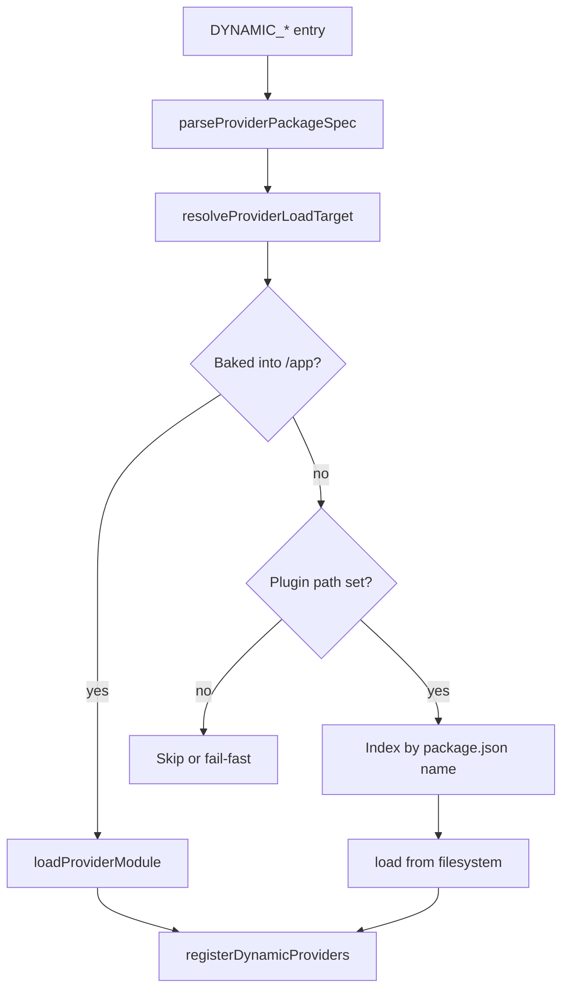

# Dynamic provider plugins

Agenstra backends can register **extra provider implementations at runtime** from comma-separated `DYNAMIC_*` environment variables. The same mechanism supports **baked-in** packages (present in the app image deploy graph) and **post-build** plugins (mounted or installed into a container path without rebuilding the image).

This page covers **Agenstra** backends only: **agent controller** and **agent manager**. Payment processor and billing UI plugins are documented in the Decabill product documentation site.

## Overview

Several registries accept a static built-in set plus optional plugins:

| Backend          | Env var                            | Criticality | Registers                         |
| ---------------- | ---------------------------------- | ----------- | --------------------------------- |
| Agent controller | `DYNAMIC_PROVISIONING_PROVIDERS`   | critical    | Cloud provisioning providers      |
| Agent controller | `DYNAMIC_CONTEXT_IMPORT_PROVIDERS` | optional    | External context import providers |
| Agent manager    | `DYNAMIC_AGENT_PROVIDERS`          | optional    | Agent backend implementations     |
| Agent manager    | `DYNAMIC_PIPELINE_PROVIDERS`       | optional    | CI/CD pipeline providers          |
| Agent manager    | `DYNAMIC_CHAT_FILTERS`             | optional    | Chat filter plugins               |

Shared tuning:

| Variable                          | Purpose                                                                   |
| --------------------------------- | ------------------------------------------------------------------------- |
| `DYNAMIC_PROVIDERS_FAIL_FAST`     | When `true`, **critical** registries abort startup on load errors         |
| `DYNAMIC_PROVIDER_PLUGIN_PATH`    | Absolute plugin root inside the container (post-build loading)            |
| `DYNAMIC_PROVIDER_PLUGIN_INSTALL` | Comma-separated `npm install` targets run at startup into the plugin path |

Implementation lives in `@forepath/shared/backend/util-dynamic-provider-registry`. Export contract, API surface, and security rules are documented in the sections below.

## Resolution order

For each `DYNAMIC_*` entry the loader:

1. **Baked-in** — resolves the package from `/app/package.json` (image build / `nx run <app>:prune` graph).
2. **Plugin path** — looks up the package by `package.json` `name` under `DYNAMIC_PROVIDER_PLUGIN_PATH` (immediate child directories and `node_modules` after startup install).
3. **Fail** — logs and skips the entry, or aborts startup when the registry is **critical** and `DYNAMIC_PROVIDERS_FAIL_FAST=true`.

Baked-in wins when the same package exists in both places.



## Config format

```bash
# alias=@package/specifier (package name whether baked-in or mounted)
DYNAMIC_PROVISIONING_PROVIDERS=acme=@forepath/agenstra/backend/provisioning-acme

# PascalCase alias selects a named class export from the package
DYNAMIC_AGENT_PROVIDERS=AcmeAgent=@forepath/agenstra/backend/agent-acme

# bare specifier
DYNAMIC_PIPELINE_PROVIDERS=@forepath/agenstra/backend/pipeline-acme

# file: entry — directory relative to DYNAMIC_PROVIDER_PLUGIN_PATH
DYNAMIC_PROVISIONING_PROVIDERS=acme=file:provisioning-acme
```

Allowed package name prefixes: `@forepath/`, `@agenstra/`. Do not combine `file:` with an `@forepath/` specifier on the same entry.

## Plugin package contract

External packages must export one of:

1. **`createProvider`** (preferred) — `(moduleRef: ModuleRef) => T | Promise<T>`
2. **Named PascalCase class** — via entry alias or `package.json`:

```json
{
  "forepath": {
    "providerExport": "AcmeProvisioningProvider"
  }
}
```

Declare Nest and host dependencies as **peerDependencies** so they resolve from `/app/node_modules`.

Generic `provider` / `Provider` exports are not accepted for production plugin packages.

## Baked-in plugins (image build)

1. Add the provider package to the backend app deploy graph (`implicitDependencies`, import edge, or pruned `package.json`).
2. Set the relevant `DYNAMIC_*` variable.
3. Rebuild the container image (`nx run <app>:api-container-image`).

Verify the package appears under `dist/apps/agenstra/<app>/package.json` or `workspace_modules/` after `nx run <app>:prune`.

## Post-build plugins (no image rebuild)

Use this when operators add providers **after** the image exists.

1. Build the plugin (`nx build <plugin-lib>`) to produce compiled JS and `package.json`.
2. Deliver the plugin:
   - **Mount** — copy the folder into host `./provider-plugins/` (compose mounts it at `/var/lib/forepath/provider-plugins` when you enable plugins), and/or
   - **Install** — set `DYNAMIC_PROVIDER_PLUGIN_INSTALL` (see below).
3. Set `DYNAMIC_PROVIDER_PLUGIN_PATH` to `/var/lib/forepath/provider-plugins` (or your chosen absolute path inside the container).
4. Set `DYNAMIC_*` to reference the package **name** or a `file:` directory.
5. Restart the container.

At startup, when `DYNAMIC_PROVIDER_PLUGIN_PATH` is set, the API entrypoint runs `install-provider-plugins.js` before `main.js`. Install failures fail the container start.

### Startup install format

```bash
# Registry package (requires .npmrc / token in image or mounted secret)
DYNAMIC_PROVIDER_PLUGIN_INSTALL=@forepath/agenstra-provisioning-acme@1.2.0

# Paths under the plugin root (absolute or relative to plugin path)
DYNAMIC_PROVIDER_PLUGIN_INSTALL=file:/var/lib/forepath/provider-plugins/acme.tgz,file:provisioning-acme

# Mixed
DYNAMIC_PROVIDER_PLUGIN_INSTALL=file:acme.tgz,@forepath/agenstra/backend/agent-acme@2.0.0
```

Compose mounts `./provider-plugins` read-write when plugins are enabled. Use `:ro` only when plugins are pre-copied and `DYNAMIC_PROVIDER_PLUGIN_INSTALL` is unset.

### Verify

```bash
docker exec <container> node -e "require('/var/lib/forepath/provider-plugins/node_modules/@forepath/...')"
```

Or inspect startup logs for `DynamicProviderRegistry` / loader errors.

## Startup error policy

| Registry criticality | `DYNAMIC_PROVIDERS_FAIL_FAST` | On load error      |
| -------------------- | ----------------------------- | ------------------ |
| optional             | any                           | Log and skip entry |
| critical             | unset / `false`               | Log and skip entry |
| critical             | `true`                        | Abort startup      |

**Production:** set `DYNAMIC_PROVIDERS_FAIL_FAST=true` when `DYNAMIC_PROVISIONING_PROVIDERS` is non-empty.

## Security

- Package `name` in indexed `package.json` files must use allowlisted prefixes (`@forepath/`, `@agenstra/`).
- `file:` paths are resolved under `DYNAMIC_PROVIDER_PLUGIN_PATH` only; `..` traversal and paths outside the plugin root are rejected (`realpath` guard).
- Private registry installs require operator-supplied `.npmrc` or token mounts; the loader does not manage registry auth.

## Where each registry is used

### Agent controller

- **Provisioning** — [Server Provisioning](./server-provisioning.md) lists built-in Hetzner and DigitalOcean providers; `DYNAMIC_PROVISIONING_PROVIDERS` adds more for `GET /api/clients/provisioning/providers` and provision flows.
- **Context import** — [Atlassian import](./atlassian-import.md) registers Atlassian statically; `DYNAMIC_CONTEXT_IMPORT_PROVIDERS` can add other import backends to the same factory.

### Agent manager

- **Agents** — [Agent Management](./agent-management.md); `DYNAMIC_AGENT_PROVIDERS` extends agent types beyond built-in cursor/openclaw/opencode providers.
- **Pipelines** — [Deployment](./deployment.md); `DYNAMIC_PIPELINE_PROVIDERS` adds CI/CD backends.
- **Chat filters** — [Message Filter Rules](./message-filter-rules.md); `DYNAMIC_CHAT_FILTERS` adds filter implementations on the manager.

## Docker Compose (optional plugins)

`DYNAMIC_PROVIDER_PLUGIN_PATH` is **unset by default** in compose. Enable post-build plugins explicitly:

```yaml
environment:
  DYNAMIC_PROVIDER_PLUGIN_PATH: /var/lib/forepath/provider-plugins
  DYNAMIC_PROVIDER_PLUGIN_INSTALL: ${DYNAMIC_PROVIDER_PLUGIN_INSTALL:-}
volumes:
  - ./provider-plugins:/var/lib/forepath/provider-plugins
```

The mount is read-write so `DYNAMIC_PROVIDER_PLUGIN_INSTALL` can write `package.json` and `node_modules`. Use `:ro` only when plugins are pre-copied and startup install is disabled.

See [Docker Deployment](../deployment/docker-deployment.md) and [Applications](../applications/README.md).

## Related documentation

- **[Environment configuration](../deployment/environment-configuration.md)** — `DYNAMIC_*` variable reference
- **[Server Provisioning](./server-provisioning.md)** — Built-in provisioning providers
- **[Agent Management](./agent-management.md)** — Agent types and lifecycle
- **[Atlassian import](./atlassian-import.md)** — Built-in context import provider
- **[Deployment](./deployment.md)** — CI/CD providers on the manager
- **[Backend Agent Controller](../applications/backend-agent-controller.md)** — Controller env and compose
- **[Backend Agent Manager](../applications/backend-agent-manager.md)** — Manager env and compose
