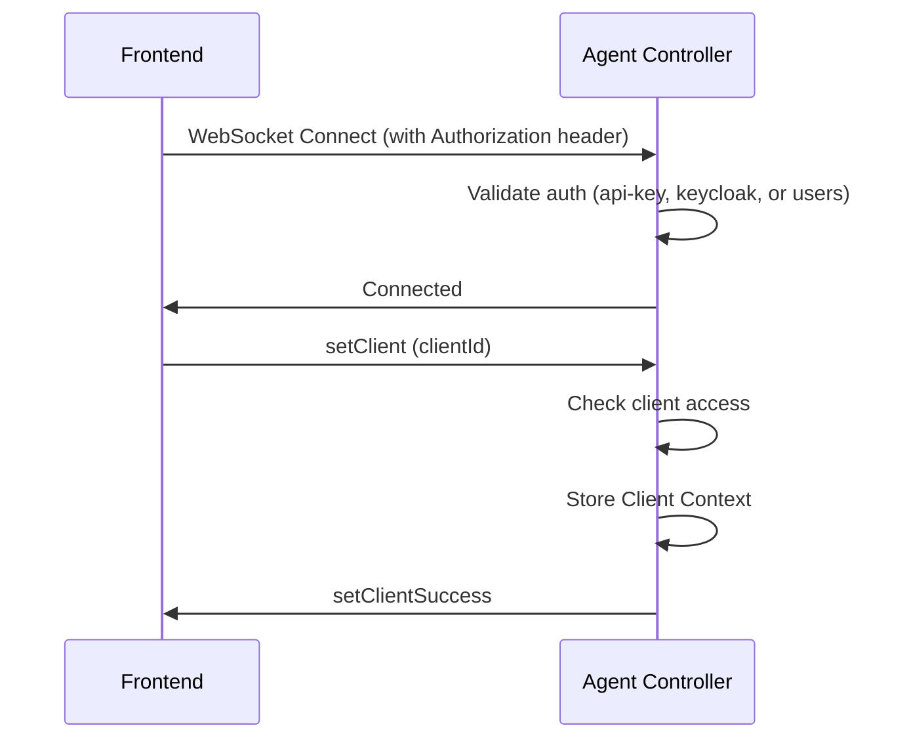
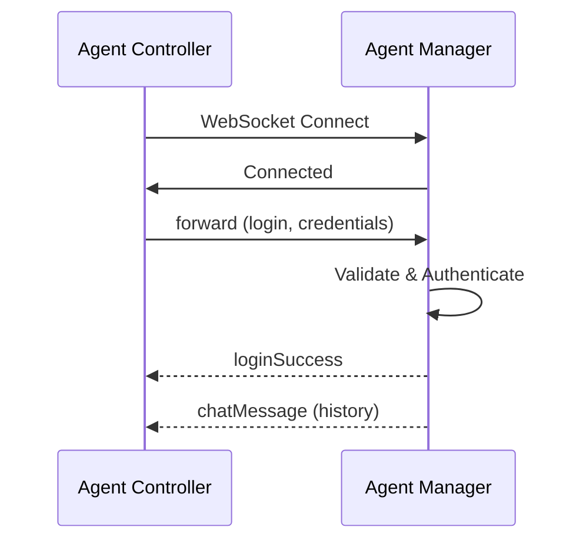
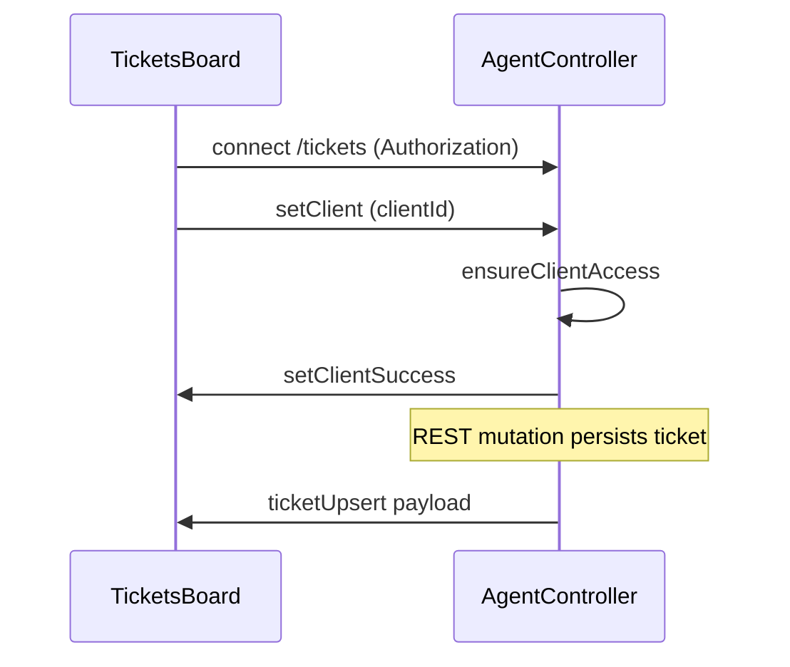
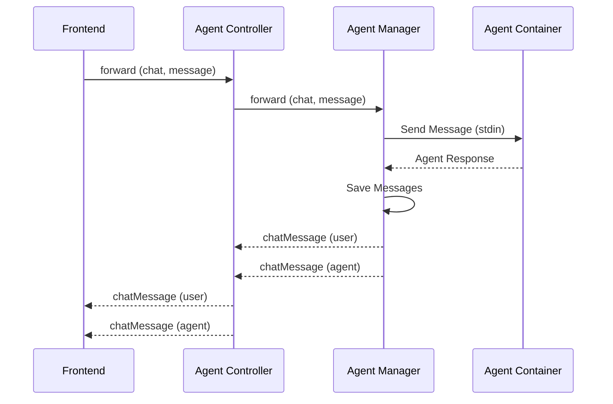

# WebSocket Communication

Real-time bidirectional communication between frontend, controller, and manager using Socket.IO WebSocket connections.

## Overview

Agenstra uses WebSocket (Socket.IO) for real-time bidirectional communication. The architecture supports:

- **Frontend ↔ Controller (`clients` namespace)**: Workspace selection (`setClient`), `forward` to remote agent-managers, and controller-originated ticket hints for chat
- **Frontend ↔ Controller (`tickets` namespace)**: Ticket board and automation realtime for subscribers
- **Frontend ↔ Controller (`status` namespace)**: Per-user workspace/environment notification state (git dirty, unread chat) without `setClient`
- **Controller ↔ Manager**: Event forwarding to remote agent-managers
- **Manager ↔ Agent Containers**: Real-time chat and container communication

On the controller, **`clients`**, **`tickets`**, **`pages`** (knowledge), and **`status`** share the same TCP port (`WEBSOCKET_PORT`); namespaces are selected in the Socket.IO client path.

## Authentication

WebSocket connections to the controller require authentication. Pass the `Authorization` header in the handshake (same as HTTP):

- **API key**: `Bearer <static-api-key>` or `ApiKey <static-api-key>`
- **Keycloak**: `Bearer <keycloak-jwt-token>`
- **Users**: `Bearer <jwt-token>`

Unauthenticated connections are rejected with `connect_error` "Unauthorized". The `setClient` operation enforces per-client authorization: only users with access to the requested client (global admin, client creator, or client_users entry) can set that client context. Unauthorized attempts emit an `error` event with message "You do not have access to this client".

### Agent console status (`status` namespace)

The agent console opens a dedicated Socket.IO connection to **`status`** (derived from `controller.websocketUrl` by replacing `/clients` with `/status`, or via `controller.statusWebsocketUrl`). Handshake auth matches other controller namespaces.

- **No `setClient`**: the stream is scoped to the authenticated user only.
- **On connect**: server emits **`statusSnapshot`** with all accessible workspaces/environments (git dirty + unread flags).
- **While connected**: server emits **`statusPatch`** for deltas; background polling (`STATUS_POLL_INTERVAL_MS`, default 30s) refreshes git state and catches unread when no `clients` socket is active. Successful VCS mutations proxied through the controller (stage, commit, fetch, pull, push including force, branch operations, conflict resolve, prepare-clean workspace) also emit **`statusPatch`** immediately to every user with access to that workspace.
- **Agent workspace changes**: agent-manager broadcasts **`gitStateChanged`** on the agents namespace after file writes, file-update notifications, workspace-affecting agent tool results, and local VCS/file mutations. The controller **`clients`** gateway listens for **`gitStateChanged`** and **`fileUpdateNotification`**, then pushes **`statusPatch`** on the **`status`** namespace to users with workspace access (same security model as VCS proxy hooks).
- **Client → server**: `markEnvironmentRead` `{ clientId, agentId }`, `setActiveEnvironment` `{ clientId, agentId | null }`.
- **Unread** includes agent chat replies and live ticket automation chat card updates; read cursors persist in `user_environment_read_state` on the controller database.

See `libs/domains/framework/backend/feature-agent-controller/spec/asyncapi.yaml` and `libs/domains/framework/frontend/data-access-agent-console/docs/notifications-state.mmd`.

### Billing manager (dashboard status)

The billing console can open a second Socket.IO connection to the **billing-manager** status gateway (default namespace `/billing`, separate TCP port from REST). Handshake auth matches HTTP (`Bearer` JWT for users or Keycloak). **Static API key** auth does not receive a user-scoped billing stream; `subscribeDashboardStatus` is rejected with an `error` event, consistent with REST returning "User not authenticated" for API-key-only requests.

The server selects subscriptions **only** from the authenticated user’s data on every poll tick and emits `dashboardStatusUpdate` **only** to that socket (no rooms). See `libs/domains/framework/backend/feature-billing-manager/spec/asyncapi.yaml`.

## Connection Flow

### Frontend to Controller



### Controller to Manager



## Events

### Frontend → Controller

#### setClient

Set the client context for subsequent operations:

```typescript
socket.emit('setClient', {
  clientId: 'client-uuid',
});
```

#### forward

Forward an event to the remote agent-manager:

```typescript
socket.emit('forward', {
  event: 'chat',
  payload: { message: 'Hello, agent!' },
  agentId: 'agent-uuid', // Optional, for auto-login
});
```

### Controller → Frontend (`clients` namespace)

#### setClientSuccess

Confirmation that client context was set (or was already selected):

```typescript
{
  clientId: 'client-uuid',
  message: 'Client context set'
}
```

#### forwardAck

Acknowledgement that a `forward` command was accepted for dispatch to the manager.

#### Proxied manager events

The controller re-emits manager events **using their original event names** to the initiating browser socket only (for example `chatMessage`, `containerStats`, `terminalOutput`). Shapes match the agent-manager AsyncAPI.

#### Controller-originated ticket events (still on `clients`)

To refresh ticket metadata in chat without subscribing to `tickets`, the controller may emit `ticketChatTicketUpsert` and automation timeline payloads such as `ticketAutomationRunChatUpsert` to room `client:{clientId}`. See the agent-controller AsyncAPI for fields.

### Manager → Controller

#### loginSuccess

Authentication successful:

```typescript
{
  message: 'Welcome, Agent Name!';
}
```

#### chatMessage

Chat messages (user or agent):

```typescript
// User message
{
  from: 'user',
  text: 'Hello, agent!',
  timestamp: '2024-01-01T00:00:00Z'
}

// Agent message
{
  from: 'agent',
  response: {
    type: 'text',
    result: 'Hello, user!'
  },
  timestamp: '2024-01-01T00:00:00Z'
}
```

## Tickets board realtime (`tickets` namespace)

Use a second Socket.IO connection to the same controller WebSocket origin with namespace **`tickets`** (override via `TICKETS_WEBSOCKET_NAMESPACE` on the server).

### Flow



### Client → Server

- `setClient` with `{ clientId }` – joins Socket.IO room `client:{clientId}` when authorized

### Server → Client

Typical events include `ticketUpsert`, `ticketRemoved`, `ticketCommentCreated`, `ticketActivityCreated`, `ticketAutomationUpsert`, `ticketAutomationRunUpsert`, and `ticketAutomationRunStepAppended`. Errors use the `error` event on this namespace.

See **[Tickets and Workspaces](./tickets-and-workspaces.md)** for product context and **[Backend Agent Controller Application](../applications/backend-agent-controller.md)** for configuration.

## Reconnection Handling

### Frontend Reconnection

When the frontend reconnects to the controller:

1. WebSocket automatically reconnects (repeat for `tickets` if used)
2. Frontend sends `setClient` event to restore context on each namespace
3. Frontend sends `forward` event with `login` to restore agent login (`clients` only)
4. Controller forwards login to manager
5. Manager restores chat history
6. Frontend clears old events to prevent duplicates

### Controller-to-Manager Reconnection

When the controller reconnects to a manager:

1. WebSocket automatically reconnects
2. Controller automatically restores agent logins for all previously logged-in agents
3. Manager restores chat history for each agent
4. Events are forwarded to the frontend

## Chat History Restoration

Chat history is automatically restored on reconnection:

1. When an agent logs in, the manager loads and emits all chat history
2. History is sent as `chatMessage` events
3. Frontend receives and displays the history
4. Old events are cleared to prevent duplicates

## Event Forwarding

The controller forwards events bidirectionally:

- **Frontend → Manager**: User events (chat, file operations, etc.)
- **Manager → Frontend**: Agent responses and events

### Example: Chat Message Flow



## Error Handling

### Connection Errors

- Automatic reconnection with exponential backoff
- State restoration on reconnection
- Error events sent to frontend

### Authentication Errors

- `connect_error` "Unauthorized" when WebSocket auth fails
- `error` "You do not have access to this client" when setClient is forbidden
- `loginError` event on agent authentication failure
- Generic error messages to prevent information disclosure
- Automatic retry on reconnection

## Related Documentation

- **[Chat Interface](./chat-interface.md)** - Chat functionality details
- **[Tickets and Workspaces](./tickets-and-workspaces.md)** - Ticket board and automation
- **[Agent Management](./agent-management.md)** - Agent authentication
- **[Backend Agent Controller Application](../applications/backend-agent-controller.md)** - Controller WebSocket details
- **[Backend Agent Manager Application](../applications/backend-agent-manager.md)** - Manager WebSocket details

---

_For detailed WebSocket event specifications, see the [API Reference](../api-reference/README.md) and the published [Agent Controller AsyncAPI](/spec/agent-controller/asyncapi.yaml) and [Agent Manager AsyncAPI](/spec/agent-manager/asyncapi.yaml)._
