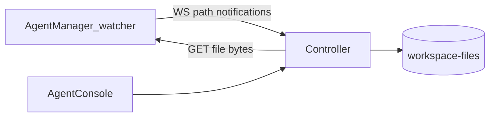

# Workspace code search

IDE-like search across an agent workspace: path and text content, with include/exclude path filters.

## Architecture

| Layer                | Role                                                                                                                                                                                               |
| -------------------- | -------------------------------------------------------------------------------------------------------------------------------------------------------------------------------------------------- |
| **Agent manager**    | Watches the workspace (`inotifywait` via docker exec) and emits **notifications only** (`workspaceIndexChanged`, `workspaceIndexRebuildRequired`, system `fileUpdateNotification`). No OpenSearch. |
| **Agent controller** | Owns OpenSearch index `agenstra-workspace-files`. Hydrates file text via the existing file proxy. Serves search / status / reindex HTTP APIs.                                                      |
| **Frontend**         | Sidebar **Files** / **Search** tabs; talks only to the controller.                                                                                                                                 |

## Multi-workspace isolation

One physical OpenSearch index holds many logical corpora keyed by `clientId` + `agentId`. Every search/status/reindex path uses client/agent route guards, then mandatory OpenSearch term filters (fail closed). Agent delete purges that corpus.

## Index lifecycle

1. After workspace setup, manager starts the watcher and emits `workspaceIndexRebuildRequired`.
2. Controller clears docs for that agent and walks/lists files (or uses optional path seeds), indexing paths + text bodies (2A rules: skip binaries’ bodies, ignore `.git` / `node_modules` / secrets, ~10MB text cap).
3. Differential updates from API writes, VCS bulk ops, and inotify.
4. Status per agent: `missing` | `indexing` | `ready` | `error` — Search panel empty states mirror these.
5. **Controller restart:** in-memory status is empty, but OpenSearch docs remain (when the OpenSearch volume persists). The first status/search call for an agent **recovers** by counting existing docs for that `clientId`+`agentId` and marks the corpus `ready` when `docCount > 0` — no full rebuild. Empty corpora stay `missing` until reindex or the first path change.

## Frontend

- Tabs: Files (`Ctrl/Cmd+Shift+E`), Search when the sidebar is visible.
- Search modes (one Search tab, radio switch):
  - **Full** (`Ctrl/Cmd+F`): path, file name, and text content (substring / partial matches).
  - **Files** (`Ctrl/Cmd+Shift+F`): path and file name only (same substring matching; no content hits or snippets).
- Empty states: No index yet / Indexing… / No results / Index unavailable.
- Results: each file is a row. When the hit has text excerpts, an accordion expands to list every matching line as a selectable item (including a single text match). Path-only hits (no excerpt) stay a flat file row.
- Rebuild index button triggers controller reindex + manager rebuild signal.
- System `fileUpdateNotification` refreshes open previews (dirty → accept/reject modal).

## API (controller)

- `GET /clients/{id}/agents/{agentId}/workspace-search?q=&mode=full|files&include=&exclude=`
- `GET /clients/{id}/agents/{agentId}/workspace-search/status`
- `POST /clients/{id}/agents/{agentId}/workspace-search/reindex`

Manager (optional): `POST /agents/{agentId}/workspace-index/rebuild-signal`
