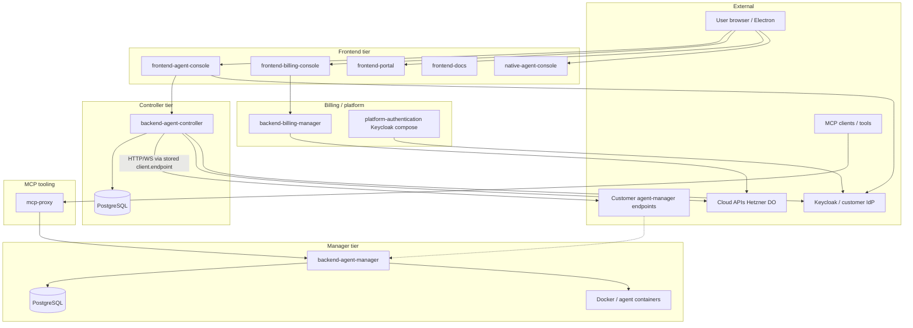

# Threat model

This model covers **deployable applications** in the Agenstra monorepo (`apps/*`). It supports **BSI / ISMS-style** traceability and **CRA-oriented** technical documentation ([Compliance and standards](./compliance-and-standards.md), Art. 13 and Annex I) using **trust boundaries**, **data-flow review**, and **STRIDE**-style categories. It is not a penetration-test report. Scored risks are in **[Risk profile](./risk-profile.md)**; deliberate residuals are in **[Accepted risks](./accepted-risks.md)**.

**Review cadence:** service rows use last reviewed **2026-05-20** and next review **2027-05-06** unless a row states otherwise; trigger an early review if trust boundaries, authentication, proxy behavior, container layout, or an application’s exposure model changes materially.

---

## Product scope and intended use

**Intended use:** Operators run Agenstra to manage **remote agent-manager** instances, interact with **AI agents** in containers, edit workspace files, run Git operations, provision cloud hosts, and (where licensed) use billing and portal surfaces.

**Reasonably foreseeable use:** Misconfigured `client.endpoint` or `CONFIG` URLs; shared `STATIC_API_KEY`; exposing manager Docker sockets to untrusted networks; using the desktop shell for general browsing; relying on report-only CSP in production without monitoring.

## Trust boundaries

The controller reaches an agent-manager (**BAM** or another host) only through each client’s stored **`client.endpoint`** (**RemoteAM**). The dotted edge means that URL often resolves to a manager instance; it is not a separate bypass of **B3**.

| Boundary | Crosses                                                                                    | Primary assets                                           |
| -------- | ------------------------------------------------------------------------------------------ | -------------------------------------------------------- |
| B1       | Internet → frontend Express/Angular                                                        | Session tokens, runtime config, CSP surface              |
| B2       | Frontend → controller API/WS                                                               | User auth, client IDs, ticket data                       |
| B3       | Controller → customer `client.endpoint`                                                    | Stored client credentials, SSRF target                   |
| B4       | Controller and **billing-manager** → cloud provisioning APIs (SSH, cloud-init; **AR-001**) | API tokens, SSH keys, user-data                          |
| B5       | Controller/manager → PostgreSQL                                                            | Clients, agents, credentials, tickets                    |
| B6       | Manager → Docker socket                                                                    | Container lifecycle, host filesystem under `/opt/agents` |
| B7       | Manager → agent containers                                                                 | Workspace files, Git creds, agent passwords, VNC/SSH     |
| B8       | MCP client → mcp-proxy → manager                                                           | Tool invocation, agent APIs                              |
| B9       | Desktop shell → same as browser                                                            | Local storage, `window.open`, no code signing (AR-002)   |

Detail: [System overview](../architecture/system-overview.md), [Data flow](../architecture/data-flow.md), [Compliance — trust boundaries](./compliance-and-standards.md#trust-boundaries-summary).

## Threat actors

| Actor                         | Capability                       | Typical goal                                                |
| ----------------------------- | -------------------------------- | ----------------------------------------------------------- |
| **Anonymous remote**          | Network access to exposed APIs   | Probe auth, abuse rate limits, fuzz endpoints               |
| **Authenticated user**        | Valid portal/console session     | Escalate to other clients/agents, exfiltrate workspace data |
| **Compromised browser**       | XSS, malicious extension (web)   | Steal tokens, drive API calls, WebSocket abuse              |
| **Compromised controller**    | DB + outbound proxy              | Pivot to all connected managers, SSRF internal networks     |
| **Compromised manager**       | Docker socket                    | Escape to host, mine crypto, lateral movement               |
| **Malicious agent/container** | Code in workspace                | Steal mounted secrets, attack manager API                   |
| **Cloud / supply chain**      | Weak cloud-init, image tampering | Host takeover, credential theft                             |
| **Insider operator**          | Admin APIs, env secrets          | Data theft, disable controls                                |

## Service inventory

| Application                | Role                                 | Default exposure            | Last reviewed  | Next review date |
| -------------------------- | ------------------------------------ | --------------------------- | -------------- | ---------------- |
| `frontend-agent-console`   | Primary web IDE / chat               | Public HTTPS                | **2026-05-20** | **2027-05-06**   |
| `backend-agent-controller` | Control plane, proxy, provisioning   | Internal or public API      | **2026-05-20** | **2027-05-06**   |
| `backend-agent-manager`    | Agents, Docker, WebSocket            | Customer network / internal | **2026-05-20** | **2027-05-06**   |
| `frontend-billing-console` | Billing UI                           | Restricted / admin          | **2026-05-20** | **2027-05-06**   |
| `backend-billing-manager`  | Billing, provisioning templates      | Restricted / admin          | **2026-05-20** | **2027-05-06**   |
| `frontend-portal`          | Marketing / landing                  | Public static               | **2026-05-20** | **2027-05-06**   |
| `frontend-docs`            | Documentation site                   | Public static               | **2026-05-20** | **2027-05-06**   |
| `native-agent-console`     | Electron wrapper                     | User desktop                | **2026-05-20** | **2027-05-06**   |
| `mcp-proxy`                | MCP bridge to manager APIs           | Local or trusted network    | **2026-05-20** | **2027-05-06**   |
| `mcp-devkit`               | MCP development utilities            | Dev machines only           | **2026-05-20** | **2027-05-06**   |
| `platform-authentication`  | Keycloak docker-compose for dev/demo | Local / private network     | **2026-05-20** | **2027-05-06**   |

Worker, VNC, and SSH **images** are not separate Node apps but are in scope as **manager-spawned** attack surfaces (boundary B7). Review dates for those images follow **`backend-agent-manager`** unless spawn logic or sidecar images change materially.

---

## `frontend-agent-console` (and shared `frontend-*` Express)

| ID      | STRIDE                 | Threat                                                | Mitigation / note                                                                                                                        |
| ------- | ---------------------- | ----------------------------------------------------- | ---------------------------------------------------------------------------------------------------------------------------------------- |
| T-FE-01 | Spoofing               | Stolen session or API key reused from browser storage | HTTPS, HttpOnly cookies where used, Keycloak/OIDC; see [Authentication](../features/authentication.md)                                   |
| T-FE-02 | Tampering              | Malicious runtime `CONFIG` JSON alters API endpoints  | `CONFIG_*` allowlists, HTTPS, DNS checks — [Operational hardening](./operational-hardening.md#frontend-runtime-configuration-get-config) |
| T-FE-03 | Repudiation            | Insufficient client-side logging of security events   | Server-side access logs with correlation IDs on backends                                                                                 |
| T-FE-04 | Information disclosure | XSS exfiltrates tokens or workspace paths             | CSP (report-only default); **AR-003**; Monaco requires `unsafe-eval`                                                                     |
| T-FE-05 | Denial of service      | Large payloads to Express static/API                  | Rate limits on backends; CDN/size limits for static                                                                                      |
| T-FE-06 | Elevation              | Client-side route guard bypass only                   | Server-side authorization on all mutations                                                                                               |

## `backend-agent-controller`

| ID      | STRIDE                 | Threat                                             | Mitigation / note                                                                                                                                     |
| ------- | ---------------------- | -------------------------------------------------- | ----------------------------------------------------------------------------------------------------------------------------------------------------- |
| T-AC-01 | Spoofing               | Weak or shared `STATIC_API_KEY`                    | Prefer Keycloak; rotate keys; **AR-004**                                                                                                              |
| T-AC-02 | Tampering              | Ticket/client record tampering via IDOR            | Per-client permissions, repository checks                                                                                                             |
| T-AC-03 | Information disclosure | SSRF via `client.endpoint` to internal services    | Allowlists, TLS, DNS rebinding checks — [Operational hardening](./operational-hardening.md#agent-controller--remote-client-endpoints-ssrf)            |
| T-AC-04 | Information disclosure | User JWT forwarded to remote manager on HTTP proxy | Stripped proxy headers; separate client credentials — [Operational hardening](./operational-hardening.md#http-proxy-to-remote-agent-manager--headers) |
| T-AC-05 | Denial of service      | WebSocket fan-out exhaustion                       | Rate limits; connection management                                                                                                                    |
| T-AC-06 | Elevation              | Admin automation/import APIs abused                | Role guards; admin-only routes                                                                                                                        |
| T-AC-07 | Information disclosure | Logs leak secrets                                  | `redactSecretsInString`, `redactSensitive`                                                                                                            |

## `backend-agent-manager`

| ID      | STRIDE                 | Threat                                      | Mitigation / note                                                                                   |
| ------- | ---------------------- | ------------------------------------------- | --------------------------------------------------------------------------------------------------- |
| T-AM-01 | Spoofing               | Agent login with stolen password/API key    | Per-agent credentials; WebSocket auth                                                               |
| T-AM-02 | Tampering              | Arbitrary file write in container workspace | Path validation; container isolation                                                                |
| T-AM-03 | Information disclosure | Docker socket abuse from compromised API    | Non-root `agenstra`, restricted `sudo`, socket GID sync — [Container images](./container-images.md) |
| T-AM-04 | Elevation              | Container escape to host                    | Non-root user, minimal caps; deployer hardening                                                     |
| T-AM-05 | Denial of service      | Runaway containers / log streams            | Resource limits (deployer); manager controls                                                        |
| T-AM-06 | Information disclosure | Git credentials in worker `$HOME`           | Credentials under `/home/agenstra`; host mount permissions                                          |
| T-AM-07 | Spoofing               | VNC/SSH sidecar password guessing           | Runtime passwords; network isolation                                                                |

## `backend-billing-manager` / `frontend-billing-console`

| ID      | STRIDE                 | Threat                                             | Mitigation / note                                   |
| ------- | ---------------------- | -------------------------------------------------- | --------------------------------------------------- |
| T-BM-01 | Information disclosure | Cloud provider API keys in env                     | Secrets via env/vault; not in images                |
| T-BM-02 | Elevation              | Provisioning scripts yield **root SSH** on new VMs | **AR-001**; key-only SSH; deployer network controls |
| T-BM-03 | Tampering              | Billing or subscription data altered               | DB authz; admin-only surfaces                       |
| T-BC-01 | Information disclosure | Billing UI exposes PII                             | AuthN/Z on billing routes; HTTPS                    |

## `frontend-portal` / `frontend-docs`

| ID      | STRIDE                 | Threat                              | Mitigation / note                                  |
| ------- | ---------------------- | ----------------------------------- | -------------------------------------------------- |
| T-PO-01 | Tampering              | Static site supply-chain defacement | Build integrity, hosting controls                  |
| T-PO-02 | Information disclosure | Form or analytics data leakage      | Minimal collection; cookie consent util where used |

## `native-agent-console`

| ID      | STRIDE                 | Threat                                          | Mitigation / note                                       |
| ------- | ---------------------- | ----------------------------------------------- | ------------------------------------------------------- |
| T-NA-01 | Spoofing               | Unsigned binary substituted in download         | **AR-002**; SHA256 manifests                            |
| T-NA-02 | Elevation              | `window.open` opens attacker-controlled content | **AR-005**; sandbox, contextIsolation                   |
| T-NA-03 | Information disclosure | Local Electron storage read by malware          | OS disk encryption; prefer web client for untrusted use |

## `mcp-proxy` / `mcp-devkit`

| ID       | STRIDE    | Threat                                             | Mitigation / note                                            |
| -------- | --------- | -------------------------------------------------- | ------------------------------------------------------------ |
| T-MCP-01 | Elevation | MCP tool invokes manager APIs with excessive scope | Bind to localhost; same auth as manager; dev-only for devkit |
| T-MCP-02 | Tampering | Malicious MCP server configuration                 | Operator-controlled config only                              |

## `platform-authentication`

| ID      | STRIDE                 | Threat                                            | Mitigation / note                                |
| ------- | ---------------------- | ------------------------------------------------- | ------------------------------------------------ |
| T-PA-01 | Spoofing               | Default Keycloak admin credentials in dev compose | Not for production; production uses customer IdP |
| T-PA-02 | Information disclosure | IdP misconfiguration exposes realms               | Harden Keycloak per vendor guidance              |

---

## Cross-cutting threats

| Field                | Recorded value                          |
| -------------------- | --------------------------------------- |
| **Scope**            | All deployables and shared dependencies |
| **Last reviewed**    | **2026-05-20**                          |
| **Next review date** | **2027-05-06**                          |

| ID     | Threat                         | Affected services   | Controls                                |
| ------ | ------------------------------ | ------------------- | --------------------------------------- |
| T-X-01 | Dependency CVE                 | All                 | Trivy CI, SBOM, **AR-006**              |
| T-X-02 | Weak TLS or HTTP in production | All public tiers    | Enforce HTTPS/WSS; production checklist |
| T-X-03 | Database credential leak       | Backends            | Env secrets; least-privilege DB users   |
| T-X-04 | Insider admin abuse            | Controller, billing | RBAC, audit features, logging           |

## Mitigation summary map

| Control area                   | Documentation                                                                                                                |
| ------------------------------ | ---------------------------------------------------------------------------------------------------------------------------- |
| Authentication / authorization | [Authentication](../features/authentication.md), [Operational hardening](./operational-hardening.md)                         |
| SSRF / config fetch            | [Operational hardening](./operational-hardening.md), [Environment configuration](../deployment/environment-configuration.md) |
| Containers                     | [Container images](./container-images.md), [Docker deployment](../deployment/docker-deployment.md)                           |
| Vulnerabilities                | [Vulnerability reporting](./vulnerability-reporting-and-artifacts.md), [CI scanning](./ci-security-scanning.md)              |
| Accepted residuals             | [Accepted risks](./accepted-risks.md)                                                                                        |

## Related documentation

- **[Risk profile](./risk-profile.md)**
- **[Accepted risks](./accepted-risks.md)**
- **[Compliance and standards](./compliance-and-standards.md)**
- **[Architecture components](../architecture/components.md)**
