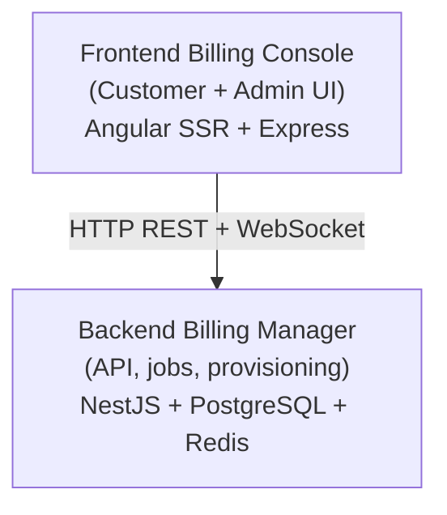

# Decabill Documentation

Welcome to the documentation for **Decabill**, the ForePath billing product for subscriptions, invoicing, payment processing, and customer billing administration.

## What is Decabill?

Decabill lets operators and customers manage billing in one place:

- **Subscriptions and service plans** with configurable providers and pricing
- **Invoicing and payments** including Stripe checkout flows
- **Customer self-service** for profiles, invoices, and subscription lifecycle
- **Administration** for manual invoices, customer billing profiles, and operational dashboards
- **Multi-tenant deployments** with tenant-scoped data and configurable frontends
- **Server provisioning** for bundled product stacks via cloud-init when service plans include infrastructure

## Documentation Structure

### [Getting Started](./getting-started.md)

Prerequisites, installation, and your first login to the billing console.

### [Architecture](./architecture/README.md)

- [System Overview](./architecture/system-overview.md)
- [Components](./architecture/components.md)
- [Data Flow](./architecture/data-flow.md)

### [Applications](./applications/README.md)

- [Frontend Billing Console](./applications/frontend-billing-console.md)
- [Backend Billing Manager](./applications/backend-billing-manager.md)

### [Features](./features/README.md)

Product capabilities including subscriptions, invoices, administration, multi-tenancy, payments, and real-time dashboard status.

### [Deployment](./deployment/README.md)

- [Local Development](./deployment/local-development.md)
- [Docker Deployment](./deployment/docker-deployment.md)
- [Environment Configuration](./deployment/environment-configuration.md)
- [Production Checklist](./deployment/production-checklist.md)
- [Background Jobs](./deployment/background-jobs.md)

### [Security](./security/README.md)

Compliance-oriented transparency, accepted-risk register, vulnerability reporting, SBOM artifacts, and CI scanning.

### [API Reference](./api-reference/README.md)

Billing Manager HTTP OpenAPI and WebSocket AsyncAPI specifications.

### [Troubleshooting](./troubleshooting/README.md)

- [Common Issues](./troubleshooting/common-issues.md)
- [Debugging Guide](./troubleshooting/debugging-guide.md)

## Quick Start

New to Decabill? Follow this path:

1. **[Getting Started](./getting-started.md)** for local setup
2. **[System Overview](./architecture/system-overview.md)** for architecture
3. **[Multi-tenancy](./features/multi-tenancy.md)** if you run more than one tenant
4. **[Environment Configuration](./deployment/environment-configuration.md)** before production

## System Architecture

Decabill follows a two-tier architecture:

## External Resources

- [NestJS Documentation](https://docs.nestjs.com/)
- [Angular Documentation](https://angular.dev/)
- [Stripe Documentation](https://stripe.com/docs)

---

_For repository-wide security contact and supported versions, see the root `SECURITY.md` file in the GitHub repository._
