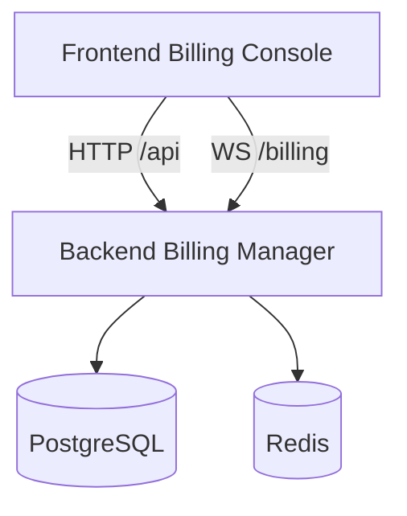

# Applications Documentation

This section provides detailed documentation for each application in the Decabill product.

## Overview

Decabill consists of two primary applications:

1. **Frontend Billing Console** - Angular SSR customer and admin UI
2. **Backend Billing Manager** - NestJS API, WebSocket gateway, background jobs, and integrations

Both applications live under `apps/decabill/` and delegate feature logic to domain libraries in `libs/domains/decabill/`.

## Applications

### [Frontend Billing Console](./frontend-billing-console.md)

Web application for subscription self-service, invoicing, payments, and billing administration.

**Key features**:

- Localized Angular UI with Express SSR in production
- Dashboard with live server status (WebSocket) and power actions
- Customer routes for plans, invoices, and profile
- Admin routes for service catalog, manual billing, and customer profiles
- Identity integration (login, register, user management)

**Default port**: **4500**

**Docker image**: `ghcr.io/forepath/decabill-billing-console-server:latest`

### [Backend Billing Manager](./backend-billing-manager.md)

Backend service for all billing business logic, persistence, and async processing.

**Key features**:

- HTTP REST API (OpenAPI)
- Socket.IO dashboard status gateway (AsyncAPI)
- PostgreSQL with automatic migrations on API startup
- BullMQ schedulers and workers (split roles in compose)
- Stripe checkout and webhooks
- Cloud provisioning and backorder retry

**Default ports**: HTTP **3200**, WebSocket **8082**

**Docker image**: `ghcr.io/forepath/decabill-billing-api:latest`

## Application Relationships



The console never talks to Stripe or cloud providers directly. All privileged operations flow through the billing manager.

## Communication Patterns

| Channel         | Direction           | Purpose                                     |
| --------------- | ------------------- | ------------------------------------------- |
| HTTP REST       | Console to Manager  | CRUD, checkout initiation, admin operations |
| WebSocket       | Console to Manager  | Dashboard server status stream              |
| BullMQ          | Internal to Manager | Schedulers, workers, repeatable jobs        |
| Stripe webhooks | Stripe to Manager   | Payment completion events                   |
| Provider APIs   | Manager to cloud    | Availability, provisioning, DNS             |

## Build and Run Commands

From the repository root:

```bash
# Backend
nx serve decabill-backend-billing-manager
nx build decabill-backend-billing-manager
nx run decabill-backend-billing-manager:api-container-image

# Frontend
nx serve decabill-frontend-billing-console
nx build decabill-frontend-billing-console
nx run decabill-frontend-billing-console:container-image
```

Docker Compose entry points:

- `apps/decabill/backend-billing-manager/docker-compose.yaml`
- `apps/decabill/frontend-billing-console/docker-compose.yaml`

## Related Documentation

- **[Getting Started](../getting-started.md)** - First-time setup
- **[Architecture Overview](../architecture/system-overview.md)** - System design
- **[Deployment Guide](../deployment/README.md)** - Local and container deployment
- **[Features Documentation](../features/README.md)** - Product capabilities
- **[API Reference](../api-reference/README.md)** - Specifications

---

_For library-level implementation details, see the README files under `libs/domains/decabill/`._
