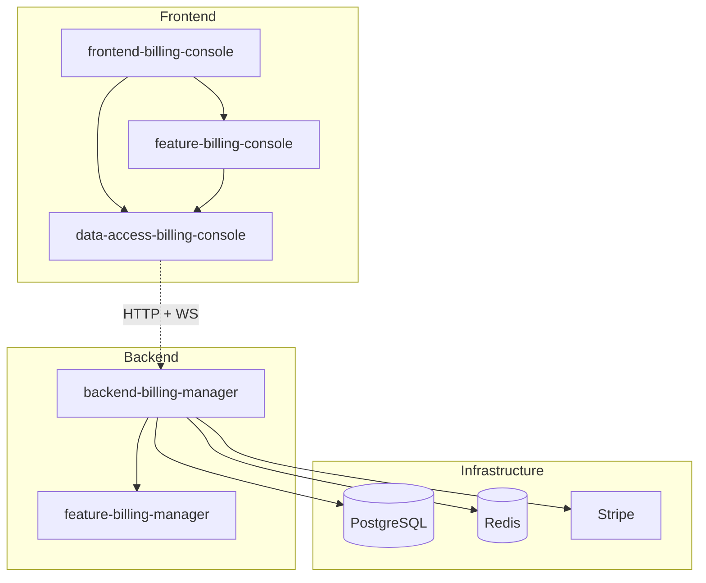

# Components

This document describes the major runtime components in Decabill, their responsibilities, dependencies, and default ports.

## Backend Billing Manager

**Location**: `apps/decabill/backend-billing-manager`

**Purpose**: NestJS application hosting the billing HTTP API, dashboard WebSocket gateway, TypeORM persistence, BullMQ integration, Stripe payments, and cloud provisioning.

**Docker image**: `ghcr.io/forepath/decabill-billing-api:latest`

**Library implementation**: `libs/domains/decabill/backend/feature-billing-manager` (imported as `BillingManagerModule` and related providers)

**License**: **AGPL-3.0** (Open Source tier)

### Key responsibilities

- REST controllers for subscriptions, invoices, service catalog, customer profile, admin billing, and public offerings
- Socket.IO **billing** namespace for dashboard server status
- TypeORM entities and migrations (billing tables plus identity migrations bundled at startup)
- BullMQ queue **`billing`** with coordinator and unit jobs (see job registry in the app)
- Stripe checkout session creation and webhook endpoint processing
- Provider integrations (Hetzner Cloud, DigitalOcean) for availability checks and provisioning
- Invoice PDF generation (ZUGFeRD-style HTML template) and filesystem storage
- Optional dynamic payment processor and billing UI metadata plugins

### Dependencies

- PostgreSQL 16 (primary data store)
- Redis 7 (BullMQ backing store)
- SMTP or Mailhog (transactional email)
- Stripe API (when payment processing is enabled)
- Cloud provider API tokens (when plans include infrastructure)

### Ports and endpoints

| Surface    | Default         | Notes                                        |
| ---------- | --------------- | -------------------------------------------- |
| HTTP API   | **3200**        | Global prefix `/api`                         |
| WebSocket  | **8082**        | Namespace `/billing` (`WEBSOCKET_NAMESPACE`) |
| Bull Board | `/admin/queues` | Optional on API or `all` role                |

### Queue roles (same image, different `QUEUE_ROLE`)

- **`api`** - Serves HTTP and WebSocket; runs migrations; may expose Bull Board
- **`worker`** - Consumes BullMQ unit jobs (billing, expiration, reminders, backorder retry, SSH updates, bill-now units)
- **`scheduler`** - Registers repeatable coordinator jobs on startup
- **`all`** - Combines all roles for local development

**Documentation**: [Backend Billing Manager Application](../applications/backend-billing-manager.md)

## Frontend Billing Console

**Location**: `apps/decabill/frontend-billing-console`

**Purpose**: Angular application with localized builds and an Express SSR server for production hosting.

**Docker image**: `ghcr.io/forepath/decabill-billing-console-server:latest`

**Feature library**: `libs/domains/decabill/frontend/feature-billing-console`

**Data access**: `libs/domains/decabill/frontend/data-access-billing-console` (NgRx)

**License**: **BUSL-1.1** with Additional Use Grant (Startup tier and above)

### Key responsibilities

- Routed UI for dashboard, subscriptions, invoices, and admin catalog or billing pages
- Identity auth UI from `@forepath/identity/frontend` (login, register, users)
- HTTP client to billing manager REST API with tenant and auth interceptors
- Socket.IO client connecting to `WEBSOCKET_URL` (default `http://localhost:8082/billing`)
- Cookie consent, Bootstrap layout, and ApexCharts where used in admin views

### Dependencies

- Billing manager HTTP and WebSocket endpoints (configured at build or runtime)
- Identity configuration aligned with backend `AUTHENTICATION_METHOD`

### Ports

| Mode                 | Default  | Notes                               |
| -------------------- | -------- | ----------------------------------- |
| `nx serve`           | **4500** | Angular dev server                  |
| Express SSR / Docker | **4500** | Serves `browser/{locale}` bundles   |
| `serve-static`       | **4500** | File server for built SPA (non-SSR) |

**Documentation**: [Frontend Billing Console Application](../applications/frontend-billing-console.md)

## Frontend Landing Page

**Location**: `apps/decabill/frontend-landingpage`

**Purpose**: Angular SSR marketing site for [decabill.com](https://decabill.com) with localized routes for home, pricing, competitor comparisons, and legal pages.

**Feature library**: `libs/domains/decabill/frontend/feature-landingpage`

**License**: **Source-available** (viewing only; see [LICENSE](../../../apps/decabill/frontend-landingpage/LICENSE))

### Key responsibilities

- Public marketing pages, pricing tiers, and competitor comparison content
- Localized Angular builds with Express SSR in production
- Cookie consent and Bootstrap layout shared with other ForePath frontends

### Ports

| Mode                 | Default  | Notes                             |
| -------------------- | -------- | --------------------------------- |
| `nx serve`           | **4302** | Angular dev server                |
| Express SSR / Docker | **4302** | Serves `browser/{locale}` bundles |

## PostgreSQL

**Role**: System of record for tenants, users (identity), subscriptions, subscription items, invoices, open positions, backorders, service catalog, customer billing profiles, and audit-oriented admin data.

**Compose service**: `postgres` in `apps/decabill/backend-billing-manager/docker-compose.yaml`

**Notable concerns**:

- Migrations run when `QUEUE_ROLE` is `api` or `all`
- Tenant scoping via `tenant_id` columns on billing entities
- Encrypted columns for provider config snapshots and SSH private keys when `ENCRYPTION_KEY` is set

## Redis

**Role**: BullMQ connection, job metadata, and repeatable coordinator schedules.

**Compose service**: `redis` with AOF persistence

**Configuration**:

- `REDIS_HOST`, `REDIS_PORT`, `REDIS_PASSWORD`, `REDIS_DB`
- `REDIS_KEY_PREFIX` (default `decabill-billing`) isolates keys when sharing a Redis instance
- Host port **6380** maps to container **6379** in the default compose file to avoid clashing with other stacks

## Stripe

**Role**: Default payment processor for invoice checkout.

**Integration points**:

- `STRIPE_SECRET_KEY` for server-side Checkout Session creation
- `STRIPE_WEBHOOK_SECRET` for signed webhook verification
- `STRIPE_CHECKOUT_SUCCESS_URL` and `STRIPE_CHECKOUT_CANCEL_URL` (overridable per tenant via `TENANT_FRONTEND_URLS`)
- Customer ids stored on billing profiles after first payment

**Alternatives**: Additional processors may load via `DYNAMIC_PAYMENT_PROCESSORS`. See **[Dynamic Provider Plugins](../features/dynamic-provider-plugins.md)**.

## Mailhog (Local Only)

**Role**: Captures outbound SMTP from the billing manager during local compose runs.

**Ports** (default compose): SMTP **1026**, UI **8026**

Replace with production SMTP settings (`SMTP_*`, `EMAIL_FROM`) and optional brand block (`EMAIL_COMPANY_*`, fallback `BILLING_ISSUER_*`) in real deployments. See [Email notifications](../features/email-notifications.md).

## Cloud Providers

Built-in provisioning providers:

- **Hetzner Cloud** (`HETZNER_API_TOKEN`)
- **DigitalOcean** (`DIGITALOCEAN_API_TOKEN`)

Used for availability checks, server creation, DNS (Cloudflare optional), and subscription item server info snapshots. Provisioned stacks may include Docker Compose bundles deployed via cloud-init. See **[Server Provisioning](../features/server-provisioning.md)**.

## Component Dependencies

## External Dependencies

| Dependency                         | Purpose                    |
| ---------------------------------- | -------------------------- |
| [NestJS](https://docs.nestjs.com/) | Backend framework          |
| [Angular](https://angular.dev/)    | Console UI                 |
| [Socket.IO](https://socket.io/)    | Dashboard status transport |
| [BullMQ](https://docs.bullmq.io/)  | Background jobs            |
| [Stripe](https://stripe.com/docs)  | Payments                   |
| [TypeORM](https://typeorm.io/)     | Database access            |

## Related Documentation

- **[System Overview](./system-overview.md)** - Architecture summary
- **[Data Flow](./data-flow.md)** - Request and event flows
- **[Background Jobs](../deployment/background-jobs.md)** - Queue job catalog
- **[API Reference](../api-reference/README.md)** - HTTP and WebSocket contracts

---

_For deployment topology, see **[Docker Deployment](../deployment/docker-deployment.md)**._
