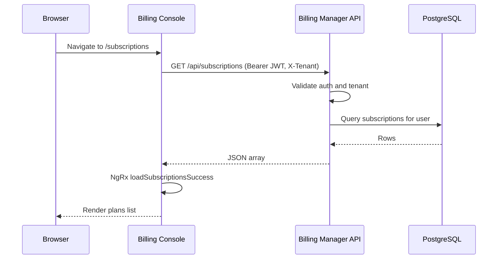
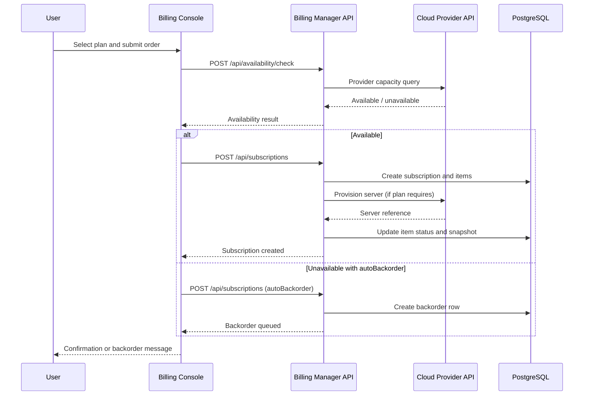
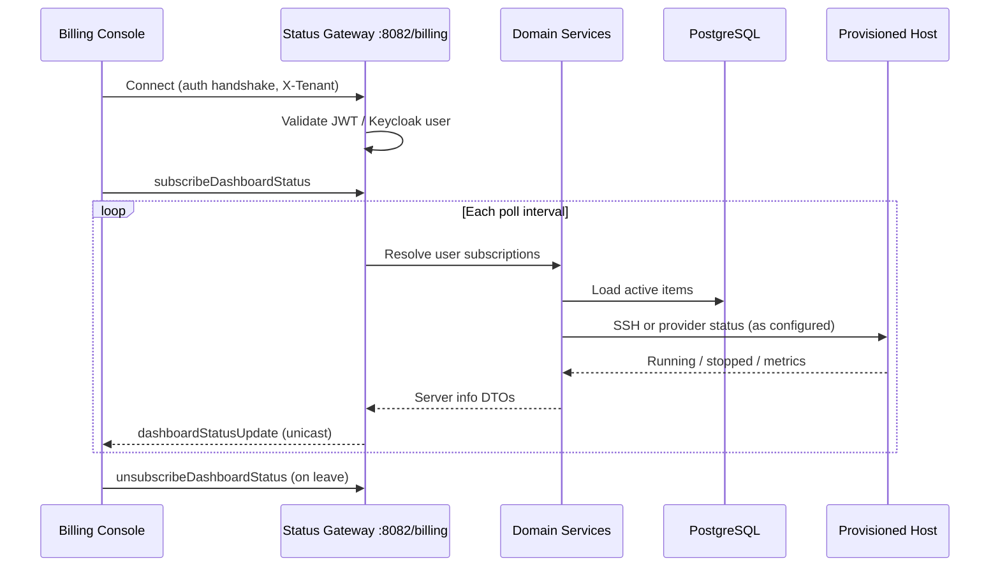
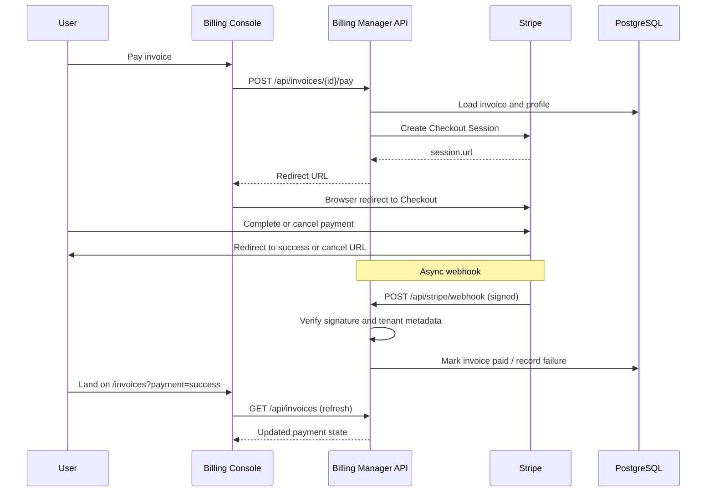
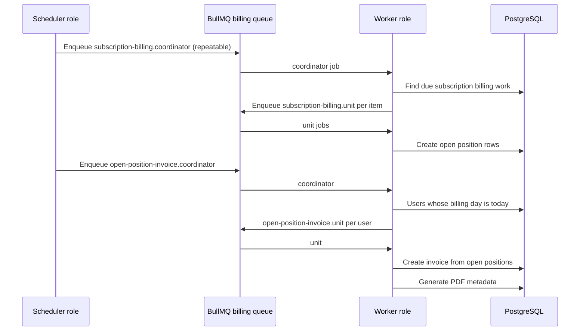
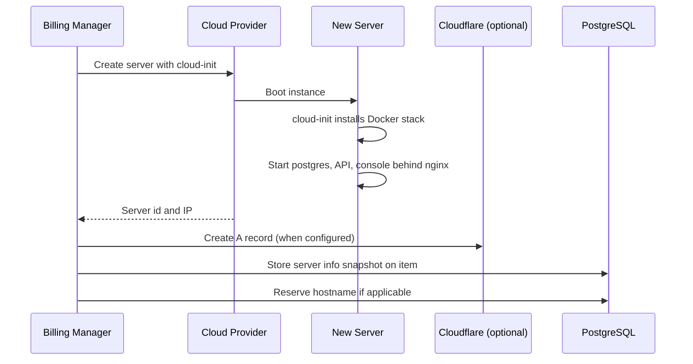
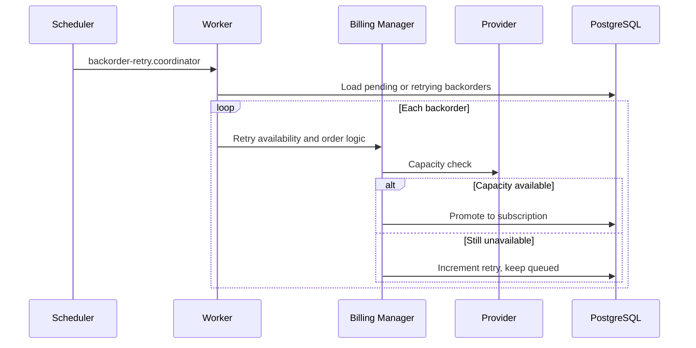
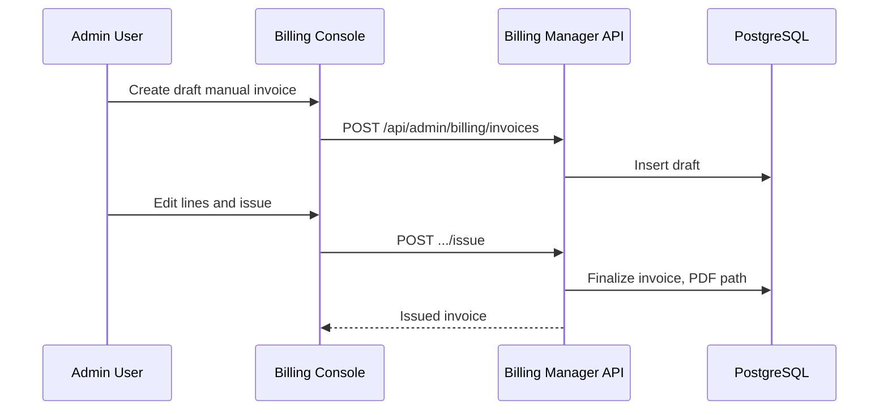
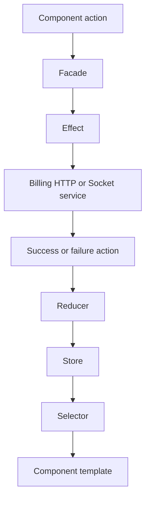

# Data Flow

This document describes communication patterns and end-to-end data flows across the Decabill billing console and billing manager.

## HTTP REST API Flow

### Authenticated read (example: list subscriptions)

Admin routes under `/api/admin/billing/*` follow the same pattern with role checks. API key auth bypasses user identity but grants admin REST access when configured.

### Subscription order with availability check

See **[Subscriptions](../features/subscriptions.md)** and **[Backorders](../features/backorders.md)**.

## WebSocket Dashboard Flow

The overview page connects to the billing namespace and subscribes to periodic server status for provisioned subscription items owned by the logged-in user.

Poll interval is clamped between 10s and 120s. Default server interval comes from `STATUS_POLL_INTERVAL` (15000 ms).

REST fallback: `GET /api/subscriptions/.../server-info` when WebSocket is disabled or unavailable. See **[Dashboard and Server Control](../features/dashboard-and-server-control.md)**.

## Stripe Redirect and Webhook Flow

Checkout is initiated over HTTP. Payment state is finalized asynchronously via Stripe webhooks.

Tenant-specific return URLs resolve from `TENANT_FRONTEND_URLS` or `BILLING_FRONTEND_URL`. See **[Payment Processing](../features/payment-processing.md)** and **[Invoices](../features/invoices.md)**.

## Open Position and Billing Day Flow

Recurring charges accumulate as open positions until the user's billing day scheduler creates a consolidated invoice.

Admin **bill-now** follows a similar coordinator and unit pattern outside the normal schedule. See **[Billing Administration](../features/billing-administration.md)**.

## Server Provisioning Flow

When a service plan includes infrastructure, the manager provisions a cloud server and records connection details on the subscription item.

Later, the **subscription-item-update** scheduler SSHes to the host and runs `docker compose up -d --pull=always` to refresh bundled stacks. See **[Server Provisioning](../features/server-provisioning.md)**.

## Backorder Retry Flow

Users may also trigger manual retry or cancel from the console when exposed in UI effects.

## Admin Manual Invoice Flow

Void, mark paid, and mark unpaid operations update invoice state without Stripe when paid offline. See **[Billing Administration](../features/billing-administration.md)**.

## Multi-Tenant Request Flow

Every HTTP and WebSocket call carries tenant context:

1. Client sends `X-Tenant` (HTTP header or socket auth metadata)
2. API validates against `TENANTS` allowlist
3. Services scope queries with `tenant_id`
4. Stripe webhooks recover tenant id from Checkout Session metadata

See **[Multi-tenancy](../features/multi-tenancy.md)**.

## State Management Flow (NgRx)

Dashboard socket effects (`connectBillingDashboardSocket$`, `billingDashboardSocketApplicationErrorFallback$`) bridge Socket.IO events into the `billingDashboardSocket` slice used by the overview page.

## Related Documentation

- **[System Overview](./system-overview.md)** - Tier architecture
- **[Components](./components.md)** - Runtime components
- **[Real-time Status](../features/real-time-status.md)** - WebSocket contract details
- **[API Reference](../api-reference/README.md)** - OpenAPI and AsyncAPI specs

---

_For queue job names and intervals, see **[Background Jobs](../deployment/background-jobs.md)**._
