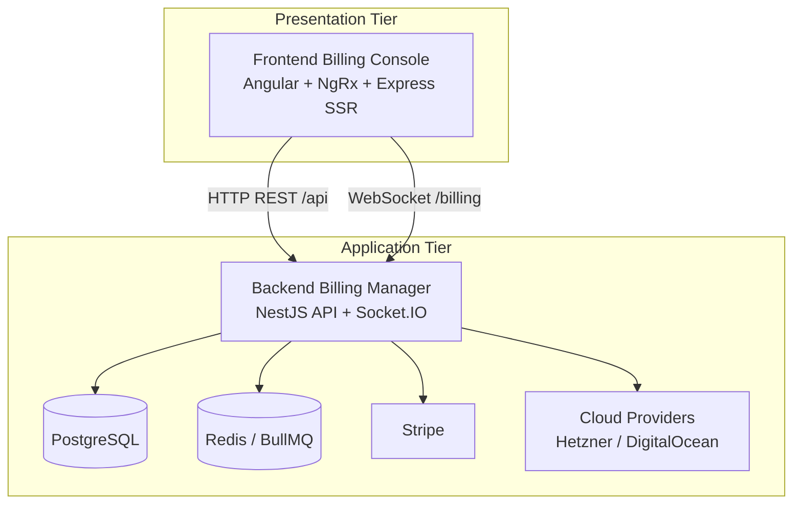
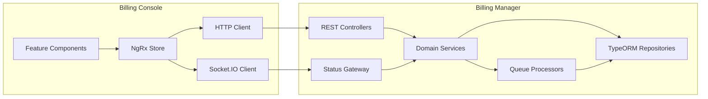
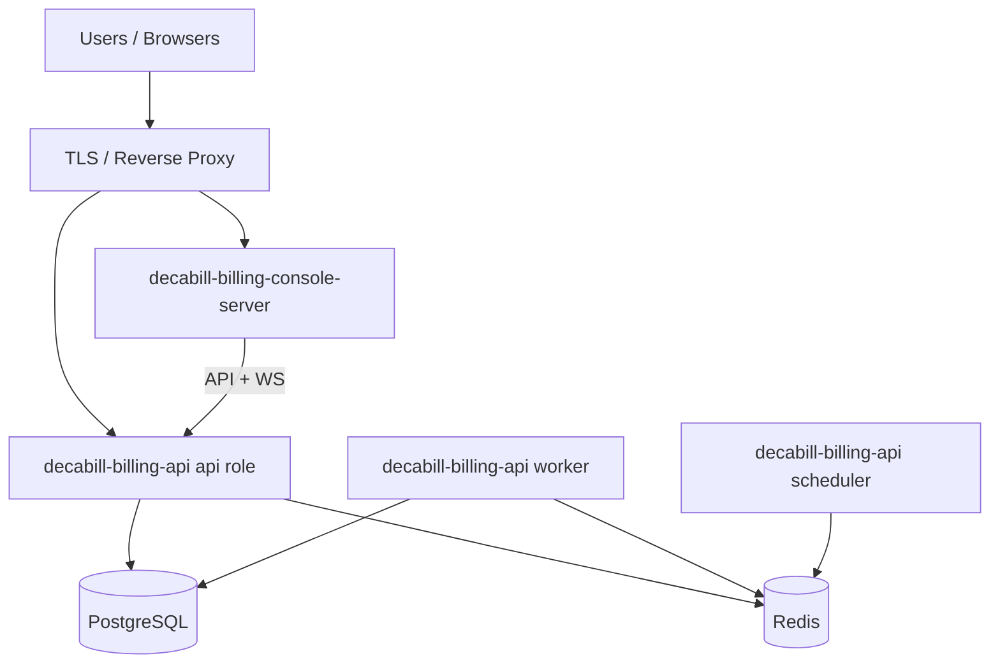

# System Overview

This document provides a high-level overview of the Decabill system architecture, component relationships, and communication patterns.

## Two-Tier Architecture

Decabill separates the billing console from the billing manager. All product logic for subscriptions, invoices, payments, and provisioning runs in the manager. The console renders UI, holds client state, and calls the manager over HTTP and WebSocket.

### Tier Responsibilities

#### Presentation Tier (Frontend Billing Console)

- Customer and admin UI for dashboard, plans, invoices, and administration
- Identity routes (login, register, password reset, user management)
- NgRx data access and effects for billing API calls
- Socket.IO client for live server status on the overview dashboard
- Express SSR server for localized static assets, CSP, and runtime config

#### Application Tier (Backend Billing Manager)

- HTTP REST API under `/api` (OpenAPI documented)
- WebSocket gateway on port **8082**, namespace **`billing`**
- PostgreSQL persistence with TypeORM migrations on API startup
- BullMQ schedulers and workers for billing cycles, reminders, backorders, and provisioning updates
- Stripe checkout session creation and webhook handling
- Optional cloud server provisioning via provider APIs and cloud-init

## Component Relationships

## Communication Patterns

### HTTP REST API

The console and external integrators call the billing manager synchronously for CRUD, checkout initiation, availability checks, and admin operations. All authenticated routes expect a bearer token, Keycloak token, or API key depending on deployment configuration. Tenant scope travels in the `X-Tenant` header.

Typical namespaces in the API include:

- Public plan offerings (unauthenticated marketing endpoints)
- Service types and service plans (admin catalog)
- Subscriptions, backorders, and customer profile
- Invoices, open positions, and payment initiation
- Admin billing, manual invoices, statistics, and audit

See **[API Reference](../api-reference/README.md)**.

### WebSocket Dashboard Status

The billing manager exposes a Socket.IO namespace separate from the HTTP port. Authenticated users subscribe with `subscribeDashboardStatus`. The server polls provisioned subscription items on an interval and emits `dashboardStatusUpdate` events scoped to the connecting socket only.

Static API key clients cannot use this stream because there is no end-user subscription scope. See **[Real-time Status](../features/real-time-status.md)**.

### Background Processing

Repeatable coordinator jobs enqueue unit jobs on the **`billing`** BullMQ queue. Workers process subscription billing, expiration, invoice overdue marking, open-position invoicing, renewal reminders, subscription item updates (SSH/docker compose pull), backorder retries, and admin bill-now operations.

Schedulers register coordinators; workers execute units; the API process serves HTTP and optionally Bull Board.

## Deployment Topology

### Local Development

A single process with `QUEUE_ROLE=all` or Docker Compose with three manager containers plus Postgres, Redis, and Mailhog.

### Production

- One or more **api** replicas behind TLS termination
- Dedicated **worker** replicas sized for job volume
- A single **scheduler** replica per Redis key prefix
- Managed PostgreSQL and Redis
- SSR billing console container (`decabill-billing-console-server`) with CSP connect-src allowing the public API origin

## Data Boundaries

- **Tenant isolation** - Rows carry `tenant_id`; requests with invalid or missing tenant ids are rejected when not allowed
- **User scope** - Customers see their subscriptions and invoices; admins access `/admin/billing/*` routes and administration UI
- **Provider secrets** - Cloud API tokens and SSH keys are stored encrypted; Stripe secrets remain server-side only

## Related Documentation

- **[Components](./components.md)** - Detailed component breakdown
- **[Data Flow](./data-flow.md)** - Sequence diagrams for major flows
- **[Applications](../applications/README.md)** - Per-application reference
- **[Getting Started](../getting-started.md)** - Run the stack locally

---

_For environment variables and ports, see **[Environment Configuration](../deployment/environment-configuration.md)**._
