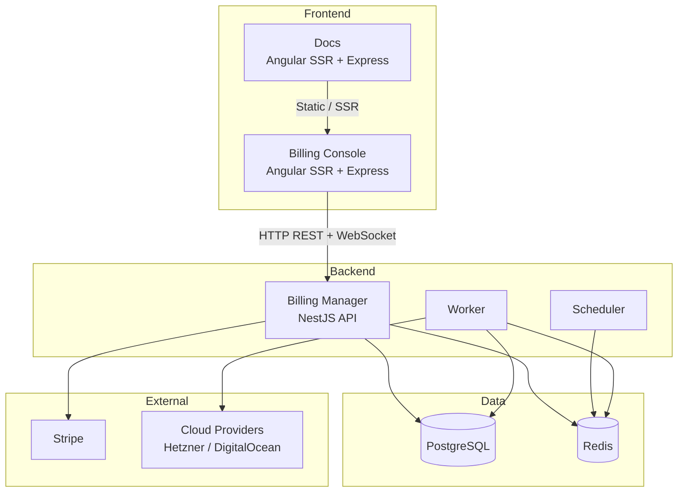

# Deployment Documentation

This section provides deployment guides and configuration information for Decabill.

## Overview

Decabill can be deployed in several ways:

- **Local Development** - For development and testing on your machine
- **Docker Deployment** - Containerized deployment using Docker Compose
- **Production Deployment** - Production-ready deployment with security and performance considerations

## Deployment Guides

### [Local Development](./local-development.md)

Setting up Decabill for local development:

- Prerequisites and installation
- Local database and Redis setup
- Running the billing manager and frontends locally
- Development workflow and testing

### [Docker Deployment](./docker-deployment.md)

Containerized deployment using Docker:

- Docker Compose setup for billing manager, billing console, and docs
- Container configuration and image hardening
- Volume management for invoice PDFs and provider plugins
- Network configuration and multi-container orchestration

### [System Requirements](./system-requirements.md)

CPU, memory, and disk guidance by deployment role:

- API, worker, and scheduler sizing for the billing manager
- PostgreSQL and Redis baselines
- Frontend SSR hosts and mixed local-development hosts
- Production split examples

### [Environment Configuration](./environment-configuration.md)

Complete environment variables reference:

- Billing manager multi-tenancy
- Stripe and payment processor configuration
- Frontend Express variables for billing console and docs
- Redis and BullMQ queue settings

### [Production Checklist](./production-checklist.md)

Production deployment guide:

- Pre-deployment checklist
- Security considerations
- Performance optimization
- Monitoring and backup strategies

### [Background Jobs](./background-jobs.md)

BullMQ background processing for the billing manager:

- Queue roles (API, scheduler, worker)
- Job registry and coordinator schedules
- Redis host port 6380 and Bull Board on port 3200

## Deployment Architecture



## Quick Start

### Docker Compose (Recommended)

```bash
# Billing manager (API, worker, scheduler, Postgres, Redis, Mailhog)
cd apps/decabill/backend-billing-manager
docker compose up -d

# Billing console frontend
cd ../frontend-billing-console
docker compose up -d

# Docs frontend (optional)
cd ../frontend-docs
docker compose up -d
```

### Local Development

```bash
# Install dependencies (repository root)
npm install

# Start billing manager
nx serve decabill-backend-billing-manager

# Start billing console
nx serve decabill-frontend-billing-console
```

## Related Documentation

- **[Security](../security/README.md)** - Accepted risks, hardening, SBOM, and disclosure
- **[Troubleshooting](../troubleshooting/README.md)** - Common issues and debugging

---

_For detailed deployment information, see the individual deployment guides._
