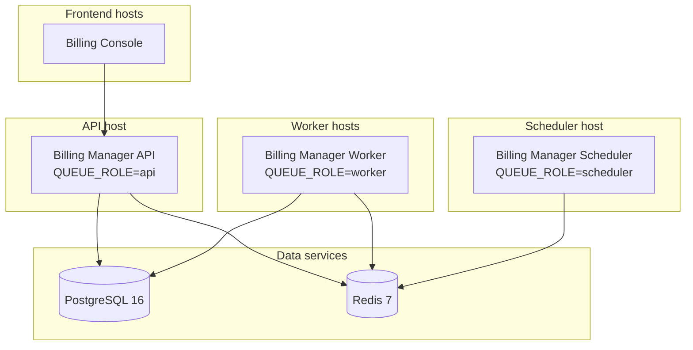

# System Requirements

Hardware and software requirements for running Decabill components in development and production. Figures are **starting points** for capacity planning; tune limits from observed CPU, memory, and queue depth in your environment.

## Overview

Decabill splits backend work across **queue roles** (`api`, `worker`, `scheduler`) from one billing-manager image. The billing console is a lightweight Express SSR server. PostgreSQL and Redis are required for every backend deployment.

Typical production layout:

Workers and the API share the same image, which includes **Playwright Chromium** for invoice PDF rendering. PDF and provisioning jobs are the main memory spikes on worker replicas.

## Platform Prerequisites

| Requirement                     | Minimum                                    | Recommended                                |
| ------------------------------- | ------------------------------------------ | ------------------------------------------ |
| **Host OS**                     | Linux amd64 or arm64 with a current kernel | Same; use LTS distributions for production |
| **Docker**                      | 20.10+                                     | 24+ with Compose v2                        |
| **Docker Compose**              | 2.0+                                       | Latest stable                              |
| **Node.js** (local Nx dev only) | 24.14.1                                    | Match container `NODE_VERSION`             |
| **Architecture**                | 64-bit                                     | 64-bit                                     |

Container images target **Node.js 24.14.1** on **debian:trixie-slim**. Billing API and worker images run as non-root user `agenstra` (UID **10001**). Frontend server images run as `node` (UID **1000**).

## Data Services

### PostgreSQL 16

Primary datastore for tenants, subscriptions, invoices, identity, and project data.

| Profile             | vCPU | Memory  | Disk     | Notes                                      |
| ------------------- | ---- | ------- | -------- | ------------------------------------------ |
| Local / staging     | 1    | 1–2 GiB | 10 GiB   | Single tenant, low invoice volume          |
| Production (small)  | 2    | 2–4 GiB | 50 GiB   | Several tenants, routine billing cycles    |
| Production (medium) | 4    | 8 GiB   | 100+ GiB | Higher invoice PDF and DATEV export volume |

Plan disk growth for invoice metadata, audit tables, and migration history. Enable automated backups before production cutover.

### Redis 7

BullMQ backing store for the **`billing`** queue. AOF persistence is enabled in the default Compose file.

| Profile         | vCPU | Memory  | Disk  | Notes                                                    |
| --------------- | ---- | ------- | ----- | -------------------------------------------------------- |
| Local / staging | 0.5  | 512 MiB | 1 GiB | Default compose stack                                    |
| Production      | 1    | 1–2 GiB | 5 GiB | Jobs are **not** auto-removed; memory grows with history |

Monitor Redis memory when Bull Board retention is long or worker failure rates are high.

## Backend Billing Manager (by Queue Role)

All roles use image `ghcr.io/forepath/decabill-billing-api`. Set container limits per role; do not size the API like a worker.

### API (`QUEUE_ROLE=api`)

Serves HTTP **3200**, WebSocket **8082**, runs migrations, and may expose Bull Board. Holds Playwright Chromium in memory even when PDF work runs on workers.

| Profile         | vCPU | Memory limit | Notes                                                   |
| --------------- | ---- | ------------ | ------------------------------------------------------- |
| Local / staging | 1    | 2 GiB        | Single replica behind Compose                           |
| Production      | 1–2  | 2–4 GiB      | Scale replicas horizontally for HTTP and WebSocket load |

Reserve headroom for concurrent REST traffic and dashboard WebSocket connections. PDF generation on the API path can briefly need **4 GiB** per replica.

### Worker (`QUEUE_ROLE=worker`)

Processes BullMQ unit jobs: billing cycles, expiration, reminders, provisioning, invoice PDFs, SSH stack updates, and DATEV export units. Default **`QUEUE_WORKER_CONCURRENCY=5`**.

| Profile            | vCPU | Memory limit | Notes                                              |
| ------------------ | ---- | ------------ | -------------------------------------------------- |
| Local / staging    | 1    | 2 GiB        | `QUEUE_WORKER_CONCURRENCY=2` acceptable on laptops |
| Production (light) | 1–2  | 2–4 GiB      | Mostly email and status polling                    |
| Production (heavy) | 2–4  | 4–8 GiB      | Provisioning, PDF batches, or high concurrency     |

Scale **worker replicas** horizontally. Tune `QUEUE_WORKER_CONCURRENCY` to CPU count and external API rate limits (Stripe, Hetzner, DigitalOcean).

### Scheduler (`QUEUE_ROLE=scheduler`)

Registers repeatable coordinator jobs only. Lightweight and **singleton** per Redis key prefix.

| Profile          | vCPU     | Memory limit  | Notes                                          |
| ---------------- | -------- | ------------- | ---------------------------------------------- |
| All environments | 0.25–0.5 | 512 MiB–1 GiB | Run **one** scheduler container per deployment |

## Frontend Billing Console

Angular SSR Express server. No database or Redis on this host.

| Application     | Image                             | vCPU | Memory limit  | Disk  | Default port |
| --------------- | --------------------------------- | ---- | ------------- | ----- | ------------ |
| Billing console | `decabill-billing-console-server` | 0.5  | 512 MiB–1 GiB | 2 GiB | **4500**     |

Browser clients need a modern evergreen browser. The billing console initial bundle budget warns at **1 MB** (errors at **5 MB**).

## Persistent Volumes

Mount and size these paths on API, worker, and scheduler containers when the feature is enabled:

| Volume           | Path                                                          | Sizing guidance                              |
| ---------------- | ------------------------------------------------------------- | -------------------------------------------- |
| Invoice PDFs     | `BILLING_INVOICE_PDF_STORAGE_PATH` (default `/data/invoices`) | Plan per invoice PDF size × retention policy |
| DATEV exports    | `BILLING_DATEV_EXPORT_STORAGE_PATH`                           | Monthly ZIP archives per tenant              |
| Provider plugins | `DYNAMIC_PROVIDER_PLUGIN_PATH`                                | Small; optional mount                        |

## Mixed and Local Development Host

When running the full Compose stack (Postgres, Redis, API, worker, scheduler, Mailhog) plus the billing console on one machine, or using **`QUEUE_ROLE=all`** with Nx:

| Resource | Minimum     | Comfortable |
| -------- | ----------- | ----------- |
| vCPU     | 4           | 6–8         |
| Memory   | 8 GiB       | 16 GiB      |
| Disk     | 30 GiB free | 50 GiB free |

Close other memory-heavy applications when testing invoice PDF generation or provisioning jobs locally.

## Production Sizing Examples

### Small operator (single tenant, low job volume)

| Host / service                                       | vCPU | Memory |
| ---------------------------------------------------- | ---- | ------ |
| Combined API + scheduler + worker + Postgres + Redis | 4    | 8 GiB  |
| Billing console                                      | 1    | 1 GiB  |

Acceptable for staging or a single-tenant pilot. Split worker from API before production traffic.

### Recommended production split

| Host / service                | vCPU     | Memory       |
| ----------------------------- | -------- | ------------ |
| API (1–2 replicas)            | 2 each   | 2–4 GiB each |
| Worker (1+ replicas)          | 2 each   | 4 GiB each   |
| Scheduler (1 replica)         | 0.5      | 1 GiB        |
| PostgreSQL                    | 2        | 4 GiB        |
| Redis                         | 1        | 1 GiB        |
| Billing console (1+ replicas) | 0.5 each | 1 GiB each   |

## Network and External Dependencies

| Dependency                 | Required   | Notes                                               |
| -------------------------- | ---------- | --------------------------------------------------- |
| PostgreSQL                 | Yes        | Reachable from API, worker, and scheduler           |
| Redis                      | Yes        | Same network; align `REDIS_KEY_PREFIX` across roles |
| SMTP                       | Production | Replace Mailhog with production SMTP                |
| Stripe API                 | Optional   | Checkout and webhooks when payments enabled         |
| Hetzner / DigitalOcean API | Optional   | When service plans include infrastructure           |
| Outbound HTTPS             | Yes        | Payment, cloud, and email providers                 |

Ingress: expose console (**4500** or behind TLS terminator), API (**3200**), and WebSocket (**8082**). Restrict Bull Board (`/admin/queues`) to operations networks.

## Related Documentation

- **[Docker Deployment](./docker-deployment.md)** - Compose services and startup order
- **[Background Jobs](./background-jobs.md)** - Queue roles and concurrency
- **[Production Checklist](./production-checklist.md)** - Set container limits before go-live
- **[Components](../architecture/components.md)** - Ports and dependencies

---

_For environment variables that affect job load, see **[Environment Configuration](./environment-configuration.md)**._
