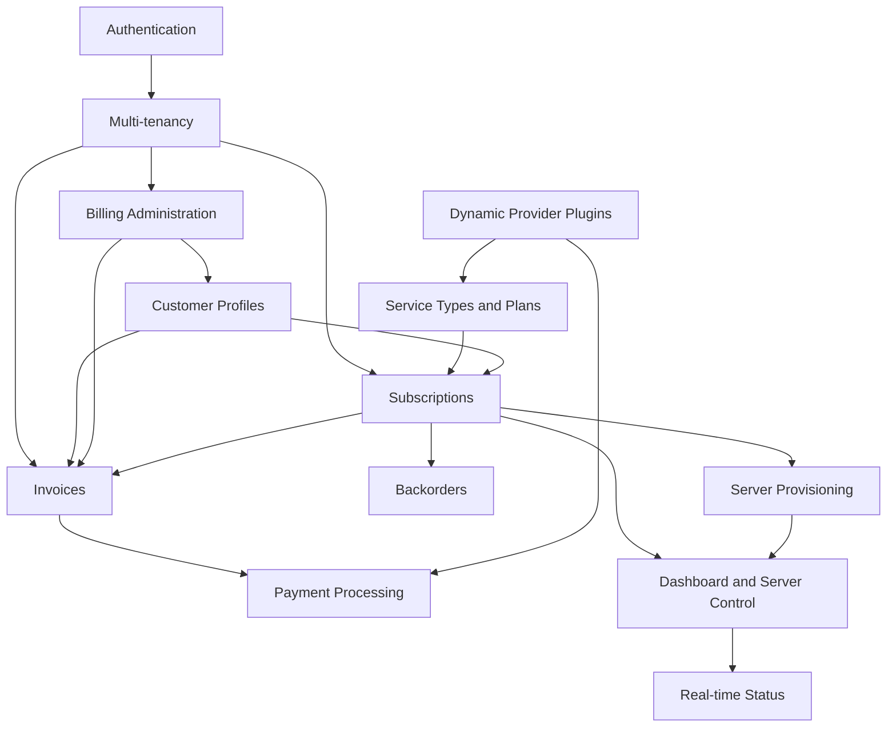

# Features Documentation

This section provides comprehensive documentation for all features in the Decabill billing product.

## Overview

Decabill provides a complete set of capabilities for subscription billing, invoicing, payments, and optional infrastructure provisioning:

- **Authentication** - Keycloak OAuth2/OIDC, built-in users with JWT, or static API key
- **Multi-tenancy** - Tenant-scoped data with `X-Tenant` header and configurable tenant frontends
- **Subscriptions** - Order, cancel, and resume service plans with optional cloud provisioning
- **Invoices** - ZUGFeRD PDFs, open positions, billing-day accumulation, and Stripe checkout
- **Service Types and Plans** - Admin-managed catalog with provider schemas and pricing
- **Billing Administration** - Manual invoices, customer profiles, KPIs, and bill-now
- **Customer Profiles** - Self-service and admin billing metadata required for ordering
- **Dashboard and Server Control** - Overview of subscriptions with start, stop, and restart actions
- **Real-time Status** - WebSocket dashboard stream for provisioned server status
- **Backorders** - Queue and retry when provider capacity is unavailable
- **Payment Processing** - Stripe checkout and webhook-driven payment state
- **Dynamic Provider Plugins** - Extend payment processors and billing UI metadata at runtime
- **Server Provisioning** - Cloud-init deployment of bundled product stacks for eligible plans

## Features

### [Authentication](./authentication.md)

Multiple authentication methods with configurable user registration. Supports API key, Keycloak OAuth2/OIDC, and built-in users with JWT.

**Key Capabilities**:

- Static API key for automation and single-operator deployments
- Keycloak OAuth2/OIDC for enterprise SSO
- Built-in user registration with email confirmation
- Password reset with 6-character alphanumeric codes
- Admin user management and optional signup disable

### [Multi-tenancy](./multi-tenancy.md)

Isolate billing data per tenant while sharing one billing manager deployment. Same email can register separately in each tenant.

**Key Capabilities**:

- `X-Tenant` header on HTTP and WebSocket requests
- `TENANTS` environment allowlist
- `TENANTS_ALLOW_DEFAULT=false` to exclude the implicit `default` tenant
- Per-tenant Stripe return URLs via `TENANT_FRONTEND_URLS`
- Optional `STATIC_API_KEY_TENANT_ID` to bind API key auth to one tenant

### [Subscriptions](./subscriptions.md)

Order service plans, manage lifecycle (cancel, resume), and provision cloud instances when the plan includes infrastructure.

**Key Capabilities**:

- Subscription creation with availability checks and provider config validation
- Cancel and resume with effective dates
- Subscription items with provisioning status and hostname reservation
- Usage records for usage-based pricing

### [Invoices](./invoices.md)

Issue, preview, download, void, and pay invoices. Open positions accumulate until each user's billing day.

**Key Capabilities**:

- ZUGFeRD-style PDFs with EN 16931 XML embedded
- Open positions and billing-day scheduler
- Stripe checkout initiation and webhook reconciliation
- Admin manual invoice draft, edit, and issue workflow

### [Service Types and Plans](./service-types-and-plans.md)

Admin-managed catalog of service types, provisioning providers, and priced service plans.

**Key Capabilities**:

- Provider registry with config schemas and server type pricing
- Public unauthenticated plan offerings for marketing pages
- Customer geography selection when the provider schema supports it
- Pricing preview before order

### [Billing Administration](./billing-administration.md)

Admin-only features for manual invoices, customer billing profiles, operational dashboards, and bill-now.

**Key Capabilities**:

- Draft, edit, issue, and void manual invoices
- Customer billing profile CRUD
- Billing summary, statistics, and open or overdue invoice lists
- Bill-now to force invoice generation outside the scheduler

### [Customer Profiles](./customer-profiles.md)

Billing metadata required before subscription orders and for compliant invoice issuance.

**Key Capabilities**:

- Self-service `GET/POST /customer-profile`
- Admin CRUD under `/admin/billing/customer-profiles`
- Stripe customer ID stored on profile when payments are initiated
- Completeness validation before `POST /subscriptions`

### [Dashboard and Server Control](./dashboard-and-server-control.md)

Customer overview of active subscriptions with live server status and power actions.

**Key Capabilities**:

- Overview page with subscription cards and server info
- Start, stop, and restart provisioned servers
- REST fallback when WebSocket is not configured
- Links to invoices and subscription detail

### [Real-time Status](./real-time-status.md)

Socket.IO dashboard status stream for provisioned subscription items.

**Key Capabilities**:

- `subscribeDashboardStatus` with configurable poll interval
- User-scoped subscription selection on every tick
- JWT or Keycloak handshake auth (API key rejected)
- `dashboardStatusUpdate` events mirroring REST server-info shape

### [Backorders](./backorders.md)

Queue subscription requests when provider capacity is unavailable and retry automatically or on demand.

**Key Capabilities**:

- Automatic backorder creation when ordering with `autoBackorder`
- Scheduled retry processor for pending and retrying backorders
- Manual retry and cancel via API
- Encrypted requested config snapshot at rest

### [Payment Processing](./payment-processing.md)

Stripe checkout sessions and webhook-driven payment reconciliation.

**Key Capabilities**:

- `POST .../pay` initiates Stripe Checkout
- Tenant-aware success and cancel redirect URLs
- Idempotent Stripe webhook handling
- Default processor configurable via `BILLING_DEFAULT_PAYMENT_PROCESSOR`

### [Dynamic Provider Plugins](./dynamic-provider-plugins.md)

Extend billing backends with extra payment processors and billing UI provider metadata without forking the image.

**Key Capabilities**:

- `DYNAMIC_PAYMENT_PROCESSORS` for payment backends
- `DYNAMIC_BILLING_PROVIDER_METADATA` for admin UI registry entries
- Baked-in or post-build plugin loading via shared dynamic provider registry
- Critical registry fail-fast in production

### [Server Provisioning](./server-provisioning.md)

Automated cloud server provisioning via cloud-init when service plans include infrastructure.

**Key Capabilities**:

- Hetzner Cloud and DigitalOcean built-in providers
- Docker stack with PostgreSQL, backend API, and frontend console behind Nginx
- Let's Encrypt TLS with DNS A record creation
- SSH-based subscription item update scheduler

## Feature Relationships

## Related Documentation

- **[Getting Started](../getting-started.md)** - Quick start guide
- **[Architecture](../architecture/README.md)** - System architecture
- **[Applications](../applications/README.md)** - Application documentation
- **[Deployment](../deployment/README.md)** - Deployment guides
- **[API Reference](../api-reference/README.md)** - OpenAPI and AsyncAPI specifications

---

_For detailed information about each feature, see the individual feature documentation pages._
