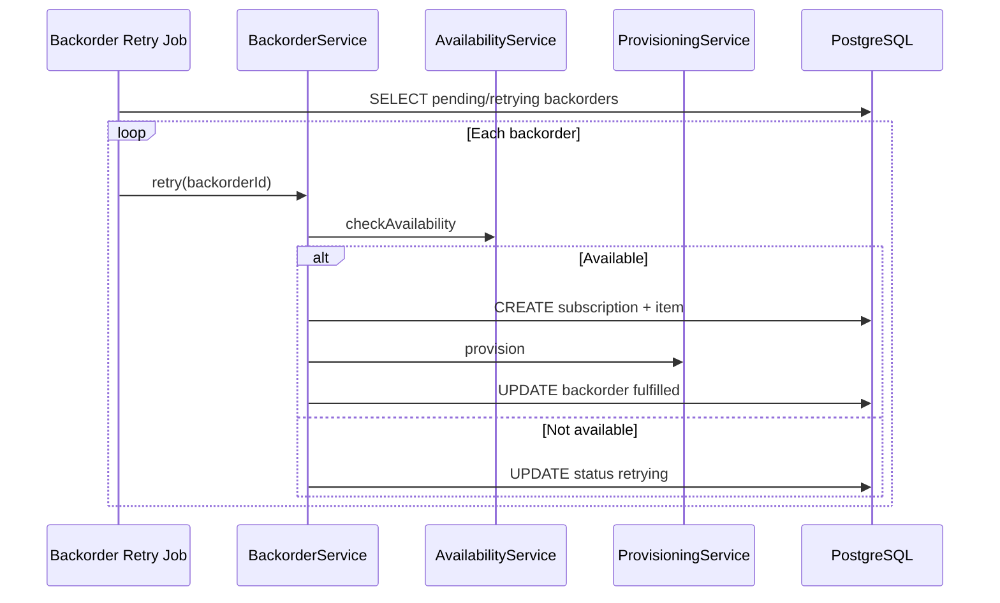

# Backorders

Queue subscription requests when cloud provider capacity is unavailable and retry automatically or on demand.

## Overview

When a user orders a plan with provisioning and capacity is unavailable (or provisioning fails with backorder enabled), Decabill creates a **backorder** record. A background processor and manual retry API attempt fulfillment when capacity returns.

Requested configuration is stored as an encrypted snapshot at rest (AES-256-GCM).

## Backorder Statuses

| Status      | Description                           |
| ----------- | ------------------------------------- |
| `pending`   | Waiting for retry                     |
| `retrying`  | Last attempt failed; will retry later |
| `fulfilled` | Successfully provisioned              |
| `canceled`  | User or operator canceled             |

## Creating Backorders

### At Subscription Order

Pass `autoBackorder: true` on `POST /subscriptions`:

- If availability check fails, a backorder is created instead of failing silently
- If provisioning throws after subscription item creation, a backorder captures the failure with `providerErrors`

Without `autoBackorder`, unavailable capacity returns an error to the client.

### Snapshot Contents

Each backorder stores:

- `userId`, `serviceTypeId`, `planId`
- `requestedConfigSnapshot` (encrypted)
- `providerErrors` and optional `failureReason`
- `preferredAlternatives` when suggested by availability service
- `retryAfter` for scheduled backoff

## Retry Processing

A scheduled job processes pending and retrying backorders:

Fulfillment follows the same hostname reservation, provisioning, and DNS A record steps as immediate orders. See [Server Provisioning](./server-provisioning.md).

## User API

| Method | Path                      | Purpose                |
| ------ | ------------------------- | ---------------------- |
| GET    | `/backorders`             | List user's backorders |
| POST   | `/backorders/{id}/retry`  | Manual retry           |
| POST   | `/backorders/{id}/cancel` | Cancel backorder       |

Manual retry runs the same availability and provisioning path as the scheduler.

## Customer Geography on Retry

When the original plan allowed customer location selection, the encrypted snapshot preserves geography overrides. Retry merges the snapshot with current plan defaults before provisioning.

## UI

The billing console lists backorders on the customer subscriptions flow with status, plan name, and retry or cancel actions where permitted.

## Related Documentation

- **[Subscriptions](./subscriptions.md)** - Order flow and `autoBackorder`
- **[Service Types and Plans](./service-types-and-plans.md)** - Availability endpoints
- **[Server Provisioning](./server-provisioning.md)** - Provisioning on fulfillment
- **[Billing Manager OpenAPI](/spec/billing-manager/openapi.yaml)** - Backorder schemas

---

_Backorders prevent lost orders during provider capacity shortages and automate fulfillment when resources become available._
