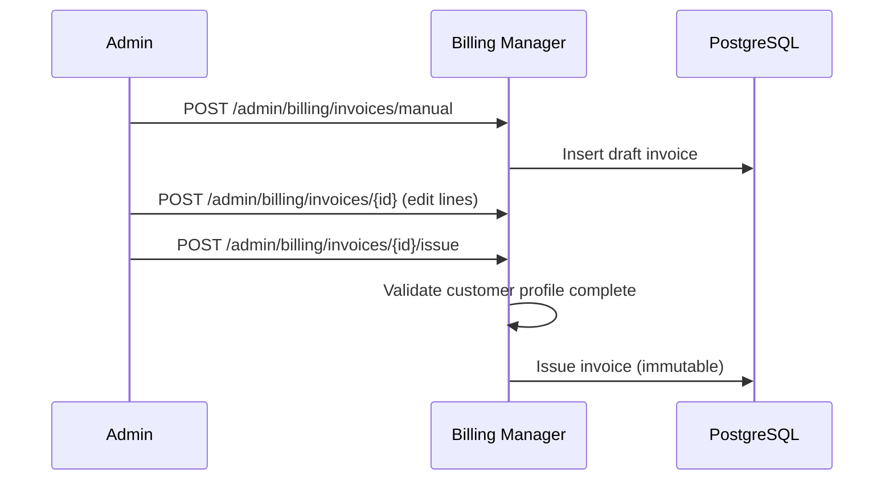

# Billing Administration

Admin-only features in the billing console for manual invoice management, customer billing profile CRUD, operational dashboards, and bill-now.

See also: [API Reference](../api-reference/README.md) for the published OpenAPI and AsyncAPI specifications.

## Access Control

All endpoints under `/admin/billing/*` require admin role (`@KeycloakRoles(ADMIN)` + `@UsersRoles(ADMIN)`). Frontend routes use `authGuard` + `billingAdminGuard`.

**Multi-tenancy:** Admin and user routes are scoped by **`X-Tenant`** and the user's **`tenant_id`**. API key auth with **`STATIC_API_KEY`** and without **`STATIC_API_KEY_TENANT_ID`** can administer **all** configured tenants (accepted risk **[DR-002](../security/accepted-risks.md#dr-002--billing-multi-tenant-api-key-scope-static_api_key_tenant_id-unset)**).

## Billing Dashboard

**Frontend route:** `/administration/billing`

Split layout with dashboard cards and charts on the left, invoice list on the right.

### KPIs and Statistics

| Method | Path                                   | Purpose                      |
| ------ | -------------------------------------- | ---------------------------- |
| GET    | `/admin/billing/summary`               | High-level billing summary   |
| GET    | `/admin/billing/statistics/summary`    | Aggregated statistics        |
| GET    | `/admin/billing/statistics/by-product` | Breakdown by product or plan |

### Invoice Lists

| Method | Path                                   | Purpose                   |
| ------ | -------------------------------------- | ------------------------- |
| GET    | `/admin/billing/invoices`              | Paginated invoice list    |
| GET    | `/admin/billing/invoices/open-overdue` | Open and overdue invoices |

The invoice list supports batch loading with client-side search in list-group style.

### Bill Now

`POST /admin/billing/bill-now` triggers immediate invoice generation for selected users, bypassing the billing-day scheduler when operators need on-demand billing. It uses the same accumulated-invoice path as the billing-day job: if the payable total is below `BILLING_MIN_CHECKOUT_PAYMENT_AMOUNT`, open positions are left unbilled for the next billing day.

## Manual Invoice Administration

**Immutability:** Only invoices in `draft` status can be edited or deleted. Once issued (`issued`, `paid`, `partially_paid`, `overdue`, or `void`), line items and amounts are immutable. Admins can still void unpaid issued invoices or mark payment status manually.

**Workflow:**

1. `POST /admin/billing/invoices/manual` - Create draft with user, optional subscription, custom line items
2. `POST /admin/billing/invoices/{invoiceRefId}` - Update draft line items
3. `POST /admin/billing/invoices/{invoiceRefId}/issue` - Issue draft (requires complete customer profile)
4. `DELETE /admin/billing/invoices/{invoiceRefId}` - Delete draft only

Additional admin actions on issued invoices:

- `POST /admin/billing/invoices/{invoiceRefId}/void` - Void invoice
- `POST /admin/billing/invoices/{invoiceRefId}/mark-paid` - Mark paid manually
- `POST /admin/billing/invoices/{invoiceRefId}/mark-unpaid` - Revert paid status
- `GET /admin/billing/invoices/{invoiceRefId}/audit-logs` - Audit trail
- `GET /admin/billing/invoices/{invoiceRefId}/pdf` - Download PDF
- `GET /admin/billing/invoices/{invoiceRefId}/void-document/pdf` - Void document PDF

## Customer Billing Profiles (Admin)

Customer billing data is stored in `billing_customer_profiles` (one profile per user).

| Method | Path                                                          | Purpose                                                |
| ------ | ------------------------------------------------------------- | ------------------------------------------------------ |
| GET    | `/admin/billing/customer-profiles`                            | Paginated list                                         |
| GET    | `/admin/billing/customer-profiles/{id}`                       | Full profile detail                                    |
| GET    | `/admin/billing/customer-profiles/{id}/trust-score`           | Recomputed trust score detail                          |
| POST   | `/admin/billing/customer-profiles/{id}/trust-score/recompute` | Force trust recompute                                  |
| POST   | `/admin/billing/customer-profiles`                            | Create for user                                        |
| POST   | `/admin/billing/customer-profiles/{id}`                       | Update                                                 |
| DELETE | `/admin/billing/customer-profiles/{id}`                       | Delete (blocked if user has invoices or subscriptions) |

Self-service `GET/POST /customer-profile` remains for end users. See [Customer Profiles](./customer-profiles.md).
Trust ranking remains admin-only. See [Customer Trust Score](./customer-trust-score.md).

**Frontend:** `/administration/customer-profiles` in the billing console.

## Admin Projects

Projects are managed under `/admin/billing/projects`. Admins assign each project to a customer user, track time, and bill unbilled hours to an invoice.

| Method | Path                                                       | Purpose                                     |
| ------ | ---------------------------------------------------------- | ------------------------------------------- |
| GET    | `/admin/billing/projects`                                  | Paginated list (`search`, `userId` filters) |
| POST   | `/admin/billing/projects`                                  | Create project                              |
| POST   | `/admin/billing/projects/{projectId}`                      | Update project                              |
| DELETE | `/admin/billing/projects/{projectId}`                      | Delete (no unbilled time)                   |
| GET    | `/admin/billing/projects/{projectId}/unbilled-time-bounds` | Default bill-time range                     |
| POST   | `/admin/billing/projects/{projectId}/bill-time`            | Issue invoice from unbilled time in range   |

**Frontend:** `/administration/projects`

See **[Projects](./projects.md)** for assignment rules, KPIs, and bill-time preconditions.

## Related Admin Pages

- **Billing dashboard** (`/administration/billing`) - KPIs, charts, bill-now
- **Customer profiles** (`/administration/customer-profiles`) - Admin CRUD
- **Customer trust score** - Admin-only traffic-light ranking inside customer profiles
- **Projects** (`/administration/projects`) - Project CRUD and bill-time
- **Webhooks** (`/webhooks`) - Tenant-scoped outbound notification endpoints; see [Webhooks](./webhooks.md)
- **Service types and plans** - Catalog administration in the billing console
- **Users** (`/users`) - Shared identity user manager

## Webhook Notifications

Admin and API-key clients manage tenant-scoped webhook endpoints under `/admin/billing/webhooks`.

| Method | Path                                      | Purpose                                           |
| ------ | ----------------------------------------- | ------------------------------------------------- |
| GET    | `/admin/billing/webhooks/event-types`     | Supported billing event catalog                   |
| GET    | `/admin/billing/webhooks`                 | List endpoints for current tenant                 |
| POST   | `/admin/billing/webhooks`                 | Create endpoint (returns one-time signing secret) |
| GET    | `/admin/billing/webhooks/{id}`            | Get endpoint                                      |
| POST   | `/admin/billing/webhooks/{id}`            | Update endpoint                                   |
| DELETE | `/admin/billing/webhooks/{id}`            | Delete endpoint                                   |
| POST   | `/admin/billing/webhooks/{id}/test`       | Send sample event                                 |
| GET    | `/admin/billing/webhooks/{id}/deliveries` | Paginated delivery log                            |

**Frontend:** `/webhooks` in the billing console (admin only).

See **[Webhooks](./webhooks.md)** for payload envelope, signing, and event types.

## Related Documentation

- **[Invoices](./invoices.md)** - Status model and open positions
- **[Customer Profiles](./customer-profiles.md)** - Profile fields and validation
- **[Customer Trust Score](./customer-trust-score.md)** - Trust ranking thresholds, factors, and webhooks
- **[Projects](./projects.md)** - Admin project CRUD and bill-time
- **[Multi-tenancy](./multi-tenancy.md)** - Tenant scope and DR-002
- **[Authentication](./authentication.md)** - Admin role requirements
- **[Billing Manager OpenAPI](/spec/billing-manager/openapi.yaml)** - Full admin path schemas

---

_For manual invoice diagrams, see the billing manager feature module documentation._
