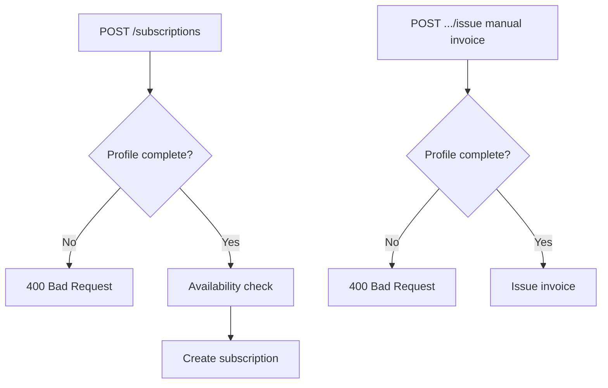

# Customer Profiles

Billing metadata for invoice issuance and subscription ordering. One profile per user per tenant.

## Overview

Customer profiles store legal and contact information required for compliant invoices and Stripe customer records. Subscription creation rejects incomplete profiles with 400 Bad Request.

Profiles are managed through self-service endpoints for customers and admin CRUD for operators.

## Required Fields for Ordering

Before `POST /subscriptions`, the backend validates:

- First name
- Last name
- Email
- Address line
- City
- Country

Optional fields may include company name, VAT ID, postal code, and phone depending on deployment configuration and invoice issuer rules.

## Self-Service

| Method | Path                | Purpose                         |
| ------ | ------------------- | ------------------------------- |
| GET    | `/customer-profile` | Retrieve current user's profile |
| POST   | `/customer-profile` | Create or update profile        |

The billing console exposes a customer profile page for authenticated users to complete or update billing details before ordering.

### Stripe Integration

When the user initiates payment, the billing manager creates or updates a Stripe Customer and stores the Stripe customer id on the profile for subsequent checkout sessions.

## Admin Management

Admins manage profiles under `/admin/billing/customer-profiles`. See [Billing Administration](./billing-administration.md).

Rules:

- One profile per user
- Delete is blocked when the user has existing invoices or subscriptions
- Admin create is used when onboarding customers who cannot self-register

**Frontend route:** `/administration/customer-profiles`

## Validation Flow

Manual invoice issuance uses the same completeness rules for the target user.

Project bill-time (`POST /admin/billing/projects/{projectId}/bill-time`) also requires a complete profile for the project's assigned customer. See **[Projects](./projects.md)**.

## Data Storage

Profiles are stored in `billing_customer_profiles` in PostgreSQL, scoped by tenant through the user's `tenant_id`.

Sensitive fields follow standard application encryption and access controls. Stripe customer ids are stored for payment orchestration only.

## User Billing Day

The user's registration date (day of month, capped at 28) defaults as their **billing day** for open position accumulation. This is stored on the user record and is independent of the service plan's `billing_day_of_month`. See [Invoices](./invoices.md).

## Related Documentation

- **[Subscriptions](./subscriptions.md)** - Profile required at order time
- **[Invoices](./invoices.md)** - Issuer and customer data on PDFs
- **[Projects](./projects.md)** - Profile required for project bill-time
- **[Billing Administration](./billing-administration.md)** - Admin profile CRUD
- **[Payment Processing](./payment-processing.md)** - Stripe customer linkage
- **[Billing Manager OpenAPI](/spec/billing-manager/openapi.yaml)** - Profile DTO schemas

---

_Complete your profile in the billing console before placing your first subscription order._
