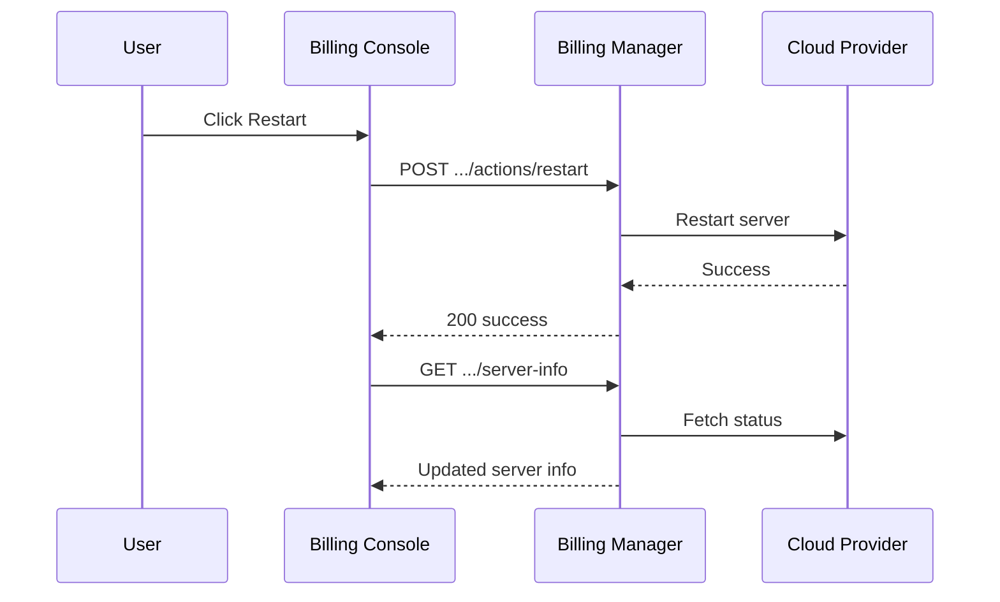

# Dashboard and Server Control

Customer overview of subscriptions with live server status and power actions for provisioned infrastructure.

## Overview

The billing console **Overview** page (`/overview`) lists active subscriptions with provisioned items. For each item, users see hostname, FQDN, IP addresses, provider status, and action buttons to start, stop, or restart the cloud server.

Status updates come from the [Real-time Status](./real-time-status.md) WebSocket when configured, or from REST polling via `GET .../server-info`.

## Overview Page

### Displayed Information

Per subscription item with active provisioning:

- Subscription and plan title
- Provisioning status
- Server name, public IP, hostname, and FQDN
- Provider-reported power state (running, off, etc.)
- Quick links to invoices and subscription detail

### Server Action Buttons

| Action  | When shown                 | API                        |
| ------- | -------------------------- | -------------------------- |
| Start   | Server is stoppable or off | `POST .../actions/start`   |
| Stop    | Server is online           | `POST .../actions/stop`    |
| Restart | Server is online           | `POST .../actions/restart` |

Buttons are disabled while an action is in progress. After a successful action, the UI refreshes server info from REST (or waits for the next WebSocket tick when the socket is connected).

## Data Loading

### With WebSocket

When `billing.websocketUrl` is set in frontend runtime config:

1. NgRx effects connect to the billing status gateway
2. On connect, client emits `subscribeDashboardStatus`
3. Server pushes `dashboardStatusUpdate` on each poll tick
4. Overview binds to the merged subscription and server info state

See [Real-time Status](./real-time-status.md).

### Without WebSocket

When WebSocket URL is not configured:

1. Overview dispatches `loadOverviewServerInfo`
2. Client fetches subscriptions and server info via REST for each item
3. Server actions trigger immediate REST refresh after completion

## Authorization

Users see only their own subscriptions and items. Server control actions verify subscription ownership on every request. Admin users using the customer overview still see only their personal subscriptions unless using admin routes.

API key authentication does not populate an end-user identity on the overview WebSocket path; use Keycloak or users auth for the dashboard stream.

## Server Control Sequence

## Error Handling

- Failed actions show error state in the overview card
- Missing or failed server info displays a loading or error placeholder
- Provisioning failures link to subscription detail and [Backorders](./backorders.md) when applicable

## Related Documentation

- **[Real-time Status](./real-time-status.md)** - WebSocket dashboard stream
- **[Subscriptions](./subscriptions.md)** - Subscription items and server-info endpoint
- **[Server Provisioning](./server-provisioning.md)** - What gets provisioned
- **[Billing Manager OpenAPI](/spec/billing-manager/openapi.yaml)** - Action endpoint schemas

---

_Configure `billing.websocketUrl` in the billing console runtime config for live status without manual refresh._
