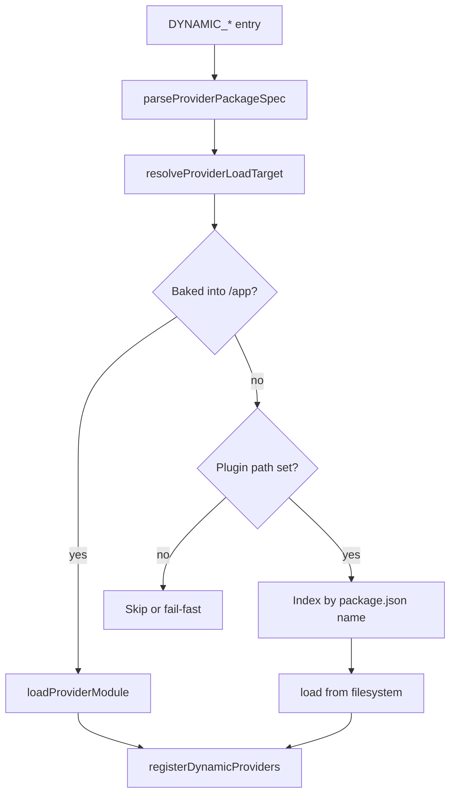

# Dynamic Provider Plugins

Extend the billing manager with extra payment processors and billing UI provider metadata at runtime without forking the application image.

## Overview

Decabill uses the shared `@forepath/shared/backend/util-dynamic-provider-registry` loader. Provider packages can be **baked into** the billing manager deploy graph or **mounted post-build** into `DYNAMIC_PROVIDER_PLUGIN_PATH`.

This page covers **Decabill billing manager** registries only.

## Registries

| Env var                             | Criticality | Registers                                              |
| ----------------------------------- | ----------- | ------------------------------------------------------ |
| `DYNAMIC_PAYMENT_PROCESSORS`        | critical    | Payment processor implementations                      |
| `DYNAMIC_BILLING_PROVIDER_METADATA` | optional    | Admin UI provider metadata (`providerMetadata` export) |

Shared tuning:

| Variable                          | Purpose                                                       |
| --------------------------------- | ------------------------------------------------------------- |
| `DYNAMIC_PROVIDERS_FAIL_FAST`     | When `true`, critical registries abort startup on load errors |
| `DYNAMIC_PROVIDER_PLUGIN_PATH`    | Absolute plugin root inside the container                     |
| `DYNAMIC_PROVIDER_PLUGIN_INSTALL` | Comma-separated `npm install` targets at startup              |

**Production:** set `DYNAMIC_PROVIDERS_FAIL_FAST=true` when `DYNAMIC_PAYMENT_PROCESSORS` is non-empty.

## Resolution Order

For each `DYNAMIC_*` entry the loader:

1. **Baked-in** - resolves the package from `/app/package.json` (image build graph)
2. **Plugin path** - looks up the package by `package.json` name under `DYNAMIC_PROVIDER_PLUGIN_PATH`
3. **Fail** - logs and skips, or aborts startup when critical and fail-fast is enabled

Baked-in wins when the same package exists in both places.



## Config Format

```bash
# alias=@package/specifier
DYNAMIC_PAYMENT_PROCESSORS=acme=@forepath/decabill/backend/payment-acme

# PascalCase alias selects named class export
DYNAMIC_BILLING_PROVIDER_METADATA=AcmeMeta=@forepath/decabill/backend/billing-provider-acme

# bare specifier
DYNAMIC_PAYMENT_PROCESSORS=@forepath/decabill/backend/payment-acme

# file: entry relative to plugin path
DYNAMIC_PAYMENT_PROCESSORS=acme=file:payment-acme
```

Allowed package name prefixes: `@forepath/`, `@decabill/`. Do not combine `file:` with an `@forepath/` specifier on the same entry.

## Plugin Package Contract

External packages must export one of:

1. **`createProvider`** (preferred) - `(moduleRef: ModuleRef) => T | Promise<T>`
2. **Named PascalCase class** - via entry alias or `package.json`:

```json
{
  "forepath": {
    "providerExport": "AcmePaymentProcessor"
  }
}
```

For billing UI metadata packages, export **`providerMetadata`** array compatible with the provider registry service.

Declare Nest and host dependencies as **peerDependencies** resolved from `/app/node_modules`.

## Payment Processors

Processors implement the `PaymentProcessor` interface:

- Register with `PaymentProcessorFactory` at module bootstrap
- Handle checkout session creation and webhook processing for their provider
- Expose a unique `type` string matching `BILLING_DEFAULT_PAYMENT_PROCESSOR`

Built-in: `stripe` via `StripePaymentProcessor`. See [Payment Processing](./payment-processing.md).

## Billing Provider Metadata

`DYNAMIC_BILLING_PROVIDER_METADATA` adds entries to `GET /service-types/providers` for admin UI dropdowns and config schema rendering without implementing full provisioning in the same package.

Built-in Hetzner and DigitalOcean providers register statically when API tokens are present.

## Baked-in Plugins

1. Add the provider package to the billing manager deploy graph
2. Set the relevant `DYNAMIC_*` variable
3. Rebuild the container image

## Post-build Plugins

1. Build the plugin to compiled JS with `package.json`
2. Mount into `./provider-plugins/` (compose maps to `/var/lib/forepath/provider-plugins`) and/or set `DYNAMIC_PROVIDER_PLUGIN_INSTALL`
3. Set `DYNAMIC_PROVIDER_PLUGIN_PATH=/var/lib/forepath/provider-plugins`
4. Set `DYNAMIC_*` to reference package name or `file:` directory
5. Restart the container

Startup runs `install-provider-plugins.js` before `main.js` when the plugin path is set. Install failures fail container start.

## Startup Error Policy

| Registry criticality | `DYNAMIC_PROVIDERS_FAIL_FAST` | On load error      |
| -------------------- | ----------------------------- | ------------------ |
| optional             | any                           | Log and skip entry |
| critical             | unset / `false`               | Log and skip entry |
| critical             | `true`                        | Abort startup      |

## Security

- Package `name` in indexed `package.json` files must use allowlisted prefixes (`@forepath/`, `@decabill/`)
- `file:` paths resolve under `DYNAMIC_PROVIDER_PLUGIN_PATH` only; traversal outside the root is rejected
- Private registry installs require operator-supplied `.npmrc` or token mounts

## Docker Compose Example

```yaml
environment:
  DYNAMIC_PROVIDER_PLUGIN_PATH: /var/lib/forepath/provider-plugins
  DYNAMIC_PROVIDER_PLUGIN_INSTALL: ${DYNAMIC_PROVIDER_PLUGIN_INSTALL:-}
  DYNAMIC_PROVIDERS_FAIL_FAST: 'true'
volumes:
  - ./provider-plugins:/var/lib/forepath/provider-plugins
```

See [Docker Deployment](../deployment/docker-deployment.md).

## Related Documentation

- **[Payment Processing](./payment-processing.md)** - Stripe built-in processor
- **[Service Types and Plans](./service-types-and-plans.md)** - Provider registry consumption
- **[Environment Configuration](../deployment/environment-configuration.md)** - `DYNAMIC_*` reference
- **[Backend Billing Manager](../applications/backend-billing-manager.md)** - Compose and env

---

_Implementation: `@forepath/shared/backend/util-dynamic-provider-registry`._
