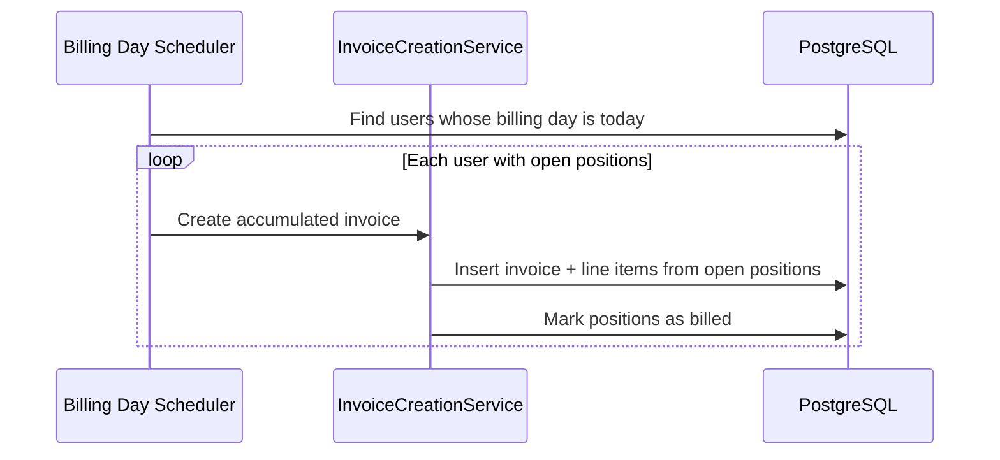

# Invoices

Invoice issuance, ZUGFeRD PDF generation, open position accumulation, and payment initiation for Decabill customers and administrators.

## Overview

Decabill stores invoices in PostgreSQL with immutable issued states. PDFs follow ZUGFeRD conventions with EN 16931 XML embedded. Customers pay via Stripe Checkout; admins can create manual invoices and adjust payment status.

## Invoice Statuses

| Status           | Description                                 |
| ---------------- | ------------------------------------------- |
| `draft`          | Editable; admin manual invoices only        |
| `issued`         | Finalized; line items and amounts immutable |
| `paid`           | Fully paid                                  |
| `partially_paid` | Partial payment recorded                    |
| `overdue`        | Past due date without full payment          |
| `void`           | Voided; void document PDF available         |

**Immutability:** Only `draft` invoices can be edited or deleted. Issued invoices can be voided (when unpaid) or marked paid or unpaid by admins.

## Open Positions and Billing Day

Recurring and final subscription charges are recorded as **open positions** instead of creating an invoice immediately.

A scheduler runs on each user's **billing day** (stored on the user record; default is registration day of month capped at 28). On that day, one accumulated invoice per user is created containing all unbilled open positions as line items.

This is separate from the service plan's `billing_day_of_month`, which controls subscription period alignment.

Configure scheduler interval with `OPEN_POSITION_INVOICE_SCHEDULER_INTERVAL` (default daily).

## Customer Invoice Access

### Summary and Lists

- `GET /invoices/summary` - Aggregated counts and amounts for the authenticated user
- `GET /invoices/open-overdue` - Open and overdue invoices for the user

### By Reference

Invoices are addressed by stable `invoiceRefId`:

- `GET /invoices/ref/{invoiceRefId}` - Invoice detail
- `GET /invoices/ref/{invoiceRefId}/pdf` - Download ZUGFeRD PDF
- `GET /invoices/ref/{invoiceRefId}/void-document/pdf` - Void document PDF when voided
- `POST /invoices/ref/{invoiceRefId}/pay` - Initiate Stripe Checkout

Subscription-scoped paths mirror the same operations under `/invoices/{subscriptionId}/ref/{invoiceRefId}`.

### Void (Customer Context)

Customers may void eligible invoices via subscription-scoped void endpoint where policy allows.

## Admin Invoice Operations

Admin routes under `/admin/billing/invoices`:

- List all invoices with filters
- Open and overdue lists across tenants (scoped by `X-Tenant`)
- Manual invoice workflow (see [Billing Administration](./billing-administration.md))
- Mark paid or unpaid
- Audit logs per invoice
- PDF and void document download

**Bill now:** `POST /admin/billing/bill-now` forces invoice generation for selected users outside the scheduler.

## PDF Generation

PDFs are stored under `BILLING_INVOICE_PDF_STORAGE_PATH`. Issuer details come from environment:

- `BILLING_ISSUER_*` (name, VAT ID, address, email, IBAN)
- `BILLING_TAX_RATE_STANDARD` and `BILLING_TAX_RATE_REDUCED`

## Usage on Invoices

Usage records posted via `POST /admin/usage/record` (admin or API key only) appear on invoices when pricing includes usage cost or unit counts. Customers can read usage via `GET /usage/summary/{subscriptionId}` but cannot submit records.

## Payment

Customer payment flow:

1. `POST .../pay` creates a Stripe Checkout Session
2. User completes checkout on Stripe
3. Stripe webhook updates invoice to paid (idempotent)

See [Payment Processing](./payment-processing.md).

## Project Time Billing

Admins bill tracked project hours via `POST /admin/billing/projects/{projectId}/bill-time` with a `{ from, to }` body. The billing console modal defaults that range from `GET .../unbilled-time-bounds`. The operation:

1. Validates the assigned customer's billing profile is complete
2. Aggregates unbilled time entries fully within the requested range
3. Creates and immediately issues a draft invoice with one line item (project name, quantity = billed hours, unit price net = hourly rate)
4. Marks those time entries with `invoiceId` and `billedAt`

This is separate from open-position accumulation on the user's billing day. Project invoices link to the project through `projectId` on the invoice record.

See **[Projects](./projects.md)** for KPIs, reassignment rules, and minimum billable amount.

## Manual Invoice Workflow (Admin)

1. `POST /admin/billing/invoices/manual` - Create draft with user, optional subscription, custom line items
2. `POST /admin/billing/invoices/{invoiceRefId}` - Update draft line items
3. `POST /admin/billing/invoices/{invoiceRefId}/issue` - Issue draft (requires complete customer profile)
4. `DELETE /admin/billing/invoices/{invoiceRefId}` - Delete draft only

## API Endpoints Summary

| Audience | Key paths                                                                                                                              |
| -------- | -------------------------------------------------------------------------------------------------------------------------------------- |
| Customer | `/invoices/summary`, `/invoices/ref/{invoiceRefId}`, `/invoices/ref/{invoiceRefId}/pdf`, `/invoices/ref/{invoiceRefId}/pay`            |
| Admin    | `/admin/billing/invoices`, `/admin/billing/invoices/manual`, `/admin/billing/invoices/{invoiceRefId}/issue`, `/admin/billing/bill-now` |

Full schemas: [Billing Manager OpenAPI](/spec/billing-manager/openapi.yaml).

## Related Documentation

- **[Payment Processing](./payment-processing.md)** - Stripe checkout and webhooks
- **[Billing Administration](./billing-administration.md)** - Manual invoices and KPIs
- **[Customer Profiles](./customer-profiles.md)** - Required for issuance
- **[Projects](./projects.md)** - Bill-time from tracked hours
- **[Subscriptions](./subscriptions.md)** - Source of open positions
- **[Multi-tenancy](./multi-tenancy.md)** - Tenant-scoped invoice data

---

_For invoice payment sequence details, see [Payment Processing](./payment-processing.md)._
