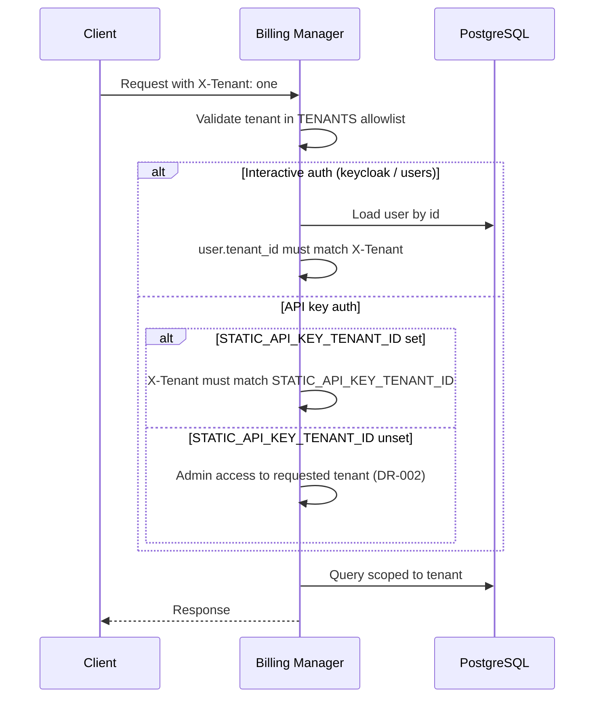

# Multi-tenancy

Tenant-scoped billing data in a shared billing manager deployment. Operators configure allowed tenants; clients select the active tenant per request.

## Overview

Decabill isolates users, subscriptions, invoices, service types, and service plans per tenant. The same email address may exist in different tenants as separate user records.

Multi-tenancy is enforced on:

- HTTP REST API via the `X-Tenant` header
- Socket.IO dashboard status via handshake `extraHeaders` or `auth.tenantId`
- Socket.IO project board via the same handshake rules on namespace **`projects`**
- Background jobs that iterate all configured tenants
- Stripe webhook handling that resolves tenant from checkout session metadata

## Tenant Selection

### HTTP Requests

Clients send optional header:

```http
X-Tenant: one
```

When omitted, the server uses `default` unless `TENANTS_ALLOW_DEFAULT=false` — then missing, blank, or `default` values are rejected with 400.

The billing console reads `billing.tenantId` from runtime config and attaches `X-Tenant` on every API call.

### Allowed Tenants

The `TENANTS` environment variable defines the allowlist:

```bash
TENANTS=default,one,two
```

Rules:

- `default` is included in the allowlist unless `TENANTS_ALLOW_DEFAULT=false`
- When `TENANTS_ALLOW_DEFAULT` is unset or not `false`, `default` is allowed even when not listed in `TENANTS`
- When `TENANTS` is unset or empty and default is allowed, only `default` is allowed
- When `TENANTS_ALLOW_DEFAULT=false`, missing, blank, or explicit `default` **`X-Tenant`** values are rejected (400)
- Invalid tenant ids return 400 Bad Request

Example without the default tenant:

```bash
TENANTS=one,two
TENANTS_ALLOW_DEFAULT=false
```

### Per-tenant Frontend URLs

Stripe checkout success and cancel redirects use tenant-specific billing console base URLs:

| Variable               | Purpose                                      |
| ---------------------- | -------------------------------------------- |
| `BILLING_FRONTEND_URL` | Base URL for the `default` tenant            |
| `TENANT_FRONTEND_URLS` | Comma-separated `tenantId=https://...` pairs |

Example:

```bash
BILLING_FRONTEND_URL=https://billing.example.com
TENANT_FRONTEND_URLS=one=https://one.billing.example.com,two=https://two.billing.example.com
```

## Data Isolation

Each tenant has independent:

- User accounts (same email allowed in multiple tenants)
- Customer billing profiles
- Subscriptions and subscription items
- Invoices and open positions
- Service types and service plans
- CloudInit config templates
- Backorders
- Projects (scoped via assigned user's `tenant_id`; customers see only their assigned projects)

Admin and user routes filter by the request tenant. Interactive auth (Keycloak or users) additionally requires the authenticated user's `tenant_id` to match the request tenant.

## API Key Auth and Tenant Scope

When `AUTHENTICATION_METHOD=api-key` (or api-key is inferred from `STATIC_API_KEY`):

### With `STATIC_API_KEY_TENANT_ID` set

API key requests are accepted only when `X-Tenant` matches the configured tenant id. Mismatch returns 403 Forbidden.

```bash
STATIC_API_KEY_TENANT_ID=one
```

### With `STATIC_API_KEY_TENANT_ID` unset

A valid `STATIC_API_KEY` grants admin access to **every** tenant listed in `TENANTS`, selected per request via `X-Tenant`. This is intentional for a single shared automation credential.

**Accepted risk [DR-002](../security/accepted-risks.md#dr-002--billing-multi-tenant-api-key-scope-static_api_key_tenant_id-unset):** Anyone with the deployment API key can read and mutate all configured tenants by changing `X-Tenant`.

**Mitigations:**

- Set `STATIC_API_KEY_TENANT_ID` when automation must target one tenant only
- Prefer Keycloak or users auth for the billing console in multi-tenant production
- Rotate and protect `STATIC_API_KEY` as a high-value secret
- WebSocket dashboard status does not stream to API key clients
- Project board WebSocket does not stream to API key clients

Interactive Keycloak and users sessions always enforce the user's `tenant_id` regardless of the above.

## Public Catalog

`GET /public/service-plan-offerings` is unauthenticated. Tenant is selected via `X-Tenant` (defaults to `default`). Restrict exposure with `TENANTS` on public-facing deployments.

## Background Jobs

Schedulers iterate all configured tenants:

- Open position invoice generation on each user's billing day
- Subscription item update (SSH docker compose pull)
- Backorder retry processing
- Other tenant-scoped maintenance tasks

Stripe webhooks resolve tenant from checkout session metadata to apply payment state to the correct tenant's invoice.

## Multi-tenancy Flow



## Configuration Summary

| Variable                   | Required | Description                                                                                 |
| -------------------------- | -------- | ------------------------------------------------------------------------------------------- |
| `TENANTS`                  | No       | Comma-separated allowed tenant ids                                                          |
| `TENANTS_ALLOW_DEFAULT`    | No       | When `false`, excludes `default` and rejects missing, blank, or `default` `X-Tenant` values |
| `STATIC_API_KEY_TENANT_ID` | No       | Bind API key auth to one tenant                                                             |
| `BILLING_FRONTEND_URL`     | No       | Default tenant frontend base URL for Stripe redirects                                       |
| `TENANT_FRONTEND_URLS`     | No       | Per-tenant frontend URLs for Stripe redirects                                               |

## Related Documentation

- **[Authentication](./authentication.md)** - Auth methods and API key behavior
- **[Billing Administration](./billing-administration.md)** - Admin routes and tenant scope
- **[Security - Accepted risks](../security/accepted-risks.md)** - **DR-002** multi-tenant API key scope
- **[Environment Configuration](../deployment/environment-configuration.md)** - Full variable reference
- **[Payment Processing](./payment-processing.md)** - Tenant-aware Stripe redirects

---

_For HTTP header documentation, see [Billing Manager OpenAPI](/spec/billing-manager/openapi.yaml)._
