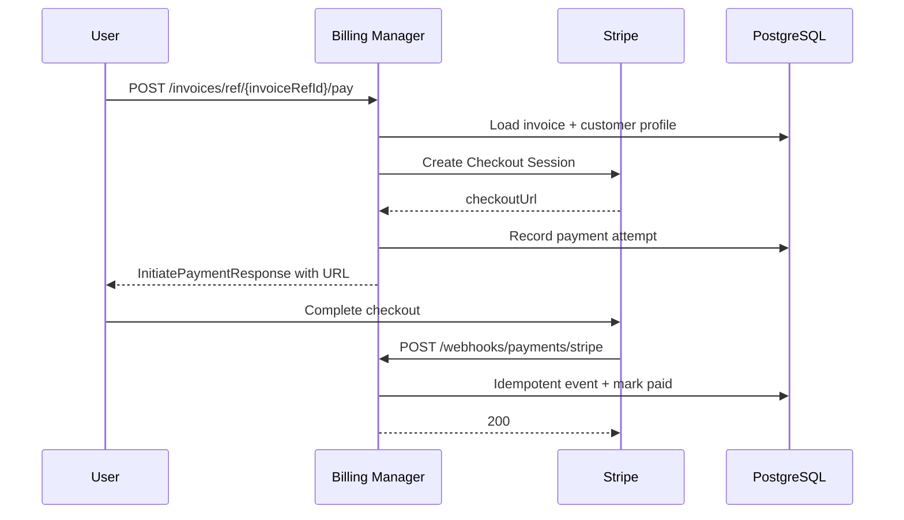

# Payment Processing

Stripe Checkout integration and webhook-driven payment reconciliation for Decabill invoices.

## Overview

Decabill uses a payment processor abstraction with **Stripe** as the built-in implementation. Customers initiate payment from the billing console; the backend creates a Stripe Checkout Session and records the attempt. Stripe webhooks mark invoices paid idempotently.

Additional processors can be registered via [Dynamic Provider Plugins](./dynamic-provider-plugins.md).

## Default Processor

Set the active processor type:

```bash
BILLING_DEFAULT_PAYMENT_PROCESSOR=stripe
```

The `PaymentProcessorFactory` resolves processors by type string at runtime.

## Stripe Configuration

| Variable                              | Purpose                                                 |
| ------------------------------------- | ------------------------------------------------------- |
| `STRIPE_SECRET_KEY`                   | Stripe API secret key                                   |
| `STRIPE_WEBHOOK_SECRET`               | Webhook signing secret                                  |
| `STRIPE_CHECKOUT_SUCCESS_URL`         | Legacy full URL or path used with tenant frontend base  |
| `STRIPE_CHECKOUT_CANCEL_URL`          | Cancel redirect path                                    |
| `BILLING_MIN_CHECKOUT_PAYMENT_AMOUNT` | Minimum balance for Checkout / PM charges (default `1`) |

Per-tenant redirect bases come from [Multi-tenancy](./multi-tenancy.md):

- `BILLING_FRONTEND_URL` for `default`
- `TENANT_FRONTEND_URLS` for other tenants

Checkout success and cancel URLs are built from the tenant frontend base plus configured path segments.

## Customer Payment Flow



### Initiate Payment

`POST /invoices/ref/{invoiceRefId}/pay` (and subscription-scoped variant) returns a checkout URL. The user is redirected to Stripe Hosted Checkout.

Session metadata includes tenant id so webhooks apply payment to the correct tenant's invoice.

### Webhook Handling

`POST /webhooks/payments/stripe` is a public endpoint secured by Stripe signature verification.

Behavior:

- Verify webhook signature with `STRIPE_WEBHOOK_SECRET`
- Process events idempotently (duplicate deliveries safe)
- Update invoice payment status to `paid` on successful checkout
- Store Stripe customer id on [Customer Profile](./customer-profiles.md) when created

## Admin Manual Payment Status

Admins can override payment state without Stripe:

- `POST /admin/billing/invoices/{invoiceRefId}/mark-paid`
- `POST /admin/billing/invoices/{invoiceRefId}/mark-unpaid`

Use for offline payments or reconciliation corrections. Audit logs record admin actions.

## Payment Processor Interface

Built-in and dynamic processors implement:

- Checkout session creation with amount, currency, and metadata
- Webhook route registration (Stripe uses fixed path)
- Customer create or update helpers
- **Auto-payment capability:** `supportsAutoPayment()`, `createSetupSession`, `chargeOffSession`

Stripe implementation: `StripePaymentProcessor` in the billing manager feature module.

See [Auto-Billing](./auto-billing.md) for off-session charging, retries, and manual-pay blocking.

## Security

- Never expose `STRIPE_SECRET_KEY` or `STRIPE_WEBHOOK_SECRET` to the frontend
- Webhook endpoint validates Stripe signatures before state changes
- Checkout sessions include tenant and invoice references for scoped updates
- Use HTTPS for production webhook URLs

## Related Documentation

- **[Invoices](./invoices.md)** - Invoice statuses and pay endpoints
- **[Multi-tenancy](./multi-tenancy.md)** - Tenant-aware redirect URLs
- **[Dynamic Provider Plugins](./dynamic-provider-plugins.md)** - `DYNAMIC_PAYMENT_PROCESSORS`
- **[Customer Profiles](./customer-profiles.md)** - Stripe customer id storage
- **[Stripe Documentation](https://stripe.com/docs)** - External Stripe reference
- **[Billing Manager OpenAPI](/spec/billing-manager/openapi.yaml)** - Pay and webhook paths

---

_Configure Stripe keys in the billing manager environment before enabling customer checkout._
