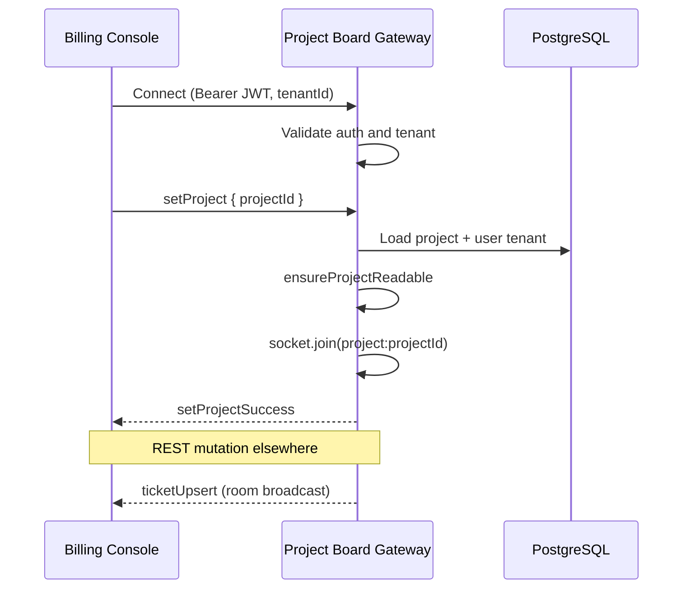

# Project Board

Live Kanban-style board for project tickets with Socket.IO updates on the **`projects`** namespace.

## Overview

The project board displays hierarchical tickets in swimlanes by status. Admins create, edit, drag between lanes, and lock tickets. Customers view the board read-only and may add comments on tickets. REST mutations emit realtime events to clients joined to the project room.

Specification: [Billing Manager AsyncAPI](/spec/billing-manager/asyncapi.yaml) (`projects` server).

## Swimlanes

The UI renders four active lanes plus terminal states:

| Lane (board)  | Ticket status    | Who can move                               |
| ------------- | ---------------- | ------------------------------------------ |
| Draft         | `draft`          | Admin only                                 |
| To do         | `todo`           | Admin only                                 |
| In progress   | `in_progress`    | Admin only                                 |
| Prototype     | `prototype`      | Admin only                                 |
| Done / Closed | `done`, `closed` | Admin only (detail editor, not drag lanes) |

Lane labels are localized in the billing console. Locked tickets and tickets under a locked milestone cannot be edited or dragged by admins.

Customers never see create-ticket or drag-drop controls (`isAdmin=false` on the board component).

## REST Board Operations

Base path: `/projects/{projectId}`

### Tickets

| Method | Path                           | Access                                                            |
| ------ | ------------------------------ | ----------------------------------------------------------------- |
| GET    | `/tickets`                     | Customer read, admin read (optional `status`, `parentId` filters) |
| GET    | `/tickets/{ticketId}`          | Customer read, admin read                                         |
| GET    | `/tickets/{ticketId}/comments` | Customer read, admin read                                         |
| GET    | `/tickets/{ticketId}/activity` | Customer read, admin read                                         |
| POST   | `/tickets`                     | Admin only                                                        |
| POST   | `/tickets/{ticketId}`          | Admin only                                                        |
| DELETE | `/tickets/{ticketId}`          | Admin only                                                        |
| POST   | `/tickets/{ticketId}/comments` | Customer or admin                                                 |

Tickets support parent-child hierarchy and optional milestone assignment. Each ticket gets a stable content SHA for traceability.

### Milestones

| Method | Path                    | Access                                               |
| ------ | ----------------------- | ---------------------------------------------------- |
| GET    | `/milestones`           | Customer read, admin read                            |
| POST   | `/milestones`           | Admin only                                           |
| POST   | `/milestones/{id}`      | Admin only                                           |
| POST   | `/milestones/{id}/lock` | Admin only (locks milestone and related board edits) |
| DELETE | `/milestones/{id}`      | Admin only                                           |

## WebSocket Connection

### URL and Namespace

Configure the billing console runtime config:

```json
{
  "billing": {
    "websocketUrl": "ws://localhost:8082/billing",
    "projectsWebsocketUrl": "ws://localhost:8082/projects",
    "tenantId": "default"
  }
}
```

When `projectsWebsocketUrl` is omitted, the client derives it from `websocketUrl` by replacing the `/billing` path segment with `/projects`.

Backend environment variables:

| Variable                       | Default    | Purpose                                            |
| ------------------------------ | ---------- | -------------------------------------------------- |
| `WEBSOCKET_PORT`               | `8082`     | Socket.IO TCP port (shared with dashboard gateway) |
| `PROJECTS_WEBSOCKET_NAMESPACE` | `projects` | Namespace path segment                             |
| `WEBSOCKET_CORS_ORIGIN`        | `*`        | CORS origin for browser clients                    |

### Authentication

Pass the same credentials as HTTP in the Socket.IO handshake:

- **Keycloak:** `Bearer <keycloak-jwt>` in `auth.Authorization` or handshake headers
- **Users:** `Bearer <jwt>` in `auth.Authorization` or handshake headers
- **API key:** **Not supported**. `setProject` emits `error` with message "User not authenticated"

Pass tenant in the handshake:

- **Browser clients:** `auth.tenantId` and `auth.Authorization`
- **Node clients:** `extraHeaders: { 'X-Tenant': 'default', Authorization: '...' }`

The authenticated user's `tenant_id` must match the socket tenant.

## Events

### Client to Server

| Event        | Payload               | Purpose                                            |
| ------------ | --------------------- | -------------------------------------------------- |
| `setProject` | `{ projectId: uuid }` | Join `project:{projectId}` room after access check |

On success the server emits `setProjectSuccess`. On failure it emits `error` to the initiating socket only.

### Server to Client

Events are broadcast to the project room (`project:{projectId}`) after successful REST mutations:

| Event                   | Purpose                                      |
| ----------------------- | -------------------------------------------- |
| `ticketUpsert`          | Created or updated ticket (full DTO)         |
| `ticketRemoved`         | `{ id, projectId }`                          |
| `ticketCommentCreated`  | New comment on a ticket                      |
| `ticketActivityCreated` | Audit activity entry                         |
| `milestoneUpsert`       | Created or updated milestone                 |
| `milestoneRemoved`      | `{ id, projectId }`                          |
| `timeEntryUpsert`       | Created or updated time entry                |
| `timeEntryRemoved`      | `{ id, projectId }`                          |
| `projectSummaryChanged` | Updated KPI summary (e.g. after bill-time)   |
| `error`                 | Application errors for the initiating socket |

## Security Model

- Clients must call `setProject` before receiving room broadcasts
- The server validates project readability (admin or assigned customer) before joining a room
- Room membership is per socket; disconnect leaves the previous project room
- API key auth cannot join project rooms
- REST ownership checks mirror WebSocket access (`ensureProjectReadable`)

Unlike the dashboard status gateway, the project board **uses Socket.IO rooms** scoped by project id.

## Connection Flow



Sequence source: [`project-board-realtime.mmd`](../../../libs/domains/decabill/backend/feature-billing-manager/docs/project-board-realtime.mmd)

## Frontend Integration

NgRx effects in `data-access-billing-console`:

- `connectProjectBoardSocket$` — connect when entering a project board
- `setProjectBoardSocketProjectEmit$` — emit `setProject` after connect
- `restoreProjectBoardSocketProject$` — re-emit `setProject` after reconnect
- Socket events dispatch board slice updates (tickets, milestones, time entries, summary)

The `ProjectBoardComponent` loads tickets over REST on init, connects the socket, and calls `setProject(projectId)`.

## Related Documentation

- **[Projects](./projects.md)** - Assignment, admin CRUD, bill-time, KPIs
- **[Real-time Status](./real-time-status.md)** - Separate `billing` namespace for server status
- **[Authentication](./authentication.md)** - JWT and Keycloak handshake
- **[Multi-tenancy](./multi-tenancy.md)** - Tenant in handshake
- **[Billing Manager AsyncAPI](/spec/billing-manager/asyncapi.yaml)** - Full message schemas

---

_Static API key auth cannot subscribe to project board updates; use interactive auth in the billing console._
