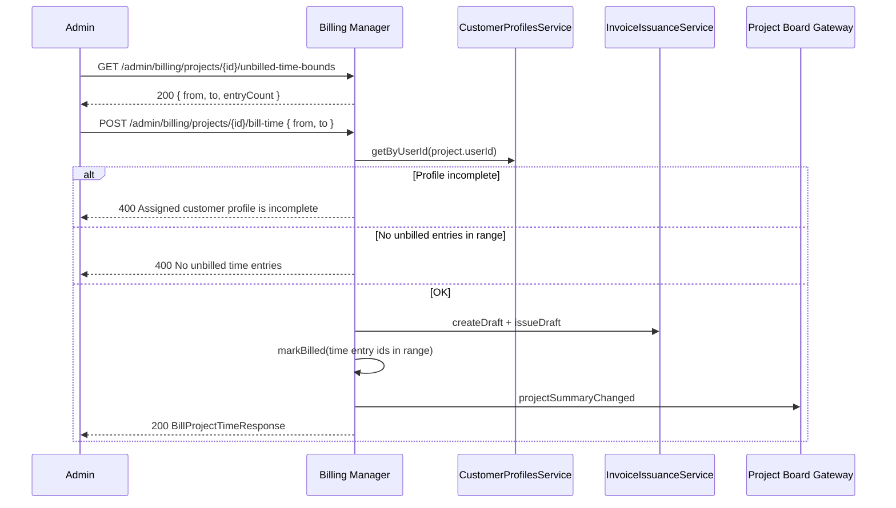
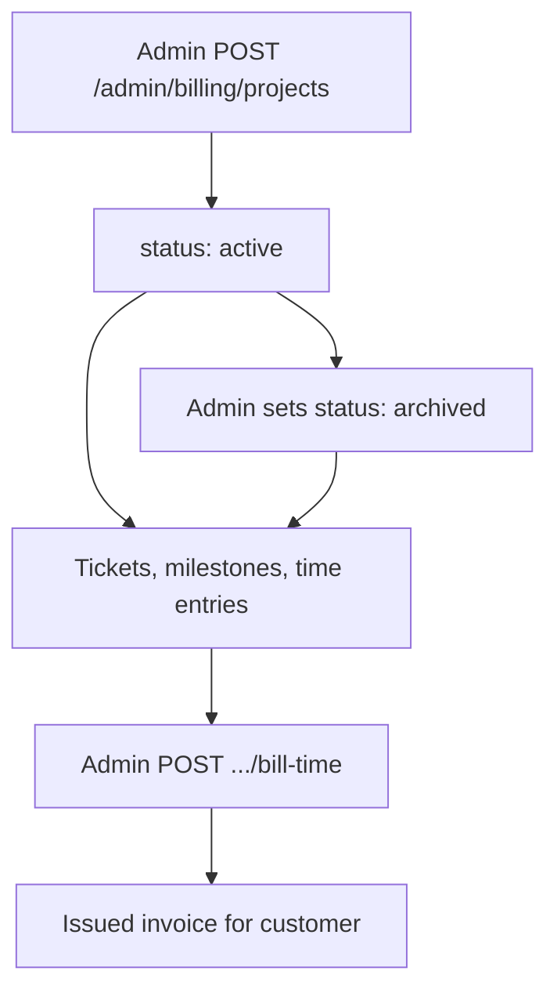

# Projects

Customer-assigned work tracking with admin-managed boards, time entries, and billable hours invoicing.

## Overview

Projects let operators track delivery work for a billing customer: milestones, hierarchical tickets, time entries, and KPI summaries. Each project is assigned to exactly one user (`userId`) in the current tenant. Customers see their assigned projects read-only and can comment on tickets. Admins create and manage projects, edit the live board, record time, and bill unbilled hours to an invoice.

Live board updates use the **`projects`** Socket.IO namespace. See [Project Board](./project-board.md).

## Assignment Model

| Concept         | Behavior                                                        |
| --------------- | --------------------------------------------------------------- |
| Owner           | One `userId` per project (the billing customer)                 |
| Admin access    | Admins read and write all projects in the tenant                |
| Customer access | Users see only projects where `project.userId` matches their id |
| Reassignment    | Admin may change `userId` until billed time entries exist       |
| Hourly rate     | Locked after the first successful bill-time operation           |

Projects inherit tenant scope through the assigned user's `tenant_id`. There is no separate `tenant_id` column on project rows.

## Customer Access (Read-Only)

| Method | Path                            | Purpose                                                       |
| ------ | ------------------------------- | ------------------------------------------------------------- |
| GET    | `/projects`                     | Paginated list of projects assigned to the authenticated user |
| GET    | `/projects/{projectId}`         | Project detail                                                |
| GET    | `/projects/{projectId}/summary` | KPI summary                                                   |

Customers can list and view tickets, milestones, and ticket comments. Ticket create, update, delete, and lane moves are **admin only**. Customers may add ticket comments.

**Frontend routes:**

- `/projects` — project list
- `/projects/:projectId` — project detail with read-only board

## Admin CRUD

All admin routes require admin role (`@KeycloakRoles(ADMIN)` + `@UsersRoles(ADMIN)`).

| Method | Path                                                       | Purpose                                                     |
| ------ | ---------------------------------------------------------- | ----------------------------------------------------------- |
| GET    | `/admin/billing/projects`                                  | Paginated list (optional `search`, `userId` filter)         |
| GET    | `/admin/billing/projects/{projectId}`                      | Detail with summary and assignee email                      |
| GET    | `/admin/billing/projects/{projectId}/summary`              | KPI summary                                                 |
| POST   | `/admin/billing/projects`                                  | Create project (requires `userId`, `name`, `hourlyRateNet`) |
| POST   | `/admin/billing/projects/{projectId}`                      | Update project                                              |
| DELETE | `/admin/billing/projects/{projectId}`                      | Delete (blocked when unbilled time entries exist)           |
| GET    | `/admin/billing/projects/{projectId}/unbilled-time-bounds` | Oldest/newest unbilled entry range for bill-time defaults   |
| POST   | `/admin/billing/projects/{projectId}/bill-time`            | Bill unbilled time in range to an issued invoice            |

**Frontend route:** `/administration/projects`

### Create and Update Rules

- **Create:** `userId` must reference an existing user in the request tenant
- **Delete:** Rejected when any unbilled time entries remain
- **Reassign customer:** Blocked after billed time entries exist
- **Change hourly rate:** Blocked after the first bill-time operation

### Project Fields

| Field           | Description                      |
| --------------- | -------------------------------- |
| `name`          | Display name                     |
| `description`   | Optional long text               |
| `status`        | `active` or `archived`           |
| `hourlyRateNet` | Net hourly rate for time billing |
| `currency`      | ISO currency (default `EUR`)     |

## Time Entries (Admin)

Time is recorded under `/projects/{projectId}/time-entries`. Only admins can list, create, update, or delete entries.

| Method | Path                                           | Purpose               |
| ------ | ---------------------------------------------- | --------------------- |
| GET    | `/projects/{projectId}/time-entries`           | Paginated list        |
| POST   | `/projects/{projectId}/time-entries`           | Create entry          |
| POST   | `/projects/{projectId}/time-entries/{entryId}` | Update unbilled entry |
| DELETE | `/projects/{projectId}/time-entries/{entryId}` | Delete unbilled entry |

Entries may optionally reference a ticket (`ticketId`). Billed entries (`billedAt` set) are immutable and cannot be deleted.

## Bill Time

`POST /admin/billing/projects/{projectId}/bill-time` converts **unbilled** time entries that fall fully within a requested datetime range into one issued invoice line item for the project's assigned customer.

### Unbilled time bounds

`GET /admin/billing/projects/{projectId}/unbilled-time-bounds` returns the default range for the billing console modal:

| Field        | Description                                          |
| ------------ | ---------------------------------------------------- |
| `from`       | `startedAt` of the oldest unbilled entry (or `null`) |
| `to`         | `endedAt` of the newest unbilled entry (or `null`)   |
| `entryCount` | Number of unbilled entries on the project            |

### Request body

`POST .../bill-time` requires a JSON body:

| Field            | Description                                                  |
| ---------------- | ------------------------------------------------------------ |
| `from`           | Range start (ISO 8601, inclusive)                            |
| `to`             | Range end (ISO 8601, inclusive)                              |
| `subscriptionId` | Optional subscription link (must belong to project customer) |
| `lineItems`      | Optional extra invoice lines (same shape as manual invoices) |

Only unbilled entries where `startedAt >= from` and `endedAt <= to` are included. `from` must be strictly before `to`. The issued invoice always includes one generated line for the billed time range, followed by any optional `lineItems`.

### Preconditions

1. Assigned customer has a **complete** billing profile (same rules as subscription ordering and manual invoice issuance)
2. At least one unbilled time entry exists **within the requested range**
3. Billable combined net amount (time line plus optional extras) is at least **0.01** in project currency

### Result

The response includes `invoiceId`, `invoiceNumber`, `billedMinutes`, and `amountNet` (total invoice subtotal net, including optional line items). Time entries are marked with `invoiceId` and `billedAt`. A `projectSummaryChanged` event is emitted on the project board WebSocket.

The billing console opens a modal with **From** and **To** datetime fields pre-filled from the bounds endpoint, optional **Subscription**, and optional **additional line items** (same fields as manual invoice lines) before submitting bill-time.

Bill-time does **not** require ticket or milestone lock and does **not** lock tickets automatically. Board scope lock (ticket/milestone) and billing lock (billed time entries) are separate concerns. See [Project Board — Locking](./project-board.md#locking).

See also [Invoices](./invoices.md) and [Customer Profiles](./customer-profiles.md).

## KPI Summary

`GET /projects/{projectId}/summary` (or admin equivalent) returns:

| Field                   | Description                            |
| ----------------------- | -------------------------------------- |
| `totalTrackedMinutes`   | Sum of all time entry durations        |
| `unbilledMinutes`       | Minutes not yet invoiced               |
| `openBillableAmountNet` | `unbilledMinutes / 60 × hourlyRateNet` |
| `billedAmountNet`       | Net amount from billed minutes         |
| `openTicketCount`       | Tickets not in `done` or `closed`      |
| `doneTicketCount`       | Tickets in `done` or `closed`          |
| `milestoneCount`        | Number of milestones                   |

## Data Storage

| Table                          | Purpose                                              |
| ------------------------------ | ---------------------------------------------------- |
| `billing_projects`             | Project header and hourly rate                       |
| `billing_project_milestones`   | Milestones with optional lock                        |
| `billing_project_tickets`      | Hierarchical tickets with status and priority        |
| `billing_project_time_entries` | Tracked minutes, optional ticket link, billing state |

Ticket activity and comments are stored in separate tables and surfaced through ticket endpoints.

## Project Lifecycle

## Authentication Notes

- Project REST endpoints require an interactive user identity (JWT or Keycloak)
- Static API key auth is rejected for customer project reads (`403 User not authenticated`)
- Dashboard and project board WebSockets also reject API key auth

See [Authentication](./authentication.md) and [Multi-tenancy](./multi-tenancy.md).

## Related Documentation

- **[Project Board](./project-board.md)** - Live board, swimlanes, and WebSocket events
- **[Billing Administration](./billing-administration.md)** - Admin projects UI and cross-links
- **[Customer Profiles](./customer-profiles.md)** - Profile required for bill-time
- **[Invoices](./invoices.md)** - Issued invoice from project time
- **[Real-time Status](./real-time-status.md)** - Separate `billing` namespace for server status
- **[Billing Manager OpenAPI](/spec/billing-manager/openapi.yaml)** - Project and board REST schemas

---

_Admins manage projects under `/administration/projects`; customers view assigned work under `/projects`._
