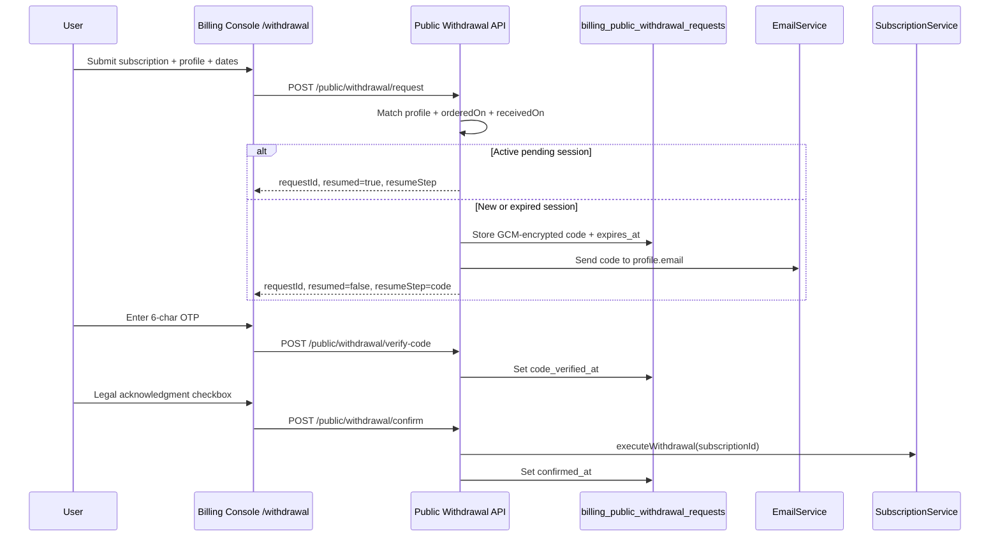

# Public Statutory Withdrawal

Exercise statutory withdrawal (Widerruf) without logging in. Customers verify identity by email, acknowledge the withdrawal, and the billing manager runs the same pipeline as `POST /subscriptions/{id}/withdraw`.

## Overview

The public flow is available at **`/withdrawal`** in the billing console (no authentication required). It matches the subscription against the **billing profile** (not the login email), validates order/receipt dates, sends a 6-character confirmation code to the profile email, and executes withdrawal after OTP verification and legal acknowledgment.

Logged-in customers continue to use the subscription **Withdraw** action in the console. See [Subscriptions — Statutory Withdrawal](./subscriptions.md#statutory-withdrawal-widerruf) for eligibility rules and refund behavior.

## Flow

## Session resume

Re-submitting the **same** subscription number, customer name, email, optional company, ordered on, and received on (when applicable) resumes a non-expired pending request:

| Existing session                        | Behavior                                                |
| --------------------------------------- | ------------------------------------------------------- |
| None                                    | Create request, send email, advance to `code`           |
| Pending, not expired, code not verified | Resume to `code` — no new email                         |
| Pending, not expired, code verified     | Resume to `acknowledge` — user re-checks legal checkbox |
| Expired or already confirmed            | Invalidate old row, create new request, send new email  |

Default confirmation TTL: **`PUBLIC_WITHDRAWAL_CONFIRMATION_TTL_HOURS`** (48 hours).

## Matching rules

### Billing profile

- Subscription number must exist (`SUB-######`)
- Customer name, email, and optional company must match the linked [Customer Profile](./customer-profiles.md) (normalized comparison)
- Match failures return a generic message: _"We could not find a subscription matching the details provided."_

### Dates

- **`orderedOn`** (required): must match the subscription `createdAt` calendar date (UTC)
- **`receivedOn`** (optional): required only when at least one active item has been provisioned; must match the earliest active item `provisionedAt` calendar date (UTC)

## Public API

All endpoints are `@Public()` and rate-limited by the global throttler.

| Method | Path                             | Description                                             |
| ------ | -------------------------------- | ------------------------------------------------------- |
| GET    | `/public/withdrawal/addressee`   | Seller legal entity from `BILLING_ISSUER_*` for display |
| POST   | `/public/withdrawal/request`     | Match details, create or resume session                 |
| POST   | `/public/withdrawal/verify-code` | Validate OTP and set `code_verified_at`                 |
| POST   | `/public/withdrawal/confirm`     | Require acknowledgment; call `executeWithdrawal`        |

OpenAPI operation IDs: `getPublicWithdrawalAddressee`, `requestPublicWithdrawal`, `verifyPublicWithdrawalCode`, `confirmPublicWithdrawal`.

## Security

- Server-side validation only (class-validator DTOs)
- Confirmation codes stored with GCM encryption (`ENCRYPTION_KEY`); never returned in API responses or logs
- Email sent only to billing profile email
- Tenant scoping on all database lookups
- Generic messages for profile/date match failures; specific but safe messages for invalid/expired codes and withdrawal policy blocks

## Configuration

| Variable                                   | Description                                                                               | Default  |
| ------------------------------------------ | ----------------------------------------------------------------------------------------- | -------- |
| `PUBLIC_WITHDRAWAL_CONFIRMATION_TTL_HOURS` | Hours until a pending request expires                                                     | `48`     |
| `BILLING_ISSUER_*`                         | Legal entity shown as withdrawal addressee and on invoices                                | —        |
| `ENCRYPTION_KEY`                           | Encrypts confirmation codes at rest                                                       | required |
| `SMTP_*` / `EMAIL_FROM`                    | Outbound confirmation email (queued; see [Email notifications](./email-notifications.md)) | —        |
| `EMAIL_COMPANY_*` / `BILLING_ISSUER_*`     | Optional brand header/footer on the confirmation email                                    | —        |

See [Environment Configuration](../deployment/environment-configuration.md).

## Frontend

- Route: `/withdrawal` with `loginGuard` (anonymous allowed; authenticated users redirected like login)
- NgRx slice: `publicWithdrawal` in `data-access-billing-console`
- UI mirrors identity auth layout (two-column, Bootstrap alerts, `IdentityOtpInputComponent`)
- Addressee card: _"Your withdrawal is addressed to"_ from `GET /public/withdrawal/addressee`

## Related

- [Subscriptions — Statutory Withdrawal](./subscriptions.md#statutory-withdrawal-widerruf)
- [Customer Profiles](./customer-profiles.md)
- [Authentication](./authentication.md)
