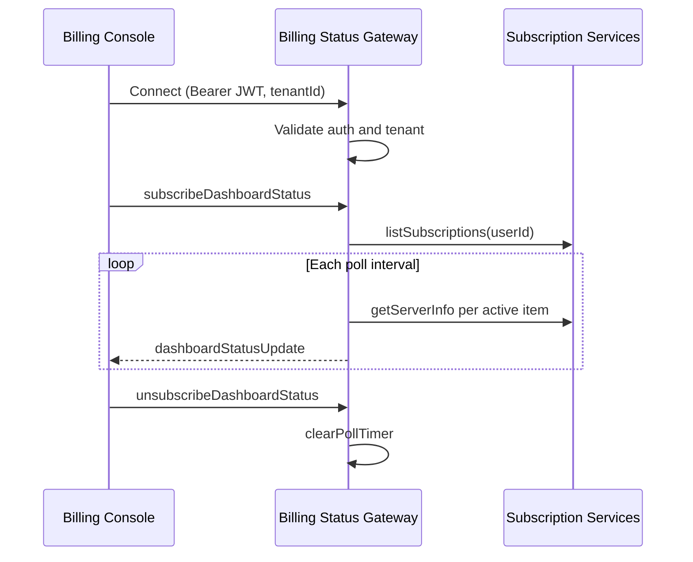

# Real-time Status

Socket.IO dashboard status stream for provisioned subscription items in the billing console.

## Overview

The billing manager exposes a dedicated WebSocket gateway (default TCP port **8082**, namespace **`billing`**) separate from the HTTP REST API (default port **3200**). Authenticated users subscribe to periodic server status snapshots for all active subscription items they own.

Specification: [Billing Manager AsyncAPI](/spec/billing-manager/asyncapi.yaml).

## Connection

### URL and Namespace

Configure the billing console runtime config:

```json
{
  "billing": {
    "websocketUrl": "ws://localhost:8082/billing",
    "tenantId": "default"
  }
}
```

Environment variables on the backend:

| Variable                | Default   | Purpose                         |
| ----------------------- | --------- | ------------------------------- |
| `WEBSOCKET_PORT`        | `8082`    | Socket.IO TCP port              |
| `WEBSOCKET_NAMESPACE`   | `billing` | Namespace path segment          |
| `WEBSOCKET_CORS_ORIGIN` | `*`       | CORS origin for browser clients |
| `STATUS_POLL_INTERVAL`  | `15000`   | Default poll interval in ms     |

### Authentication

Pass the same credentials as HTTP in the Socket.IO handshake:

- **Keycloak:** `Bearer <keycloak-jwt>` in `auth.Authorization` or handshake headers
- **Users:** `Bearer <jwt>` in `auth.Authorization` or handshake headers
- **API key:** **Not supported** for dashboard status. `subscribeDashboardStatus` emits `error` with message "User not authenticated". This mirrors REST behavior for API-key-only requests.

### Multi-tenancy

Pass tenant in the handshake:

- **Browser clients:** `auth.tenantId` and `auth.Authorization`
- **Node clients:** `extraHeaders: { 'X-Tenant': 'default', Authorization: '...' }`

The authenticated user's `tenant_id` must match the socket tenant.

## Events

### Client to Server

| Event                        | Payload                       | Purpose       |
| ---------------------------- | ----------------------------- | ------------- |
| `subscribeDashboardStatus`   | `{ pollIntervalMs?: number }` | Start polling |
| `unsubscribeDashboardStatus` | none                          | Stop polling  |

`pollIntervalMs` is clamped server-side between 10 seconds and 120 seconds. When omitted, the server uses `STATUS_POLL_INTERVAL`.

### Server to Client

| Event                   | Purpose                                 |
| ----------------------- | --------------------------------------- |
| `dashboardStatusUpdate` | Snapshot per poll tick                  |
| `error`                 | Application errors for this socket only |

## Security Model

- The server **never uses Socket.IO rooms** for this feature
- Subscription ids are chosen **only** from the authenticated user's subscriptions on each poll tick
- Client-supplied subscription lists are **not** trusted
- `dashboardStatusUpdate` and `error` are emitted **only** to the subscribing socket

This mirrors REST subscription ownership checks on `GET .../server-info`.

## Payload Shape

Each `dashboardStatusUpdate` contains items matching the REST server-info response for every active provisioned item across the user's subscriptions: subscription id, item id, hostname, FQDN, IPs, provider status, and metadata.

## Connection Flow



## Frontend Integration

NgRx effects in `data-access-billing-console`:

- Connect on overview entry when `websocketUrl` is configured
- Auto-emit `subscribeDashboardStatus` on `connect`
- Dispatch `billingDashboardStatusPush` on each update
- Disconnect on overview destroy or logout

When WebSocket is unavailable, [Dashboard and Server Control](./dashboard-and-server-control.md) falls back to REST.

## Related Documentation

- **[Dashboard and Server Control](./dashboard-and-server-control.md)** - Overview UI and server actions
- **[Authentication](./authentication.md)** - JWT and Keycloak handshake
- **[Multi-tenancy](./multi-tenancy.md)** - Tenant in handshake
- **[Billing Manager AsyncAPI](/spec/billing-manager/asyncapi.yaml)** - Full message schemas

---

_Static API key auth cannot subscribe to dashboard status; use interactive auth for the billing console overview._
