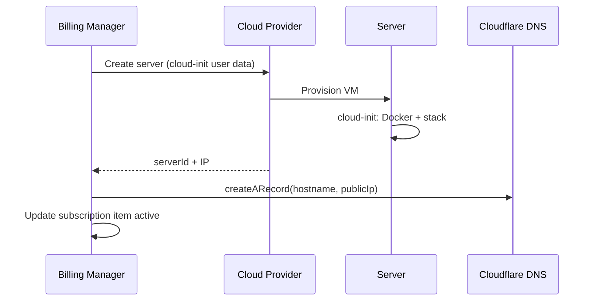

# Server Provisioning

Automated cloud server provisioning via cloud-init when service plans include infrastructure providers.

## Overview

When a [Subscription](./subscriptions.md) order includes a provisioning-enabled [Service Type](./service-types-and-plans.md), the billing manager:

1. Checks provider availability
2. Reserves a hostname under `DNS_BASE_DOMAIN`
3. Creates a cloud server via Hetzner Cloud or DigitalOcean
4. Runs cloud-init to install Docker and deploy the bundled product stack
5. Creates a DNS A record (Cloudflare) when configured
6. Stores the provider server id on the subscription item

## Supported Providers

Built-in providers register at startup when API tokens are configured:

#### Hetzner Cloud

- **Provider id:** `hetzner`
- **Requires:** `HETZNER_API_TOKEN`
- **Config keys:** `location` or `region`, `serverType` (required), optional `firewallId`
- **Server types:** Loaded live from `GET /service-types/providers/hetzner/server-types`

#### DigitalOcean

- **Provider id:** `digital-ocean`
- **Requires:** `DIGITALOCEAN_API_TOKEN`
- **Config keys:** `region` (required), `serverType` (required)
- **Server types:** Loaded live from `GET /service-types/providers/digital-ocean/server-types`

Additional cloud backends can be added via [Dynamic Provider Plugins](./dynamic-provider-plugins.md) (`DYNAMIC_BILLING_PROVIDER_METADATA` and custom provisioning packages where supported).

## Provisioning Process



## Bundled Product Stack

Cloud-init installs Docker CE and deploys a docker-compose stack on the instance. The default controller bundle includes:

- **PostgreSQL** - Application database with health checks
- **Backend API** - NestJS billing or agent controller API container (depending on service plan configuration)
- **Frontend console** - Angular SSR web application served behind reverse proxy
- **Nginx** - Terminates HTTP and HTTPS, proxies to backend and frontend containers, serves ACME HTTP-01 challenges at `/.well-known/acme-challenge/`

Containers share a defined application directory on the host (typically under `/opt/`). Environment variables for authentication, database connection, and product-specific settings are interpolated into the generated compose file from the subscription's requested configuration.

Operators choose service kind and image tags through service type and plan configuration; the update scheduler pulls latest tagged images on a schedule.

## Custom Service Kind

Plans may set `providerConfigDefaults.service` to `custom` and reference a CloudInit config id. This third path deploys a single Docker service defined by an admin template instead of the bundled controller or manager stack.

Custom cloud-init installs Docker and runs one compose service with resolved environment variables. It does not install Nginx, Certbot, or the bundled PostgreSQL and product containers. The subscription item update scheduler skips custom items.

See **[CloudInit Configs](./cloud-init-configs.md)** for environment variable metadata, admin UI, and order form behavior.

## TLS and DNS

TLS uses Let's Encrypt via Certbot installed in cloud-init (pip/venv under `/opt/certbot`):

- Initial bootstrap certificate generated with OpenSSL so Nginx can start immediately
- Production certificates requested with `certbot certonly --webroot` for the instance FQDN (`hostname.DNS_BASE_DOMAIN`)
- On success, Nginx switches to Let's Encrypt certificate paths
- Automatic renewal in crontab with deploy hook to reload the Nginx container

Environment:

| Variable               | Purpose                                                           |
| ---------------------- | ----------------------------------------------------------------- |
| `LETS_ENCRYPT_EMAIL`   | ACME account email                                                |
| `DNS_BASE_DOMAIN`      | Base domain for hostnames and certificates (default `spirde.com`) |
| `CLOUDFLARE_API_TOKEN` | DNS API token                                                     |
| `CLOUDFLARE_ZONE_ID`   | Zone for A records                                                |

Cloud-init waits for the DNS A record (`proxied: false`) to resolve to the host before requesting the certificate.

## SSH Access

Provisioning templates configure SSH for operational access. Key-based authentication is enabled; password authentication is disabled in generated `sshd` configuration.

**Accepted risk [DR-001](../security/accepted-risks.md#dr-001--provisioning-ssh-cloud-init-templates):** Cloud-init may configure root SSH access and install root `authorized_keys` for first-boot automation. Compensating controls include network restrictions, key rotation, and bastion access. See [Security - Accepted risks](../security/accepted-risks.md).

## Nested Provisioning Tokens

Optional `requestedConfig` keys on subscription order allow the provisioned instance to provision additional servers:

- `hetznerApiToken` - Hetzner API token injected into instance environment
- `digitaloceanApiToken` - DigitalOcean API token injected into instance environment

Use only when the product stack requires nested cloud automation.

## Server Information and Control

After provisioning:

- `GET /subscriptions/{subscriptionId}/items/{itemId}/server-info` - Live status from provider API
- Start, stop, restart via action endpoints (see [Dashboard and Server Control](./dashboard-and-server-control.md))

## Subscription Item Update Scheduler

A background scheduler connects to each provisioned host via SSH (key stored on the subscription item) at `SUBSCRIPTION_UPDATE_SCHEDULER_INTERVAL` (default 24 hours) and runs:

```bash
docker compose up -d --pull=always
```

in the application directory. This pulls latest container images and recreates services. Failures are logged on the host under `/var/log/agent-controller-update.log` or equivalent per service kind.

## Optional Instance Configuration

Subscription `requestedConfig` can include authentication mode for the provisioned stack (`users`, `api-key`, `keycloak`), SMTP settings, and Git or API credentials where the plan schema allows. Values are passed securely through user-data into the generated compose environment.

## API Endpoints

| Method | Path                                                 | Purpose                    |
| ------ | ---------------------------------------------------- | -------------------------- |
| GET    | `/service-types/providers`                           | List providers and schemas |
| GET    | `/service-types/providers/{providerId}/server-types` | Server types and pricing   |
| POST   | `/availability/check`                                | Pre-order capacity check   |
| GET    | `/subscriptions/.../server-info`                     | Live server metadata       |

Provisioning itself is triggered internally by subscription and backorder services, not via a standalone public provision endpoint.

## Related Documentation

- **[Subscriptions](./subscriptions.md)** - Order flow
- **[Backorders](./backorders.md)** - Retry when capacity unavailable
- **[Service Types and Plans](./service-types-and-plans.md)** - Provider schemas
- **[Dashboard and Server Control](./dashboard-and-server-control.md)** - Power actions
- **[Security - Accepted risks](../security/accepted-risks.md)** - **DR-001** provisioning SSH
- **[Billing Manager OpenAPI](/spec/billing-manager/openapi.yaml)** - Server info schemas

---

_Provisioned instances are owned by the subscribing customer within the current tenant scope._
