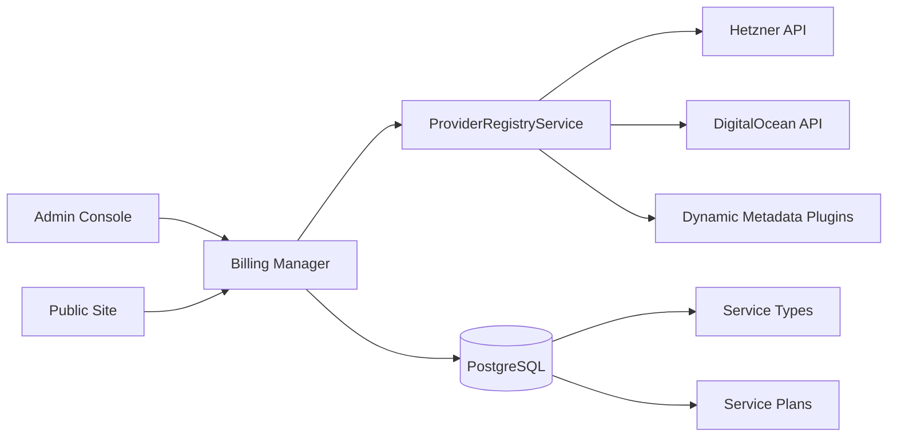

# Service Types and Plans

Admin-managed catalog of provisioning providers, service types, and priced service plans exposed to customers and public marketing endpoints.

## Overview

Service types define which provisioning provider (if any) backs a product. Service plans attach pricing, billing intervals, margins, and provider default configuration. The billing console admin UI and public catalog consume the same backend registry.

## Service Types

A service type links a product name to a provider id (for example `hetzner`, `digital-ocean`) or no provider for non-infrastructure plans.

### Admin Endpoints

| Method | Path                  | Purpose                     |
| ------ | --------------------- | --------------------------- |
| GET    | `/service-types`      | List service types          |
| POST   | `/service-types`      | Create service type (admin) |
| GET    | `/service-types/{id}` | Get service type            |
| POST   | `/service-types/{id}` | Update service type (admin) |
| DELETE | `/service-types/{id}` | Delete service type (admin) |

### Provider Registry

`GET /service-types/providers` returns registered provisioning providers with:

- Provider id and display name
- Optional `configSchema` for admin UI and subscription validation
- Dynamic metadata from `DYNAMIC_BILLING_PROVIDER_METADATA` plugins

Built-in providers include Hetzner Cloud and DigitalOcean when API tokens are configured. Additional providers can be registered via [Dynamic Provider Plugins](./dynamic-provider-plugins.md).

### Config Schema

The optional `configSchema` is a JSON-schema-like object:

- **`properties`** - Field definitions with `type`, `description`, and optional `enum`
- **`basePriceFromField`** - When set (for example `serverType`), the console loads options from `GET /service-types/providers/{providerId}/server-types` and uses selected `priceMonthly` as plan base price

Enum fields render as select inputs in the billing console.

### Statutory withdrawal opt-out

Service types may set **`disallowStatutoryWithdrawal`** (admin checkbox in the billing console). When true:

- Post-provisioning statutory withdrawal is blocked for subscriptions of that type.
- Unprovisioned orders remain withdrawable.
- Public and admin plan responses include `withdrawalPolicy.allowedAfterProvisioning: false` for checkout copy.

### Server Types

`GET /service-types/providers/{providerId}/server-types` returns server types with id, name, specs (cores, memory, disk), `priceMonthly`, and `priceHourly`. Requires the provider API token in the billing manager environment.

## Service Plans

Service plans belong to a service type and define customer-facing pricing and billing rules.

### Admin Endpoints

| Method | Path                                             | Purpose                                       |
| ------ | ------------------------------------------------ | --------------------------------------------- |
| GET    | `/service-plans`                                 | List service plans                            |
| POST   | `/service-plans`                                 | Create plan (admin)                           |
| GET    | `/service-plans/{id}`                            | Get plan                                      |
| GET    | `/service-plans/{id}/order-provisioning-options` | List customer-selectable provisioning options |
| POST   | `/service-plans/{id}`                            | Update plan (admin)                           |
| DELETE | `/service-plans/{id}`                            | Delete plan (admin)                           |

### Plan Fields (Conceptual)

- Title, description, and active flag
- Billing interval (monthly, yearly, etc.)
- Base price, margin, and computed customer total
- `providerConfigDefaults` merged with customer `requestedConfig` on order
- For provisioning plans, customers choose from `provisioningOptions` (integrated `controller`/`manager` and/or custom CloudInit configs). Admins configure these exclusively via **Customer-selectable options** checkboxes in the plan editor; **Product defaults** fields are scoped to the checked options only. New plans default to both Agenstra Controller and Agenstra Manager selected. Existing legacy plans are reconciled by migration `1772000000000_CloudInitAndPlanProvisioningConsolidated`.
- `billing_day_of_month` for subscription period alignment
- `allowCustomerLocationSelection` when geography override is supported
- Provider `configSchema.properties` may set `scope: "server"` or `scope: "product"` with optional `productServices` (`controller`, `manager`) to control the plan editor. Server fields stay under **Provider default config**; product fields appear under **Product defaults** when required by selected customer options.

### Customer Geography Selection

When `allowCustomerLocationSelection` is true **and** the merged provider schema defines `region` or `location` as a string with a non-empty enum, customers may pass geography in `POST /subscriptions` `requestedConfig`. Setting the flag without a supported schema returns 400.

For Hetzner and DigitalOcean, `region` and `location` are treated as aliases during merge and provisioning.

### CloudInit Configs Admin Route

Operators manage templates at `/administration/cloud-init-configs` in the billing console (sidebar label **Configs**, below **Providers**). See **[CloudInit Configs](./cloud-init-configs.md)**.

## Public Catalog

Unauthenticated endpoints for external pricing pages:

| Method | Path                                      | Purpose                                        |
| ------ | ----------------------------------------- | ---------------------------------------------- |
| GET    | `/public/service-plan-offerings`          | Paginated active plans (marketing fields only) |
| GET    | `/public/service-plan-offerings/cheapest` | Lowest-priced active plan                      |

Tenant is selected via `X-Tenant` (defaults to `default`). No provider secrets or internal margins are exposed.

## Availability and Pricing

Before order:

- `POST /availability/check` - Validate config against provider capacity
- `POST /availability/alternatives` - Suggest alternatives when unavailable
- `POST /pricing/preview` - Estimated customer total for plan and config

## Admin UI

The billing console provides administration routes for service types and service plans. Provider dropdown and dynamic config fields are driven by `GET /service-types/providers` and server type endpoints.

## Architecture

## Related Documentation

- **[Subscriptions](./subscriptions.md)** - Ordering against plans
- **[Server Provisioning](./server-provisioning.md)** - Provider provisioning behavior
- **[Dynamic Provider Plugins](./dynamic-provider-plugins.md)** - Extra providers and UI metadata
- **[CloudInit Configs](./cloud-init-configs.md)** - Custom service templates
- **[Multi-tenancy](./multi-tenancy.md)** - Tenant-scoped catalog

---

_See [Billing Manager OpenAPI](/spec/billing-manager/openapi.yaml) for DTO schemas._
