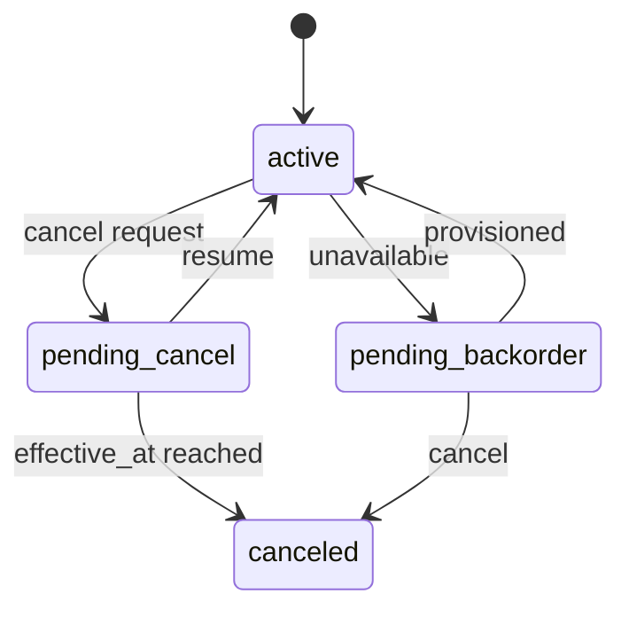
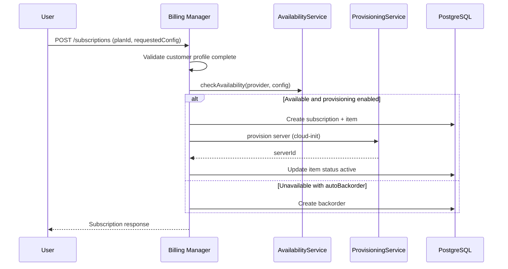

# Subscriptions

Order service plans, manage subscription lifecycle, and provision cloud infrastructure when the plan includes a provisioning provider.

## Overview

Subscriptions link a user to a service plan. Plans reference a service type that may include Hetzner or DigitalOcean provisioning. Each subscription can have one or more subscription items representing provisioned or pending instances.

The order flow requires a complete [Customer Profile](./customer-profiles.md) before `POST /subscriptions` is accepted.

## Subscription Lifecycle

### Active

Subscription is in good standing. Recurring charges create open positions according to the plan billing interval.

### Pending Cancel

User requested cancellation. Subscription remains active until `effective_at`. User may resume before that date.

### Canceled

Subscription ended. No further recurring charges. Provisioned items may be decommissioned per operator policy.

### Pending Backorder

Capacity was unavailable at order time or provisioning failed with `autoBackorder`. See [Backorders](./backorders.md).

## Ordering a Subscription

### Prerequisites

1. Authenticated user in the current tenant
2. Complete customer billing profile (name, email, address, city, country)
3. Active service plan selected

### Order Flow

### Request Body

- **`planId`** (required) - UUID of the service plan
- **`requestedConfig`** (optional) - Provider-specific configuration validated against the service type schema
- **`autoBackorder`** (optional) - When true, queue a backorder if capacity is unavailable

Provider config keys include `serverType`, `location` or `region`, and optional nested provisioning tokens. See [Service Types and Plans](./service-types-and-plans.md) and [Server Provisioning](./server-provisioning.md).

### Customer Geography

When `allowCustomerLocationSelection` is true on the plan and the provider schema defines `region` or `location` with an enum, customers may override geography in `requestedConfig`. Otherwise geography keys are stripped before merge.

### Customer Server Type

When `allowCustomerServerTypeSelection` is true on the plan, customers may pass `serverType` in `requestedConfig` if the value is listed in `allowedServerTypes`. Otherwise `serverType` is stripped before merge. The chosen type’s infrastructure price is stored in `configSnapshot.billingBasePrice` for billing.

### Custom Service Plans

When the plan sets `providerConfigDefaults.service` to `custom`, customers supply environment variables in `requestedConfig.env` as a string map. The billing console loads order fields from `GET /service-plans/{planId}/cloud-init-configs/{configId}/order-fields` (only for configs offered on the selected plan) and renders only variables with `showInOrderForm`.

The backend merges customer values with decrypted admin defaults. Variables without a default and without a customer value cause a validation error at order time. Controller and manager authentication fields are not used for custom plans.

See **[CloudInit Configs](./cloud-init-configs.md)**.

## Cancel and Resume

- `POST /subscriptions/{subscriptionId}/cancel` - Schedule cancellation at period end or immediately per plan rules
- `POST /subscriptions/{subscriptionId}/resume` - Reverse a pending cancel before `effective_at`

## Statutory Withdrawal (Widerruf)

Statutory withdrawal is separate from commercial cancellation. Customers exercise a **Withdraw** action when eligible; **Cancel** remains for period-end or commitment-based termination.

Customers who are not logged in can use the public **[Public Statutory Withdrawal](./public-withdrawal.md)** flow at `/withdrawal`. It reuses the same `executeWithdrawal` logic as `POST /subscriptions/{subscriptionId}/withdraw` after email verification.

### Eligibility

| Phase             | Condition                                                                                               | Withdraw allowed                 |
| ----------------- | ------------------------------------------------------------------------------------------------------- | -------------------------------- |
| Unprovisioned     | No subscription item is `active`                                                                        | Always                           |
| Withdrawal period | Item provisioned within `BILLING_STATUTORY_WITHDRAWAL_PERIOD_DAYS` (default 14) and service type allows | Yes                              |
| Expired           | Statutory window elapsed                                                                                | No (use Cancel per plan rules)   |
| Excluded type     | Service type has `disallowStatutoryWithdrawal` and item is provisioned                                  | No (unprovisioned still allowed) |

`GET /subscriptions` and `GET /subscriptions/{id}` include `withdrawalEligibility` with `canWithdraw`, `phase`, optional `deadline`, and `estimatedRefundGross` for provisioned withdrawals.

### Withdraw vs Cancel

- **Withdraw** (`POST /subscriptions/{subscriptionId}/withdraw`) — immediate teardown, bypasses `CancellationPolicyService` (e.g. works during `minCommitmentDays`).
- **Cancel** — commercial cancellation subject to notice and commitment rules.

### Refunds on provisioned withdrawal

When withdrawal occurs after provisioning and within the statutory window:

1. Unused time from `withdrawnAt` to `currentPeriodEnd` is prorated using the same logic as invoice creation.
2. A **partial credit note** PDF is generated and emailed.
3. **Paid** invoices: Stripe refund (or configured processor) for the credited gross amount, capped by amount paid.
4. **Unpaid** issued/overdue invoices: `balance_due` is reduced; no payment processor call.
5. **Unprovisioned** withdrawal: no partial refund; no open position (no billing).
6. **Provisioned** withdrawal: open position bills only from `provisionedAt` to `withdrawnAt`; unused period refunded when applicable.

Withdrawal policy is exposed on service plan reads as `withdrawalPolicy` (`periodDays`, `allowedAfterProvisioning`, `provisionedRefundPolicy`) for checkout disclosure.

## Subscription Items

Each item tracks:

- Provisioning status (`pending`, `active`, `failed`, etc.)
- Provider reference (cloud server id)
- Hostname and FQDN under `DNS_BASE_DOMAIN`
- Service kind (for example controller stack)

### Server Info

`GET /subscriptions/{subscriptionId}/items/{itemId}/server-info` returns live cloud status: server id, name, public and private IP, hostname, FQDN, and provider metadata.

### Server Control

Start, stop, and restart actions are available for provisioned items. See [Dashboard and Server Control](./dashboard-and-server-control.md).

### Automated stack updates

The **subscription-item-update** scheduler refreshes bundled controller and manager Docker stacks on a schedule. **Custom CloudInit subscription items are excluded** from this job; see [CloudInit Configs](./cloud-init-configs.md#automated-image-updates).

## Usage Records

Usage-based plans accept metering via `POST /usage/record`. Usage is included in invoice line items when `usagePayload` or `units` and `unitPrice` are present. Summary available at `GET /usage/summary/{subscriptionId}`.

## Pricing Preview

`POST /pricing/preview` returns estimated customer total for a plan and optional config before ordering.

## Availability

- `POST /availability/check` - Check whether requested config is available at the provider
- `POST /availability/alternatives` - Suggest alternative regions or server types

## API Endpoints

| Method | Path                                                             | Purpose                   |
| ------ | ---------------------------------------------------------------- | ------------------------- |
| GET    | `/subscriptions`                                                 | List user's subscriptions |
| POST   | `/subscriptions`                                                 | Create subscription       |
| GET    | `/subscriptions/{subscriptionId}`                                | Get subscription detail   |
| POST   | `/subscriptions/{subscriptionId}/cancel`                         | Cancel subscription       |
| POST   | `/subscriptions/{subscriptionId}/withdraw`                       | Statutory withdrawal      |
| POST   | `/subscriptions/{subscriptionId}/resume`                         | Resume pending cancel     |
| GET    | `/subscriptions/{subscriptionId}/items`                          | List subscription items   |
| GET    | `/subscriptions/{subscriptionId}/items/{itemId}/server-info`     | Live server info          |
| POST   | `/subscriptions/{subscriptionId}/items/{itemId}/actions/start`   | Start server              |
| POST   | `/subscriptions/{subscriptionId}/items/{itemId}/actions/stop`    | Stop server               |
| POST   | `/subscriptions/{subscriptionId}/items/{itemId}/actions/restart` | Restart server            |

See [Billing Manager OpenAPI](/spec/billing-manager/openapi.yaml) for schemas.

## Related Documentation

- **[Customer Profiles](./customer-profiles.md)** - Required before ordering
- **[Service Types and Plans](./service-types-and-plans.md)** - Catalog and provider schemas
- **[Invoices](./invoices.md)** - Open positions and billing-day accumulation
- **[Backorders](./backorders.md)** - Capacity retry queue
- **[Server Provisioning](./server-provisioning.md)** - Cloud-init and bundled stacks
- **[Dashboard and Server Control](./dashboard-and-server-control.md)** - Overview and power actions

---

_For the full subscription order sequence, see the billing manager feature module diagrams._
